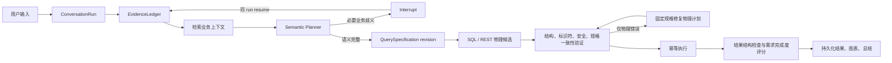
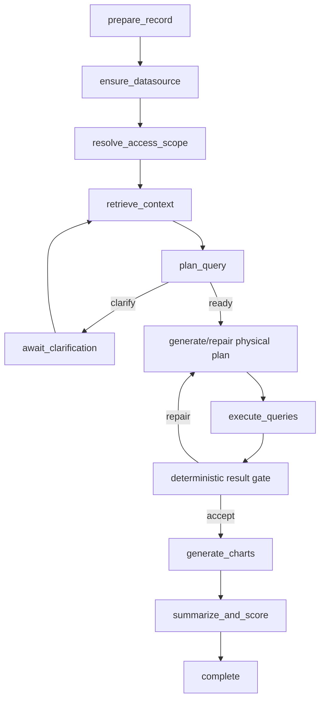

# NLQ 查询规划与澄清体系重构方案 v3

> 本文是当前实现的唯一设计基线。v1、v2、v2.1 文档仅保留为历史记录，不再作为实现依据。

## 1. 设计边界

- `QuerySpecification` 是唯一业务语义真相；SQL/REST 只是可替换的物理计划。
- 用户问题、澄清选择、自定义回答和纠正以追加式证据保存，原文永不覆盖；有效证据由 `supersedes` 链投影计算，事件行本身不维护可变状态。
- 规格通过 revision 演进，不存在 freeze/unfreeze。
- 只澄清会明显改变业务结果的歧义；低影响不确定性写入 assumption 后继续。
- 当前不建设跨协议关系代数编译器，也不存在“编译器 + 原始 SQL”双执行路径。
- SSE 只订阅持久化事件；run snapshot 是前端最终读取模型。

## 2. 唯一数据流



## 3. 分层职责

| 层 | 唯一职责 | 不允许承担的职责 |
|---|---|---|
| Conversation runtime | 进程内图初始化、run 状态、checkpoint、interrupt、事件游标、恢复 | 推断业务语义 |
| Evidence ledger | 保存不可变来源事实与 supersedes 关系 | 生成 SQL |
| Context retrieval | 装配权限内 schema、术语、示例、关系和实体候选 | 创造业务政策 |
| Semantic planner | 输出 `NeedClarification` 或 `Ready(specification, candidates)` | 覆盖用户证据 |
| Clarification policy | 必问/可假设、问题合并、每轮最多两题 | 暴露 JOIN/表名等技术选择 |
| QuerySpecification | 表达 outputs、predicates、group、time、order、limit、business relations | 保存 UI 展开状态或 SQL 文本 |
| Physical plan | 实现固定规格的 SQL/REST 请求 | 修改业务 clause |
| Validators | 验证规格自身、物理标识符、安全和规格覆盖 | 在总结阶段补救错误计划 |
| Result quality | 按用户需求完成度评分并披露假设 | 因空结果直接判错或阻止发布 |

认证业务口径沿用同一规格标准，不建立第二份 Contract。知识 Capture、Certify、natural key、字段目标
提取和当前轮应用统一通过 `parse_specification_fragment` 解析 typed v3 requirements。

## 4. 持久化模型

```text
conversation_run        一条用户请求的一次持久运行
conversation_interrupt  版本化暂停卡；一次性、幂等消费
conversation_run_event  有游标的传输事件日志
nlq_run                  规格 revisions、物理候选、执行结果与评分
nlq_evidence_event       追加式证据账本
chat_record              用户可见的最终消息/结果投影
LangGraph checkpoint     唯一图运行状态（仅 JSON 可序列化值）
chat_log                 唯一执行详情审计时间线
```

运行状态固定为 `queued → running ⇄ awaiting_input → succeeded|degraded|failed|cancelled`。
`awaiting_input` 不是完成态。一个问题只有一个 `ChatRecord`、一个 `ConversationRun`；回答通过
`resume` 恢复同一 checkpoint，不创建父子消息。

节点内工作数据只进入 LangGraph checkpoint；规格、计划、执行结果等领域产物同时按稳定 ID 写入
`nlq_run`，供审计、幂等执行和前端读取，但不再保存第二份通用 `workflow_state`。ORM、连接、协议实例、
模型客户端永不进入 checkpoint，恢复时通过 `run_id` 重建运行时服务。

## 5. 澄清协议

`Ambiguity` 使用服务端根据互斥候选的结构化 `resolution` 生成稳定 ID。`business_axis` 只用于模型表达
和审计，不拥有身份，避免同一问题换一个 axis 名称后被重复询问。候选 `resolution` 必须自描述完整业务
含义，禁止只写通用的 yes/no 或 choice/value；服务端据此生成稳定 option ID。

必须澄清：指标定义、统计主体、时间口径、结果人口、去重粒度或状态范围存在会显著改变结果的分歧。
不应澄清：JOIN 方式、关联键、表名、SQL 方言、CTE/子查询以及唯一 schema 事实可确定的问题。

- 每轮最多两个高度相关的问题；推荐只标记、不预选。
- option 与 custom 严格互斥；custom 是完整回答，可以自然语言引用 A/B/C。
- 已回答的结构化业务分歧不得重复出题；`business_axis` 仅作为辅助重复检查。
- 同一结构化业务分歧即使被模型换名也不得重复出题；达到有限澄清边界后，可安全执行的非关键内容必须
  作为 assumption 披露，不能形成无限暂停。
- 非关键不确定性成为显式 assumption，不暂停。
- interrupt 创建与 run 进入 `awaiting_input` 同事务；version 乐观锁和 idempotency key 防重复消费。
- LangGraph 恢复会重放暂停节点；同内容且已消费的 interrupt 必须复用，不能生成重复问题版本或重复事件。
- 运行等待后续澄清时允许修改历史回答；修改追加 `user_correction` 并 supersede 旧证据，当前未回答卡作废，
  同一 checkpoint 继续重新规划。终态 run 不重新打开，完成后的新要求属于新的用户消息和 run。

## 6. 查询规格与计划门禁

`QuerySpecification(version=3)` 按查询子句组织：output、predicate、group、time window、
order、limit、business relation、assumption。每条 requirement 的 ID 由服务端按规范化语义生成，
用户来源必须引用 `user:question` 或 `user:answer:<evidence_id>`。是否属于用户确认由服务端根据当前有效
`evidence_refs` 推导，不能信任模型输出的 `source`；仍有效的用户 clause 不得被后续 revision 静默删除。

明细字段和聚合指标统一属于 `outputs`，明细字段使用 `aggregation=value`，不存在第二套
`projections` 业务语义。字段映射失败不得通过删除 clause 降级：业务 requirement 保持不变，回到语义
规划重新 grounding；非关键不确定性必须在 Planner 产生规格时直接成为 assumption。

### 6.1 认证口径复用

仅 `certified` 且 label/synonym 与当前问题存在明确业务短语匹配的 Caliber 可以进入
`protected_knowledge_requirements`。字段名、表名或短 token 重合不构成强适用性；未认证或弱相关资产
直接从强制路径丢弃，不通过 advisory 通道影响业务语义。

认证 fragment 作为当前规划的 typed 默认要求和 `knowledge_caliber` Evidence，绝不写入
`previous_specification`。Planner 可以补充规格；用户当前有效证据冲突时用户要求确定性覆盖知识默认值；
没有用户冲突时不得静默遗漏认证 requirement。服务端在 Planner 输出后统一 reconcile：规格真正吸收后
才记录 `apply=bind`，用户覆盖记录 `drop/user_override`。第一次遗漏进入现有语义修复；修复后仍无法吸收
时继续执行模型规格，但追加高风险 assumption 和 `planner_omitted_after_repair`，避免知识故障阻断核心查询。

Training Example 只作为字段映射、方言和物理计划实现参考，不能解决关键业务歧义，也不能覆盖用户证据
或认证口径。Compile 阶段只产生候选和召回日志，不得提前宣称已 Bind。

验证顺序固定：

1. 规格内部引用和组合一致性；
2. 物理表/字段真实性；仅 `semantic_ref` 的概念标为不可自动核验，不伪造字段；
3. SQL/REST 结构、安全和数据源能力；
4. 物理计划与同一规格 revision 的 clause 覆盖；
5. 方言确定性限制。

规格错误回到语义规划；规格合法而计划错误时只调用物理修复器。错误候选不进入可见结果。
修复耗尽后只有结构安全候选才可降级执行；不存在安全候选才失败。AST 无法证明 `semantic_ref`
时属于可披露的不可观测风险，不进行无法产生新证据的重复物理修复。

## 7. 发布、评分与恢复

评分是用户需求完成度：规格覆盖 35%、计划一致性 25%、字段/关系证据 15%、执行完整性 15%、
结果合理性与假设风险 10%。空结果在语义和执行均正确时不扣分。总结只解释已执行结果；失败时生成
确定性基础总结，不再作为发布门禁。

终态通过唯一 `finalize_run` 事务同时提交 `chat_record`、`nlq_run` 和 run 状态，再发布 finish 事件。前端收到 finish 后必须重新读取
snapshot 并覆盖本地消息模型；刷新、SSE 重连和实时页面因此使用同一结果。SSE 断开只解除订阅，后台
继续运行。进程启动时按 checkpoint 恢复 queued/running run；awaiting_input 保持暂停，执行通过 plan ID
幂等。

主应用和 MCP 是不同进程，各自初始化图注册表和 checkpointer；migration、未完成 run 恢复及后台维护
只由主应用负责。Web 通过 SSE interrupt/resume 交互；MCP/JSON 必须返回包含 run 和 interrupt 的
`awaiting_input` 结构，不能把暂停误报成查询失败。前端的 `detach` 只断开传输，只有显式 `cancel` 才终止 run。

## 8. 当前拓扑



图拓扑只在 `backend/graphs/current/chat.yaml` 定义。检索内部仍保留独立 domain step 和 `chat_log`
审计，但图层只设一个 `retrieve_context` checkpoint，避免大量只传递字典的微节点。

## 9. 删除标准

旧父子澄清记录、`intent_context`、自由 slot key、`SlotEffect`、`BindingRole`、独立可执行
`time_intent`、ContractDraft freeze/unfreeze、旧 SQL 消息历史、raw SQL 流式发布及前端 SSE 最终真相
均不得重新引入。自然语言时间解析工具可以保留，但输出只作为 evidence，不能成为第二份契约状态。

## 10. 验收矩阵

- 无歧义直跑；必要业务歧义最多两题且不暴露技术实现。
- 推荐不自动选择；option/custom 互斥、可取消、回答后不重复询问同一业务轴。
- correction 追加证据并生成新 revision，历史证据不变。
- SQL 修复保持规格 revision 不变；错误候选不可见。
- 空结果可高分；总结失败不丢结果。
- resume 幂等；SSE 断线、刷新、服务重启读取一致。
- MCP 进程可独立提交图；MCP/JSON 遇到澄清可获得可恢复的 awaiting_input 响应。
- SQL 和 REST 共用同一 PlanningDecision/QuerySpecification。
- 普通对话和配置对话共用 run、事件、执行详情和消息基础组件。
