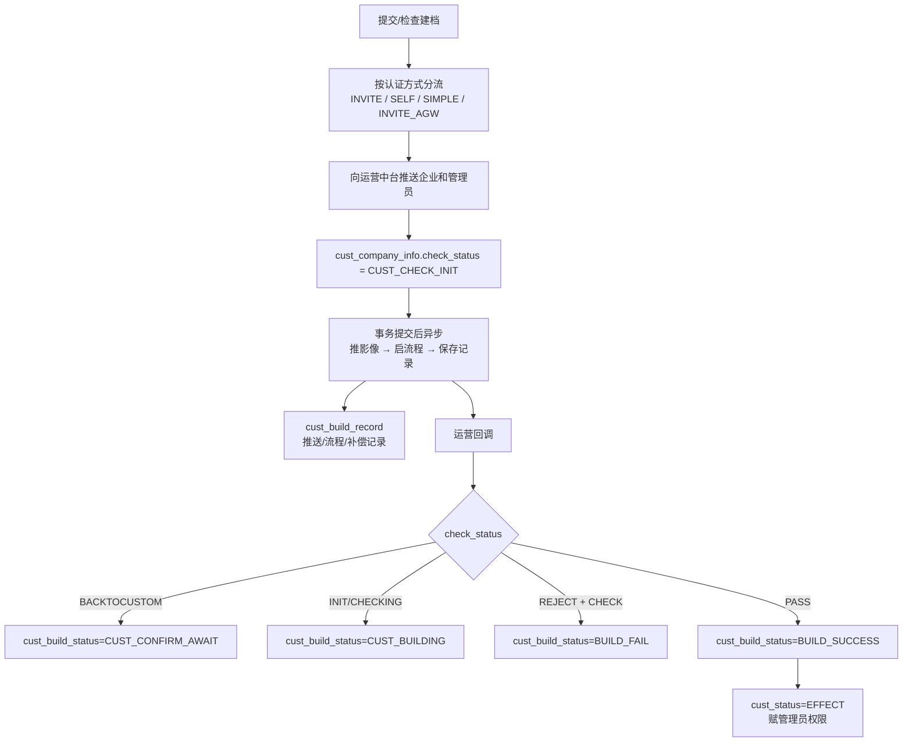

# pplatform-web 企业建档业务数据知识审核包 v1

## 1. 本轮交付结论

这是一份**可导入登记、不可直接视为已发布知识的审核包**。它基于 `pplatform-web@ee434954` 的项目知识文档与实际代码，完成了：

- 项目现有知识资料的首轮目录化；
- “企业建档”场景的 Controller → Application → Facade → 异步流程 → 运营回调 → Mapper/DO 纵向穿透；
- 20 条可定位事实、7 条关系候选、4 个术语候选、3 个口径候选、3 个查询范式候选和 2 条规则候选；
- 12 个业务/数据待确认问题与一组数据库验证项。

目录中的既有提取结果已统一转换为 [knowledge-package.yaml](./knowledge-package.yaml)：共 51 条，包含术语、口径、关系、查询范式、规则、事实证据和待确认问题。导入 SQLBot 后，51 条都会进入知识包管理区；只有满足治理门禁的条目才会进一步投影到运行时资产。当前尚未调用目标环境 API、未写数据库、未生成 embedding。

## 2. 为什么先用“建档”做样本

“建档”能检验知识提取是否真正服务问数，因为它同时包含：

- 同一业务词对应多个阶段；
- 多种录入/认证方式；
- 当前主数据、关系数据、过程记录和回调状态；
- 多个可选时间口径；
- “企业数、申请数、推送记录数”三种不同粒度；
- 成功、失败、待客户确认、审核中等状态字典；
- 项目、企业角色、联系人和认证信息的跨表关联。

如果只把文档中的“企业准入流程”向量化，SQLBot 仍无法判断用户说的“今年建档企业数”应查哪张表、用哪个时间、按什么状态过滤、是否去重。本包把这些决策拆成可审核的事实和候选资产。

## 3. 已还原的业务—数据主链



最重要的知识结论是：

> “推送完成”“后置流程完成”“审核通过”“企业生效”是四个不同事件。日志里的“客户建档流程完成”只表示提交链路完成，不表示业务建档成功。

## 4. 核心数据对象与粒度

| 数据对象 | 建议粒度 | 角色 | 查询注意事项 |
|---|---|---|---|
| `cust_company_info` | 一行一条企业主/过程记录 | 企业当前业务状态和核心属性 | 业务主数据通常需 `data_type='1' AND enable='Y'` |
| `cust_build_record` | 一行一次推送、异步后置或补偿记录 | 技术过程与重试证据 | 不能直接计为企业数或建档成功数 |
| `cust_person_info` | 一行一名企业联系人/用户关系 | 管理员、游客、认证人员 | 企业引用存在 id/code 两条路径 |
| `cust_role_info` | 一行一个企业角色 | CORE/FINANCE 等角色 | 连接 `cust_company_info.code` |
| `cust_project_rel` | 一行一个项目—企业—角色关系 | 项目成员企业、开通状态 | 同项目关系可用于连接不同企业角色 |
| `cust_certification_info` | 一行一类认证检查记录候选 | 自动/人工检查状态和时间 | 实际唯一性和历史保留策略待 DB 验证 |

## 5. SQLBot 最有价值的首批候选

### 5.1 术语不是一句解释，而是业务分歧入口

“建档”应召回阶段和数据落点，但不能自动绑定到一个状态：

- “提交建档”可能落在首次提交时间或流程记录；
- “建档中”对应审核状态组合；
- “建档成功/已建档企业”可绑定有效企业口径；
- “建档失败”必须排除企业变更拒绝仍保留成功状态的分支。

这类术语适合 K3，但需要引用 K2 口径和 K1 字段关系，而不是独立长文本。

### 5.2 可复用口径

首个高置信候选是“有效已建档企业”：

```text
cust_build_status = 'BUILD_SUCCESS'
AND cust_status = 'EFFECT'
AND data_type = '1'
AND enable = 'Y'
```

现有 Mapper 已明确使用该组合。若用户要求“包括变更中的有效企业”，应显式增加 `CUST_CHANGE + CHANGE` 分支，而不是把两个口径混成一个含糊规则。

### 5.3 时间口径仍有关键缺口

当前确认的 `cust_first_submit_auth` 只覆盖 `SELF` 和 `INVITE`，不能安全回答“所有来源的建档提交趋势”；代码中也未发现一个可以直接认定为“建档审核通过时间”的统一字段。因此本包没有伪造“建档时间”默认口径，而是将其列为必须审核的问题。

## 6. 现有项目资料的质量判断

项目已有 11 个 Cursor skill、36 份 `.dev-standards/knowledge` 文件和约 18 份版本/设计文档，这些材料非常适合作为：

- 业务域与模块索引；
- 术语和流程候选来源；
- 代码入口导航；
- 版本变更和历史原因证据。

但不适合未经复核直接导入：

- 文档通常给出简化流程，实际代码存在更多认证方式、回退和补偿分支；
- 文档中的“状态流转”未完整覆盖当前 `CustBuildStatusEnum` 与 `CheckStatus` 的组合；
- 方法/模块描述可能滞后；
- 表字段说明无法证明实际唯一约束、基数、空值率和生产值分布。

正确做法是以这些资料生成候选索引，再用当前代码和实际 DB 完成结构及数据验证。

## 7. 如何审核本包

建议按以下顺序：

1. 阅读本报告的业务主链，确认阶段划分是否符合产品语言。
2. 审核 [asset-candidates.yaml](./asset-candidates.yaml) 中术语和口径是否可被业务人员理解。
3. 审核 [review-questions.md](./review-questions.md) 中 12 个边界问题。
4. 开发人员抽查 [facts.jsonl](./facts.jsonl) 的代码位置和事实表述。
5. 数据开发/DBA 执行关系基数和字段分布验证，更新 [relations.jsonl](./relations.jsonl) 状态。
6. 审核通过的候选通过同一知识包同步到 SQLBot K1/K2/K3/K4/K5 运行时资产，不再分别维护多套导入格式。

## 8. 当前仍不能声称完成的事项

- 未连接 pplatform 实际数据库，所以没有认证主外键、基数、空值率和字典分布。
- 未验证任何查询范式能在目标数据源执行，因此 K4 仍是 specification candidate，不是 exemplar。
- 未完整覆盖企业变更、邀请、简易认证、CA、协议和项目开通流程。
- 未解决 SQLBot 当前 UI 对跨类型业务数据图的统一展示问题。
- 已生成可完整登记的标准知识包，但尚未导入或修改任何 SQLBot 运行时资产。

## 9. 下一批提取建议

审核本样本后，按运行时收益优先扩展：

1. 企业变更：解释“变更中仍有效”及新旧数据/记录表关系。
2. 项目—企业—角色：支持按项目、核心企业、资金方查询。
3. 邀请与管理员：支持邀请状态、管理员归属和人员建档状态。
4. 协议与 CA：支持签署、授权、开通状态及相关时间口径。
5. 实际 DB profile：把本包中的关系和状态候选升级为可发布资产。
