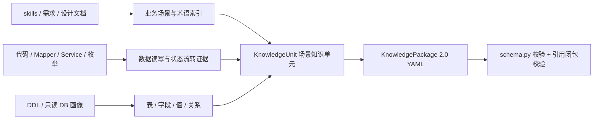

# pplatform-web 业务数据知识提取执行规范 v4

> **完整提取合同（所有项目通用）**：[`../KnowledgePackage-2.0-第三方提取规范.md`](../KnowledgePackage-2.0-第三方提取规范.md)。第三方 Agent 应先遵守该文档；本文只补充 pplatform-web 的输入路径与建议输出目录。  
> 目标输入：`/Users/fanjunwei/IdeaProjects/pplatform-web`。  
> 目标输出：一份能被 SQLBot 当前 `KnowledgePackageV2` 校验通过的 YAML 知识包，不直接导入系统。  
> 唯一权威 Schema：`backend/apps/knowledge/semantic/schema.py`。  
> 建议输出目录：`docs/knowledge-extraction/pplatform-web/system-knowledge-v4/`。

## 0. 一句话结论

不要做“项目百科”，也不要把代码、文档切片后塞进向量库。提取的每一段知识都必须回答一个运行时问题：用户说出某句业务话术时，应该落到哪些表、字段、值、关系、过滤条件或查询口径。

知识包的唯一主体是 `knowledge_units`。术语、流程、数据集、关系、指标、口径、规则、查询范式都只是某个业务场景单元的内部内容，不再使用 v1 那种顶层扁平 `items`。



## 1. 必须遵守的总体原则

1. **证据先于结论**。先产出 `sources` 和 `evidence`，再产出 `knowledge_units`。每个业务主张都要引用 `evidence_refs`，不能只写“我认为”“通常如此”。
2. **业务知识必须落数据**。没有表、字段、值、关系、读写动作、状态迁移或查询影响的描述，不能作为知识单元发布。
3. **代码路径不是业务真理，文档也不是现状**。Mapper 的局部过滤、某个方法的判断分支、历史文档的描述，都不能直接升级为全局业务规则；要用数据库结构、枚举定义、调用链和可读数据画像互相印证。
4. **同一语义只出现一次**。一个业务概念集中在一个 `concept_id` 下维护 `aliases` 和 `dictionary`，不要用“建档、企业建档、客户建档”拆成三个概念。一个可执行口径集中在一个 `caliber_id` 下，不要把同一口径的字段拆成多条规则。
5. **不伪造验证**。没有在目标库只读执行过的 SQL，不得写 `executed: true`、`passed: true`。查询范式进入 `verified_query_patterns` 时，`verification` 应标记为待绑定验证；只有实际执行通过，才能称为已验证。
6. **所有 `SemanticFieldRef` 必须先声明**。关系、指标、口径、规则、流程数据效果引用的 `dataset.field`，必须在该 unit 的 `content.datasets` 中已经定义。
7. **不使用自由字符串 ID 表达语义**。`package_id`、`source_id`、`evidence_id`、`unit_id`、`concept_id`、`stage_id`、`dataset_id`、`field_id`、`relationship_id`、`metric_id`、`caliber_id`、`rule_id`、`pattern_id` 都必须是稳定、唯一、语义明确的标识。

## 2. 输入扫描范围与优先级

只读取以下可解释业务↔数据映射的材料；项目构建文件、前端样式、测试工具代码不作为知识来源，只可作为定位线索。

| 优先级 | 输入位置 | 提取什么 |
|---|---|---|
| P0 | `.cursor/skills/*/SKILL.md`、`collaboration.md`、`reference.md`、`examples.md` | 业务域、模块边界、专业术语、典型业务流程 |
| P0 | `lowcode-pplatform-common/.dev-standards/knowledge/business/*.md` | 业务规则、状态口径、角色、产品与项目关系 |
| P0 | `lowcode-pplatform-common/.dev-standards/knowledge/codemap/*.md` | Controller → Service → Mapper 调用入口和模块归属 |
| P0 | 各模块 `src/main/resources/mappers/*.xml` | 真实 JOIN、WHERE、状态字典、去重粒度 |
| P1 | 各模块 `src/main/java/**/enums/**`、状态/类型常量类 | 字段取值、状态迁移、角色字典 |
| P1 | 各模块 `service`、`manager`、`dao`、`facade` 实现 | 写入/更新字段、触发条件、后置动作 |
| P1 | `docs/**/设计文档/*.md`、`docs/**/文档/*.md`、版本需求文档 | 业务意图、指标定义、状态流转、边界条件 |
| P2 | `lowcode-pplatform-common/.dev-standards/knowledge/service/*.md` | 服务职责和模块代码地图 |
| P2 | 数据库 DDL / 只读画像（若可访问） | 表字段、空值、重复、真实枚举分布、候选关系 |

不把以下内容作为知识单元：

- “代码关系必须经数据库画像确认”这类提取过程说明；
- “技术流程完成不得解释为业务成功”这类没有指向具体字段、状态值和查询影响的泛化治理提醒；
- `top_flag` 表示离职风险等缺少代码与数据依据的猜测；
- 无法确认物理字段、空 SQL、只有题目的查询示例；
- 纯工程规范、代码风格、包结构、前端组件说明。

## 3. 提取工作流

### 3.1 先建源与证据目录

为每个核心业务域建立 `sources` 和 `evidence`。`source` 表示“证据来自哪里”，`evidence` 表示“从中得到了什么可追溯事实”。

`source_id` 建议采用稳定短名，例如：

- `CODE-CUST-QUERY`
- `CODE-CUST-STATUS`
- `DOC-CUSTOMER-MANAGEMENT`
- `DB-LOWCODE-PPLATFORM`

`evidence_id` 建议采用 `ev-<source 短名>-<语义短名>`，例如 `ev-code-company-active`。一条 evidence 只表达一个原子事实：

```yaml
- evidence_id: ev-code-company-active
  source_id: CODE-CUST-QUERY
  evidence_kind: code_path
  locator: CustCompanyMapper.xml#selectActiveCompany
  claim: 有效企业主数据在查询侧同时限定建档成功、企业状态、数据类型和启用状态。
  confidence: 0.96
```

`claim` 要能作为后续 `concept`、`caliber`、`rule` 的依据，不能写成“看到了相关代码”。

### 3.2 再建数据集

每个 `knowledge_units` 至少含一个 `dataset`。`dataset` 是运行时字段引用的闭包基础，先声明表，再声明字段，之后的关系/口径/规则才能引用它。

一个 `dataset` 对应一个业务数据对象，不是每一张物理表都无脑成为一个独立 unit。过程表、历史表、关系表应说明“一行代表什么”，避免把行数当成业务对象数量。

字段至少写清楚：

- `field_id`：包内唯一 ID；
- `name`：物理字段名；
- `data_type`：能提供就提供；
- `dictionary`：状态/类型枚举的 `物理值 -> 业务含义`；
- `evidence_refs`：字段来自哪条证据。

没有足够依据的字段，不要为了“全面”而猜测含义。数据库画像未确认的字段和关系，只能标为低置信度或 `proposed`，不得标为 `confirmed`。

### 3.3 再补流程、关系、指标、口径、规则、查询范式

顺序固定为：

```text
sources → evidence → datasets → relationships → metrics/calibers → domain_rules → verified_query_patterns
```

先确保 `datasets` 和字段闭包成立，再写引用这些字段的其他内容。

### 3.4 最后按业务场景聚合为 knowledge_units

一个 `KnowledgeUnitEntry` 是一个业务场景闭环，例如：

- 企业建档与主数据；
- 企业项目关系与角色；
- 租户产品与配置；
- 协议/结算/审批等。

不要把“企业”这一个词拆成一个 unit，也不要只写“企业主数据”一个抽象对象而没有流程/口径/规则。

## 4. KnowledgePackage 2.0 结构说明

### 4.1 顶层

```yaml
schema_version: "2.0"
package:
  package_id: pplatform-system-business-data-v4
  revision: 1
  title: pplatform-web 业务数据运行时知识包 v4
  namespace: pplatform
  description: 从代码、业务规则、设计文档和数据库画像提取的业务↔数据知识。
sources: []
evidence: []
knowledge_units: []
```

顶层只有这四个部分，禁止出现 `package_id`、`items`、`defaults`、`target` 等 v1 字段。Schema 使用 `extra="forbid"`，多余字段会直接校验失败。

### 4.2 sources

每个 source 必须提供：

```yaml
- source_id: CODE-CUST-QUERY
  kind: mapper
  locator: lowcode-pplatform-customer-management/src/main/resources/mappers/CustCompanyQueryMapper.xml
  repository_revision: ""
  content_hash: ""
  metadata: {}
```

`locator` 写仓库内相对路径、文件标题或唯一可定位标识，不能写空泛的“代码”。

### 4.3 evidence

每条 evidence 必须：

- 引用已有 `source_id`；
- 有一个可定位 `locator`；
- 有一句可验证的 `claim`；
- 有 0～1 之间的 `confidence`。

`evidence_kind` 建议使用：

- `document_claim`：需求/设计/业务规则文档中的描述；
- `code_path`：某方法、Mapper、枚举中的实现事实；
- `database_schema`：DDL/表结构事实；
- `database_profile`：只读数据画像事实；
- `query_verification`：已执行查询的验证事实。

### 4.4 knowledge_units

每个 unit 的必填项：

- `unit_id`、`title`、`domain`、`description`；
- `content.datasets` 至少一项；
- `content.processes` / `metrics` / `calibers` / `domain_rules` / `verified_query_patterns` 至少一项；
- `evidence_refs` 只能引用顶层 `evidence` 中已存在的 ID。

unit 的 `confidence` 表示整体可信度，不能替代每条 evidence 的 confidence。

### 4.5 content 各桶的硬约束

#### concepts

```yaml
- concept_id: build-success
  name: 建档成功
  aliases: [有效已建档企业, 已建档]
  definition: 审核通过且主数据有效、启用。不要与推送完成混淆。
  dictionary:
    BUILD_SUCCESS: 建档成功
    EFFECT: 有效
    Y: 启用
  evidence_refs: [ev-code-company-active]
```

`definition` 必须落到阶段、状态、字段值或数据边界，不能写“指企业建档这个过程”。

#### processes

每个 `ProcessStage` 用 `data_effects` 描述一个业务阶段对数据的读写影响。`operation` 只允许 `read`、`insert`、`update`、`delete`、`upsert`。

```yaml
- stage_id: approved
  name: 建档审核通过
  trigger: 运营回调 PASS
  exit_conditions: [企业状态更新为生效]
  next_stages: []
  data_effects:
    - operation: update
      dataset: company
      fields: [build_status, company_status, enabled]
      condition: cust_build_status = 'BUILD_SUCCESS'
      description: 更新建档结果和主数据可用状态。
      evidence_refs: [ev-code-company-active]
  evidence_refs: [ev-code-company-active]
```

`data_effects.dataset` 和 `fields` 必须已在该 unit 的 `datasets` 中定义。

#### datasets

```yaml
- dataset_id: company
  name: cust_company_info
  description: 企业主/过程记录，一行一家企业。正式企业主数据通常需 data_type='1' AND enable='Y'。
  database: lowcode_pplatform
  fields:
    - field_id: id
      name: id
      data_type: bigint
      evidence_refs: [ev-company-schema]
    - field_id: build_status
      name: cust_build_status
      data_type: varchar
      dictionary:
        BUILD_SUCCESS: 建档成功
        CUST_BUILDING: 建档中
      evidence_refs: [ev-company-schema]
  evidence_refs: [ev-company-schema]
```

`database` 可选；如果目标数据源只有一个 schema，可以留空，但建议写 `lowcode_pplatform`。

#### relationships

`left` 和 `right` 必须是 `{dataset, field}`，且字段已在 `datasets` 中声明。`status` 默认 `proposed`，只有同时具备代码路径和数据库画像证据时才能 `confirmed`。

```yaml
- relationship_id: company-build-record
  left: {dataset: company, field: id}
  right: {dataset: build_record, field: company_id}
  relationship_type: EQUI_JOIN
  cardinality: 1:n
  business_meaning: 企业主数据对应多次推送过程
  status: proposed
  evidence_refs: [ev-code-submit, ev-build-schema]
```

禁止仅凭 `xxx_id` 或字段同名就写关系；必须给出左右字段、基数、业务含义和证据。

#### metrics

`aggregation` 写 `COUNT_DISTINCT`、`SUM`、`AVG` 等业务聚合；`field` 和 `grain` 引用已有字段；`filters` 只写已经能落成字段谓词的条件。

#### calibers

`contract_fragment` 是该口径的结构化表达。当前导入阶段不要求 v1 的 `intent_defaults`，但建议采用清晰、可被后续绑定器解释的结构：

```yaml
- caliber_id: active-built-company
  label: 有效已建档企业
  description: 同时满足建档成功、企业有效和启用状态的企业主数据。
  contract_fragment:
    predicates:
      - field: company.build_status
        operator: eq
        values: [BUILD_SUCCESS]
      - field: company.company_status
        operator: eq
        values: [EFFECT]
      - field: company.enabled
        operator: eq
        values: [Y]
      - field: company.data_type
        operator: eq
        values: ["1"]
  field_targets:
    - {dataset: company, field: build_status}
    - {dataset: company, field: company_status}
    - {dataset: company, field: enabled}
    - {dataset: company, field: data_type}
  evidence_refs: [ev-code-company-active]
```

`field_targets` 必须全部落在该 unit 的 `datasets` 中。不要写 SQL 片段作为 `contract_fragment`，也不要写没有字段指向的纯中文口径。

#### domain_rules

`DomainRuleDefinition` 有强制校验：`applicability`、`query_impact`、`field_targets` 都不能为空。这是用来防止“泛化治理提醒冒充业务规则”的。

```yaml
- rule_id: do-not-count-push-records
  label: 推送记录不计企业数
  content: 统计建档企业必须用企业主数据去重，禁止用推送过程表行数。
  applicability: 企业数、建档成功数
  query_impact: 主表必须是 company，build_record 只能作为过程过滤
  field_targets:
    - {dataset: company, field: build_status}
    - {dataset: build_record, field: company_id}
  evidence_refs: [ev-build-schema]
```

#### verified_query_patterns

查询范式表达“自然语言问题 → SQL 查询”。导入时不会强制要求已经执行，但运行时只有绑定数据源并验证通过后才会作为已验证范例使用。

```yaml
- pattern_id: count-active-built-companies
  question: 有效已建档企业有多少
  query: >
    SELECT COUNT(DISTINCT id) AS built_company_count
    FROM cust_company_info
    WHERE cust_build_status = 'BUILD_SUCCESS'
      AND cust_status = 'EFFECT'
      AND enable = 'Y'
      AND data_type = '1'
  intended_specification:
    grain: company
    caliber_id: active-built-company
  verification:
    status: PENDING_VALIDATION
  evidence_refs: [ev-code-company-active]
```

禁止：

- 把 `verification.executed` 和 `verification.passed` 写成 `true`，除非确实执行过；
- 写空 SQL 或只有题目的查询；
- 用不可执行的伪 SQL 当作查询范式。

## 5. 最小可校验模板

下面是一个最小但完整的 `knowledge-package.yaml`。第三方提取器应先把这个模板跑通，再扩展业务内容。

```yaml
schema_version: "2.0"

package:
  package_id: pplatform-minimal-v4
  revision: 1
  title: pplatform 最小业务知识包
  namespace: pplatform
  description: 用于确认 KnowledgePackage 2.0 结构和引用闭包的最小示例。

sources:
  - source_id: code-cust-status
    kind: enum
    locator: lowcode-pplatform-common/lowcode-pplatform-common-api/src/main/java/com/lls/lowcode/pplatform/common/enums/CustBuildStatusEnum.java

evidence:
  - evidence_id: ev-build-success
    source_id: code-cust-status
    evidence_kind: code_path
    locator: CustBuildStatusEnum.java#BUILD_SUCCESS
    claim: 建档成功状态对应 BUILD_SUCCESS。
    confidence: 0.95
  - evidence_id: ev-company-schema
    source_id: code-cust-status
    evidence_kind: database_schema
    locator: cust_company_info
    claim: 企业主数据包含建档状态字段 cust_build_status。
    confidence: 0.95

knowledge_units:
  - unit_id: company-status
    revision: 1
    title: 企业建档状态
    aliases: [建档状态]
    domain: enterprise
    applicability: 企业主数据状态查询
    description: 通过 cust_build_status 区分建档成功、建档中和建档失败，不能只用 create_time 判断建档成功。
    content:
      concepts:
        - concept_id: build-success
          name: 建档成功
          aliases: [有效已建档企业]
          definition: cust_build_status='BUILD_SUCCESS' 的企业主数据。
          evidence_refs: [ev-build-success]
      processes: []
      datasets:
        - dataset_id: company
          name: cust_company_info
          description: 企业主/过程记录，一行一家企业。
          fields:
            - field_id: id
              name: id
              data_type: bigint
              evidence_refs: [ev-company-schema]
            - field_id: build_status
              name: cust_build_status
              data_type: varchar
              dictionary:
                BUILD_SUCCESS: 建档成功
              evidence_refs: [ev-build-success]
          evidence_refs: [ev-company-schema]
      relationships: []
      metrics: []
      calibers:
        - caliber_id: build-success-company
          label: 建档成功企业
          description: 建档状态为 BUILD_SUCCESS 的企业主数据。
          contract_fragment:
            predicates:
              - field: company.build_status
                operator: eq
                values: [BUILD_SUCCESS]
          field_targets:
            - {dataset: company, field: build_status}
          evidence_refs: [ev-build-success]
      domain_rules: []
      verified_query_patterns: []
    evidence_refs: [ev-build-success, ev-company-schema]
    assumptions: []
    conflicts: []
    confidence: 0.9
```

## 6. 必须避免的坏样本

### 6.1 不要输出泛化治理提醒

错误：

```yaml
- rule_id: verify-before-publish
  label: 代码关系必须经数据库画像确认
  content: 本包从 Mapper、字段命名和写入路径提取的关系只作为候选。
```

这类内容没有 `field_targets`，无法改变查询语义，不应作为 `domain_rule`。过程说明可以写进 README，但不要写进知识包。

### 6.2 不要用技术完成冒充业务成功

错误：

```yaml
definition: 推送完成即建档成功
```

正确做法是区分 `cust_build_record` 的技术推送状态和 `cust_company_info.cust_build_status` 的业务建档状态，并在 `concepts`、`processes` 和 `calibers` 中分别表达。

### 6.3 不要猜测字段语义

错误：

```yaml
description: top_flag 表示离职风险提示
```

如果没有枚举、代码路径或数据库画像证据，就不要写。宁可标注为 `proposed`，也不要把猜想写成已确认知识。

### 6.4 不要把同名字段当关系

错误：

```yaml
left: {dataset: project, field: id}
right: {dataset: product, field: id}
```

必须从代码 JOIN 条件或数据库外键/画像中确认连接字段、方向和基数。

### 6.5 不要伪造已执行查询

错误：

```yaml
verification:
  executed: true
  passed: true
```

如果 SQL 只是从 Mapper 里读出来，还没有在目标库执行，必须写：

```yaml
verification:
  status: PENDING_VALIDATION
```

## 7. 建议交付文件

在 `docs/knowledge-extraction/pplatform-web/system-knowledge-v4/` 下交付：

```text
knowledge-package.yaml   # 唯一导入入口，符合 KnowledgePackage 2.0
README.md                # 范围、业务域清单、画像来源、待人工复核点
review-questions.md      # 未能确认的口径、冲突、低置信度关系和缺失数据
```

不要输出 v1 的 `asset-candidates.yaml`、`facts.jsonl`、`relations.jsonl`、`source-catalog.jsonl`，也不要再生成 `knowledge-package.yaml` 之外的旧结构文件。README 只用于人工审核，不会被导入系统。

## 8. 交付前自检

### 8.1 结构校验

在 SQLBot 仓库执行：

```bash
cd /Users/fanjunwei/Projects/SQLBot
backend/venv/bin/python - <<'PY'
from pathlib import Path
from apps.knowledge.semantic.scanner import scan_package_payload

path = Path("docs/knowledge-extraction/pplatform-web/system-knowledge-v4/knowledge-package.yaml")
pkg = scan_package_payload(path.read_text())
print("package:", pkg.package.package_id, "revision", pkg.package.revision)
print("sources:", len(pkg.sources))
print("evidence:", len(pkg.evidence))
print("units:", len(pkg.knowledge_units))
for unit in pkg.knowledge_units:
    print("-", unit.unit_id, "datasets", [d.dataset_id for d in unit.content.datasets])
PY
```

通过标准：没有 Pydantic 校验异常，所有 `unit_id`、`source_id`、`evidence_id` 唯一，所有 `evidence_refs` 引用闭合。

### 8.2 业务自检

逐条检查：

- 每个 unit 至少能回答一个“用户话术 → 表/字段/值/关系/口径”的问题；
- 每个 `concept` 都能落到一个数据形态，不只是中文解释；
- 每个 `process` 都有 `data_effects`，且引用的 dataset/field 已声明；
- 每个 `relationship` 都有代码或数据库画像证据；
- 每个 `caliber` 都有 `field_targets` 和可解释的 `contract_fragment`；
- 每个 `domain_rule` 都有 `applicability`、`query_impact`、`field_targets`；
- 查询范式没有伪造 `executed/passed`；
- 未确认的事实使用 `proposed` 或低 `confidence`，不伪装为已确认。

### 8.3 边界自检

- 没有把项目构建、前端样式、代码规范、组件说明写入 `knowledge_units`；
- 没有把密码、密钥、个人敏感数据或整行样本写入知识包；
- 没有把“提取过程说明”“待验证风险”写成 `domain_rules`；
- 没有写空 SQL 或只有题目的查询范式。

## 9. 给第三方提取 Agent 的最短执行清单

1. 扫描 `.cursor/skills` 和 `.dev-standards/knowledge`，整理业务域、术语、模块边界。
2. 从 Mapper XML、枚举、Service、DAO 中提取表字段、状态值、读写动作和 JOIN 条件。
3. 若可访问只读数据库，按表做字段存在性、真实枚举、重复率、空值率和候选关系画像；不可访问时，将对应事实标为 `proposed` 或低置信度。
4. 先写 `sources` 和 `evidence`，再写 `datasets`，最后写 `relationships/metrics/calibers/domain_rules/verified_query_patterns`。
5. 按业务场景聚合为一个或多个 `knowledge_units`，每个 unit 至少含一个 `dataset` 和一种可执行语义。
6. 用第 8 节的 Python 脚本校验 `KnowledgePackageV2`。
7. 将未确认口径、冲突和缺失数据写入 `review-questions.md`，不要混入知识包。

