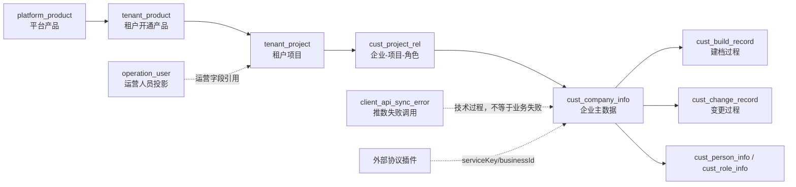

# pplatform-web 系统业务数据知识审核包 v2

## 1. 结论

本目录是按照 `KnowledgePackage 1.0` 和《业务数据知识提取与 SQLBot 资产构建指南 v1.2》重新提取的审核包。它不是业务文档摘要，而是把业务语言连接到表、字段、状态、关系、读写过程和查询规格候选。

- 源仓库：`dev-v1.33.0@ee434954e4`，提取时工作区干净；
- 覆盖 7 个数据相关业务域切片、43 个可追溯来源；
- 生成 84 条标准知识条目：术语 18、口径 8、关系 13、查询范式 7、规则 8、证据 30；
- 未连接实际数据库、未执行候选查询，因此关系全部为 `CANDIDATE`，查询范式全部为 `review_required`；
- 没有把外部协议/通知能力虚构成本地数据表。

## 2. 与旧企业建档样本的差异

旧包只纵向穿透“企业建档”。本包保留该场景的高置信结论，并横向扩展到产品—租户项目—企业角色、租户配置、运营人员同步、OpenAPI 推数和协议数据边界。包 ID 已变更为 `pplatform-system-business-data-v2`，不会覆盖旧审核样本。

## 3. 业务数据主图



## 4. 关键边界

1. 企业数、建档记录数、变更记录数和同步失败次数是四种不同粒度。
2. 企业项目关系按企业 `code` 连接，不可凭字段名猜成 `id`。
3. `top_flag` 是离职人员引用风险提示，不是人员或项目状态。
4. 技术推数完成不等于下游业务完成；失败日志也不等于失败业务对象数。
5. 协议主数据位于外部插件，产融本地只掌握业务引用与路由信息。

## 5. 审核和导入

```bash
backend/venv/bin/python scripts/knowledge-package.py validate docs/knowledge-extraction/pplatform-web/system-knowledge-v2
backend/venv/bin/python scripts/knowledge-package.py preview docs/knowledge-extraction/pplatform-web/system-knowledge-v2 --base-url http://localhost:8000 --datasource-id <ID> --token <TOKEN>
```

先审阅 `review-questions.md`，再绑定真实数据源做 preview。不要在缺少数据库校验时把 relation、caliber 或 example 直接视为已认证运行时知识。
