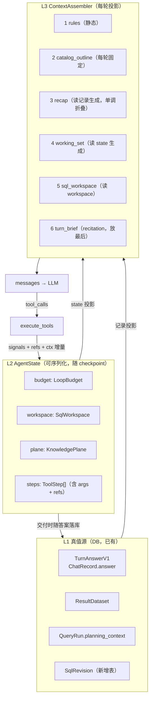

# 上下文 / 工具 / Agent Loop 重构方案

- 目标：统一问数 Agent（`backend/graphs/current/chat.yaml`）的多轮上下文、工具体系、agent loop 三层重构
- 参照系：Claude Code / Agent SDK、Manus、多轮 NL2SQL 生产系统
- 撰写日期：2026-09-29
- 代码依据：逐处核实，引用的 `文件:行` 均已打开确认
- 前置文档：`docs/reviews/tool-state-ownership-analysis-2026-09-29.md`（工具体系状态归属）、`docs/reviews/unified-agent-review-2026-09-29.md`（整体评审）、`docs/对话路由与查询执行统一架构-v6.md`（真值源契约）

---

## 0. 摘要

一句话：**这个 agent 缺的不是"更好的上下文管理"，而是"上下文的归属 "——把"记忆"当成了消息列表，于是每一层都在从消息里猜状态。**

三条主轴：

| 层 | 现状 | 目标 |
|---|---|---|
| 上下文 | 跨轮累积的 messages 就是记忆；读时折叠；从 ToolMessage 里用正则把 SQL/schema 猜回来 | **上下文是每轮现算的投影**，真值来自 DB 记录；recap 直接读 `TurnAnswerV1`，不再解析消息 |
| 工具 | 签名无状态 + 隐式全局副作用；出参 `data: Any`；控制面藏在字符串 key | **输入用句柄（`sql_ref`），输出分平面（`signals` 强类型控制面 + `payload` 强类型数据面）** |
| Loop | 预算只管"执行轮"，知识轮/总调用数无限；6 处独立推导"是否已交付"；澄清可无限重置预算 | **单点 `verdict` + 显式 `LoopBudget`**，终止条件可枚举、可观测、可复现 |

参照系给出的判断（§1.4）：成熟方案在这三条上没有分歧——**外部化状态、引用化输入、显式化预算**。本项目三条都走反了。

---

## 1. 参照系：成熟 agent 怎么做多轮上下文

### 1.1 Claude Code / Claude Agent SDK

| 机制 | 做法 | 对我们的意义 |
|---|---|---|
| 自动压缩（compaction） | 上下文接近上限时，**由 LLM 摘要旧历史**并替换，流里发 `compact_boundary` 事件；`/compact` 可手动触发 | 它有"边界事件"——压缩是一次显式的、可观测的状态变更。我们的折叠是静默的 |
| 工具结果清除（context editing API） | 服务端策略 `clear_tool_uses_20250919`：`trigger`（超多少 token 启动）、`keep`（保留最近 N 次工具调用）、`clear_at_least`（每次至少清多少，因为清除会让 KV-cache 前缀失效）、`exclude_tools`（哪些工具的结果不许清） | **清除的是"结果"，不是"决策"**。我们恰好相反：SQL（决策产物）被排版进历史，工具结果无条件保留 |
| 持久规则再注入 | 系统提示 + `CLAUDE.md` 在压缩后**从磁盘重新注入**，不参与消息历史 | 我们的 `schema_outline` 也在 system 里（`agent_knowledge.py:524-526`），方向对，但没有"压缩后重注入"的协议 |
| 子 agent 上下文隔离 | 子 agent 用独立窗口，只有最终摘要回到父上下文 | 数据类 agent 的对应物是"探查型子任务"——但目前我们连轮内清除都没有 |
| 会话恢复 | session_id + 可选 session_store；resume 恢复完整上下文 | 我们有 checkpointer，但恢复协议不完整（P0-5） |

**关键一条**：Claude Code 的压缩是"摘要替换"，而**不变量（规则）走的是重新注入**。二者的分工很明确：**可变的讲成摘要，不可变的重注入**。我们的 `turn_brief` 缺位、`memory_slots` 断在 prompt 边界，本质是这条分工没建立。

### 1.2 Manus（Peak Ji《Context Engineering for AI Agents》）

六条原则，逐条对照：

| 原则 | 内容 | 本项目现状 |
|---|---|---|
| 1. 围绕 KV-cache 设计 | 前缀必须稳定；**上下文严格 append-only**；确定性序列化；避免 system 里的时间戳 | ❌ `agent_clarify.py:162` 在轮中改写 system message；折叠决策每轮可能回溯（非单调） |
| 2. Mask，不要 Remove | 不动态增减工具（会毁 prefix cache 且让模型迷惑），改写工具定义就地稳定 | ✅ 我们工具集固定（10 个），这条已符合 |
| 3. 文件系统当上下文 | 上下文窗口 = RAM，文件系统 = 磁盘；**压缩必须可还原**："保留 URL 而不是网页内容，保留文件路径而不是文档正文" | ❌ 我们是"保留正文（SQL 明文）丢掉指针"，方向相反 |
| 4. 用 recitation 操纵注意力 | 持续重写 `todo.md`，把全局计划推到上下文**末尾**（模型注意力最强的位置），对抗 lost-in-the-middle | ❌ 没有 recitation。状态在最旧的位置（系统提示里那句"execution_limit"）或压根不在 |
| 5. 把错误留在上下文里 | 失败与堆栈不要清理，模型会隐式更新信念 | ✅ 我们保留失败（`tool_steps` 记 error/failure） |
| 6. 别被 few-shot 带偏 | 同质化的 action-observation 对会让模型模仿次优模式 | ⚠️ 我们的 tool 结果渲染高度同质（都是"成功：…\n…"），有风险但优先级低 |

**第 3 条是本次重构的理论核心**：Manus 的压缩是"内容换成指针"，我们的压缩是"内容排版成文本"。二者对模型的效果完全相反——前者让模型少看、能回取；后者让模型多看、且只能靠复述。

### 1.3 数据类 agent（多轮 NL2SQL / ChatBI）

这一类的共识比 coding agent 更直接，因为它的产物（SQL + 结果集）天生就是可引用对象：

| 实践 | 说明 |
|---|---|
| **对话状态结构化** | 每轮维护 `QueryContext`（指标 / 维度 / 时间 / 过滤），下一轮在其上做**增量修改**，而不是每次从头理解 |
| **历史 SQL 参与改写而非重写** | 把上一轮 SQL 放进上下文，让模型做 rewrite，不是 regenerate。"像分析师一样在上一版上改" |
| **指标口径用语义层模板**，RAG 相似 SQL 做 few-shot 辅助 | schema 全塞进去既贵又糟 |
| **上下文有效期 / 话题切换检测** | 超过有效期或语义不相关时主动清空历史，避免旧上下文成为干扰 |
| **执行-校验-修正闭环** | 执行失败 → 诊断 → 调整 → 重试（ReAct），但每次修正都基于上一版的**显式差异** |

对照：我们已经有 `QueryContext` 的雏形（`QueryIntent` / `memory_slots`），也有"改写而非重写"的工具（`patch_and_compile_sql`），但**上一轮 SQL 进上下文的通道是"排版后的明文"，而不是"可引用的 revision"**——所以"改写"实际退化成"让模型逐字复述上一版再改"。

### 1.4 六条被反复验证的判据

把三家的做法归并，得到六条判据，用它们给本项目打分：

| # | 判据 | 本项目 | 证据 |
|---|---|---|---|
| J1 | 状态外部化：真值在存储层，不在消息里 | ⚠️ 半对：DB 有真值（`TurnAnswerV1`/`ResultDataset`），但 prompt 用的是消息 | §2.2-D |
| J2 | 引用化：跨轮传递用句柄，不用字面量 | ❌ 传 SQL 明文 | `turn_fold.py:111-129` |
| J3 | 压缩可还原：压缩后必须留有回取路径 | ❌ 折叠丢工具结果、留 SQL 明文 | `turn_fold.py:88-95` |
| J4 | 预算显式：每个维度的消耗与上限都是数字 | ❌ 三个维度无上限 | §2.4-A |
| J5 | 注意力定位：关键状态放在上下文尾部（recitation） | ❌ 无 | — |
| J6 | 决策单点：同一事实只有一处推导 | ❌ 6 处 | 前置文档 P0-1 |

**六条里五条不及格。**下面的重构方案逐条对应。

---

## 2. 现状诊断（事实基线）

### 2.1 上下文的真实三层结构

```
┌─ L1 持久层（真值源，权威）────────────────────────────────┐
│  ChatRecord.answer (TurnAnswerV1)   ← 用户看到的答案        │
│  ResultDataset                      ← 已执行数据行          │
│  QueryRun.planning_context          ← 检索边界/知识绑定      │
│  Chat.agent_transcript (JSON)       ← 原始消息（只增不减）    │
└──────────────────────────────────────────────────────────┘
                    │ 读写不对称
┌─ L2 图 state（run-scoped，可 checkpoint）─────────────────┐
│  messages / tool_steps / knowledge_plane / memory_slots   │
│  probe_sql_calls / tool_rounds / open_tool_spans          │
└──────────────────────────────────────────────────────────┘
                    │ prepare_turn 时投影
┌─ L3 模型输入（每轮重建）───────────────────────────────────┐
│  [System(rules + schema_outline)] + [folded history] + [Q] │
└──────────────────────────────────────────────────────────┘
```

### 2.2 上下文层：七个具体病灶

**A. 存储的转录本只增不减，每轮全量反序列化 + 重新折叠**

`append_agent_transcript`（`session_transcript.py:72-96`）只做 `existing.extend(...)`。`load_agent_transcript`（`:49-69`）读出**全部**消息，`fold_history`（`turn_fold.py:69-108`）再从头折一遍。

后果：第 100 轮时，`Chat.agent_transcript` 是一个巨大的 JSON 列，且每轮 O(历史) 的反序列化 + 折叠。折叠结果**不回写**，所以下一轮还得再折一遍。这是 O(n²) 的读放大。

**B. 折叠有硬缺口：预算不是硬上限**

```python
keep = max(int(keep_turns), 1)          # turn_fold.py:81
protect_from = max(0, len(turns) - keep)   # :83  ← 最近 3 轮永不折叠
...
while estimate_tokens(projected) + extra_tokens > token_budget:
    foldable = [i for i in range(protect_from) if levels[i] == 0]
    ...
    if not demote:
        break                            # :105 — 折完还是超，直接放弃
```

两个缺口：
1. **最近 3 轮受保护，永不折叠**——而工具结果的大头恰好在这里
2. 折到 L2 仍超预算就 `break`，**静默超限，没有任何降级路径**（不丢、不摘要、不报错）

**C. token 估算是 `字符数 / 4`**

`estimate_tokens`（`turn_fold.py:27-37`）：`(total + 3) // 4`。对中文 SQL 与 schema 文本误差很大；项目里也**没有真实 tokenizer**（`tiktoken` 未引入，provider usage 只用于审计 `unified_agent.py:540`）。

**D. 结构化状态建好了，在通往模型的路上被摘掉**

这是"不对劲"最纯的一处，两条通道并存、且用的是差的那条：

| 通道 | 路径 | 状态 |
|---|---|---|
| **通道 1：DB → 投影**（正确） | `ChatRecord.answer.datasets[].sql`（`context.py:757`）→ `referenced_turns`（`context.py:842-873`）→ `memory_slots.active_baseline_sql`（`memory_slots.py:97-109`） | **建成、已水合、然后断掉** |
| **通道 2：消息 → 折叠**（在用） | ToolMessage → `_baseline_sql` 猜（`turn_fold.py:162-178`）→ 排版成 `SQL：` 明文 → 模型再解析回来 | **在用，且脆弱** |

断点的三处物证：
- `build_agent_system_prompt(memory_slots=…, change_baseline=…)` 两个参数标 `# noqa: ARG001 — kept for callers`（`agent_prompt.py:156-159`）
- `AgentKnowledgePlane.apply_to_system_message` 同名参数标 `# noqa: ARG002`（`agent_knowledge.py:467`），`rebuild_system_message` 标 `ARG001`（`:805`）
- `render_memory_slots` 的 docstring 直说：**"no longer injected into System"**（`agent_prompt.py:134-135`）
- `build_continued_messages` 签名里**没有** `memory_slots` 参数（`session_transcript.py:143-150`）

而 `memory_slots.active_baseline_sql` 的唯一读取方法 `extract_change_baseline()`（`memory_slots.py:49-59`）在 `apps/` 下**零调用**，只在 `tests/test_unified_agent_e2e.py:28`、`tests/test_agent_recall_exits.py:46`、`tests/test_turn_recall_continuity.py:204` 里被调用。也就是说：**这个字段的存在理由现在只剩"测试在调"**。

**E. 两条通道的数据已经不一致**

`referenced_turns.datasets[].sql` 被**截断到 1200 字符**（`context.py:757`：`str(dataset.get("sql") or "")[:1200]`），而 `fold_turn` 里的 SQL 是全文（`turn_fold.py:118-120`）。

即：如果哪天把通道 1 接回 prompt，长 SQL 会被截断——因为它是为"规划器扫一眼"设计的，不是为"执行/改写"设计的。

**F. 折叠从消息里"猜"三件事，且猜错无人知**

| 猜什么 | 怎么猜 | 正则/规则 |
|---|---|---|
| 基准 SQL | `_baseline_sql` | 优先 `execute_sql_sandbox` 且 `required != False`，否则最后一次（`turn_fold.py:162-178`） |
| 用到的 schema 字段 | `_schema_field_map` + `_sql_usage` | 用正则从 `schema_text` 里逐行抠表头与字段（`turn_fold.py:220-256`），再用 sqlglot 解析 SQL 反推用到的列（`:181-217`） |
| 知识页 | `_page_keys` | 遍历 `search_knowledge` 的 ToolMessage（`:277-288`） |

这三件事在 DB 和 state 里**都有结构化版本**（`knowledge_plane.tables` / `page_keys` / `knowledge_refs`，`agent_knowledge.py`），却选择从消息里正则解析。猜错的后果是静默的：折叠出一个错误的"上一轮 SQL"，模型照着改。

**G. `folds` 账本写了没人读**

`save_fold_meta`（`session_transcript.py:124-140`）把折叠元数据写进 `chat.agent_transcript["folds"]`，而 `load_agent_transcript`（`:58`）**只读 `messages`**。全仓无 `folds` 读取点。

后果：折叠**每轮重新决策**——同一轮历史，这轮可能 L1、下轮变 L0（因为预算或轮数变化），**前缀不稳定，KV-cache 命中率被自己打掉**（违反 J1 的 Manus 原则 1）。

### 2.3 工具层（不重复展开，见前置文档）

摘要：入参 Pydantic 强校验、出参 `data: Any`；控制面信号（`interrupt_required` / `required` / `skipped` / `terminal_answer` / `sql`）全是字符串 key，图路由读无类型 dict（`unified_agent.py:697-701`）；工具经进程内全局字典写状态，state 写入靠循环结束后"刮"（`tooling.py:847-862`）；`_GENERIC_SKIP_KEYS`（`tooling.py:413-424`）是渲染器必须维护的控制面黑名单。

### 2.4 Loop 层：四个病灶

**A. 预算只覆盖一个维度，另外三个无限**

| 维度 | 上限 | 证据 |
|---|---|---|
| 执行轮（execute / patch / compare） | 5 | `EXECUTION_ROUND_LIMIT=5`（`agent_knowledge.py:24`） |
| 知识轮（5 个知识工具） | **无**（`KNOWLEDGE_ROUND_LIMIT=2` 仅 telemetry） | `UNCOUNTED_TOOLS`（`agent_knowledge.py:35`）、`tool_calls_advance_round` |
| 探查 SQL | 2（**软预算，永不阻断**） | `_consume_probe_budget`（`execute_sql.py:87-99`） |
| 总工具调用数 | **无** | `tooling.py:672` 的 for 循环无计数上限 |
| 澄清次数 | **无**（且每次重置 `tool_rounds=0`） | `agent_clarify.py:169-171` |
| 上下文 token | **无**（不计数） | 无实现 |

停止条件只有两个（`tooling.py:833-845`）：非可重试失败、同一失败调用连犯 2 次。加上 `rounds >= round_limit`（`unified_agent.py:426`）。

**后果**：一轮对话理论上可以**无限次调用知识工具、无限次澄清、无限膨胀上下文**。`messages` 里越堆越多，而 `fold_history` 只保护"轮"、不裁"当前轮"。

**B. 澄清会清空工具证据，但消息里还留着**

```python
"tool_steps": [],   # agent_clarify.py:169  reset to avoid re-triggering clarify
"tool_rounds": 0,   # :170
"tool_stop_reason": "",  # :171
```

`tool_steps` 被清空，但 `messages` 里的 ToolMessage **原样保留**。于是同一轮内出现两份互相矛盾的证据：
- `_agent_has_sql_result`（读 `tool_steps`）说"没交付过"
- 模型读 `messages` 说"我交付过"

这既是 `complete_without_sql` 守卫失效的一个入口，也是"同一事实多份推导"的又一个实例。

**C. 图路由依据是一个无类型 dict 的字符串 key**

`route_after_tools_execution`（`unified_agent.py:697-701`）遍历 `tool_steps` 读 `data["interrupt_required"]`。重命名这个 key 不报错，只静默走错分支。

**D. 中断恢复协议不完整**

`_hydrate_chat`（`runtime_context.py:169-176`）只回填 4 个 key（`llm_service` / `access_scope` / `llm` / `bound_tools`）。`sql_delivered`（`execute_sql.py:301` 写入）**既不在 state、也不在 hydration 列表**，跨进程恢复后守卫静默关闭。

### 2.5 判据打分汇总

| 判据 | 现状 | 严重度 |
|---|---|---|
| J1 状态外部化 | 半对（DB 有真值，prompt 不用） | P0 |
| J2 引用化 | 完全不满足 | P0 |
| J3 压缩可还原 | 完全不满足 | P1 |
| J4 预算显式 | 1/6 维度有上限 | P0 |
| J5 recitation | 无 | P1 |
| J6 决策单点 | 6 处推导 | P0 |

---

## 3. 目标架构

### 3.1 三条设计原则

> **原则 1（上下文）**：跨轮记忆是数据库里的记录，不是消息列表。每次发给模型的 messages 是**当轮现算的投影**，投影的输入是记录，不是上一轮的消息。
>
> **原则 2（工具）**：签名即契约。输入用句柄（不可变引用），输出分平面（控制面强类型、数据面强类型），副作用只能是"写入显式传入的 ctx"。
>
> **原则 3（Loop）**：终止条件可枚举，每个预算维度有数字，同一个结论只有一个推导点。

### 3.2 分层与数据流



要点：**上下文不再是"累积物"，而是"投影物"**。同一条事实只有一条路径进上下文（记录 → 投影），不再有"消息 → 正则解析 → 排版"的第二条路。

### 3.3 ContextAssembler 规范

新增 `apps/chat/context_spec.py`（与 `memory_slots.py` / `turn_fold.py` 同级，保持仓库扁平风格）：

```python
class Section(BaseModel):
    kind: Literal["rules", "catalog_outline", "recap", "working_set",
                  "sql_workspace", "turn_brief", "messages"]
    text: str
    tokens: int
    stability: Literal["frozen", "per-turn", "volatile"]

class ContextSpec(BaseModel):
    schema_version: int = 1
    prefix_hash: str                 # 前 N 段的指纹 → 监控 KV-cache 命中
    sections: list[Section]
    total_tokens: int
```

**六段的内容与来源**：

| # | 段 | 内容 | 来源 | 稳定性 |
|---|---|---|---|---|
| 1 | `rules` | 静态规则模板（现 `_SYSTEM_PROMPT_TEMPLATE`） | 代码常量 | frozen |
| 2 | `catalog_outline` | 全库表名大纲 | `render_schema_outline`（DB/wiki） | per-turn（同一 DS 内实际恒定） |
| 3 | `recap` | 历史轮次摘要 | **`ChatRecord.answer` 投影** | per-turn（单调：只增不减地"变旧"） |
| 4 | `working_set` | 已展开表/字段/字典/口径引用 | `AgentState.plane` + `memory_slots` | per-turn |
| 5 | `sql_workspace` | SQL revision 表（见 §3.5） | `AgentState.workspace` | per-turn |
| 6 | `turn_brief` | 本轮简报：任务类型 / 当前 rev / 已交付状态 / 剩余预算 | `LoopBudget` + `verdict` | volatile（**放最后一条消息**） |

**关键规则**：

- **R1 顺序固定**，`rules` 与 `catalog_outline` 永远在最前，构成稳定前缀
- **R2 recitation 放尾部**：`turn_brief` 追加为**最后一条消息的内容**（不是 system），既拿到注意力又不动前缀（Manus 原则 4 + 原则 1 同时满足）
- **R3 折叠单调**：折叠级别只升不降，用 `agent_transcript["folds"]` 作为账本落地（复用已写未读的字段，`session_transcript.py:124-140`）
- **R4 recap 由记录生成，不由消息生成**：

```python
# 现在（turn_fold.py:111-129）—— 从 ToolMessage 猜
def fold_turn(turn, *, level): ...   # 正则解析 schema_text / 猜 SQL / 抓 page_keys

# 目标 —— 从记录读
class TurnRecap(BaseModel):
    question: str
    answer_summary: str            # TurnAnswerV1.content，截断
    status: str                    # succeeded / degraded / failed
    datasets: list[RecapDataset]   # ← 来自 TurnAnswerV1.datasets，含 rev 而非 SQL 明文
    knowledge_refs: dict           # ← 已有，context.py:866
    calibers: dict                 # ← 已有，context.py:862

class RecapDataset(BaseModel):
    dataset_id: str
    rev: str                       # SQL 句柄
    title: str
    fields: list[str]
    row_count: int | None
```

`_baseline_sql` / `_schema_field_map` / `_sql_usage` / `_page_keys`（`turn_fold.py:162-288`，约 130 行正则与猜测逻辑）**全部删除**，被 `TurnRecap` 的字段读取取代。

**R5 存储层同轮压缩**：`persist_turn_from_state` 落盘时，把"已折叠轮"替换为折叠文本（账本记录），原消息按 `keep_turns` 窗口裁剪或归档到冷表。读取路径从 O(n) 降到 O(K + 摘要数)。

### 3.4 工具契约 v2

新增 `apps/chat/tools/contract.py`：

```python
class Signals(BaseModel):
    """控制面。图路由只读这里，不读 payload。"""
    interrupt: InterruptSignal | None = None      # 需要澄清
    terminal: TerminalSignal | None = None        # 文本终局
    skipped: SkipReason | None = None             # 预算跳过（非失败）
    delivery: DeliverySignal | None = None        # required / 交付了哪个 rev+dataset
    failure_kind: str | None = None               # 非可重试错误的分类

class ToolOutcome(BaseModel, Generic[P]):
    ok: bool
    summary: str                 # 给模型的一句话（渲染器只渲染这个 + payload）
    signals: Signals = Signals()
    payload: P                   # 强类型数据面（每工具一个模型）
    refs: Refs = Refs()          # 本工具新产生的句柄：sql_rev / dataset_id / table
```

收益：
- **`_GENERIC_SKIP_KEYS` 直接删除**（`tooling.py:413-424`）：渲染器不可能渲染控制面，因为控制面类型不同、位置不同
- 图路由变成 `signals.interrupt is not None`——有类型、可重构、重命名会报错
- 每个工具的 payload 有自己的模型，出参从 `Any` 变成可校验契约

**签名改造（引用化）**：

| 现在 | v2 | 消掉的问题 |
|---|---|---|
| `execute_sql_sandbox(sql="SELECT...", required=True)` | `execute_sql_sandbox(sql_ref="r7", purpose="delivery")` | SQL 付两次 token；模型复述漂移；无 memo |
| `patch_and_compile_sql(base_sql="SELECT...", action=...)` | `patch_and_compile_sql(base_ref="r7", action=...)` | 同上；且"改错版"无法发现 |
| `compare_results(base_sql=…, new_sql=…)` | `compare_results(base_ref="r7", new_ref="r8")` | 同上 |
| `get_table_schema(tables=[...])` | 不变（本来就是指针式） | — |

`purpose` 取代 `required`：`probe` / `delivery` 是枚举，比布尔更可读，且和 `Signals.delivery` 对应。

### 3.5 SQL Workspace（句柄的实现）

```python
class SqlRevision(BaseModel):
    rev: str                       # "r7"，chat-scoped 单调递增
    ds_id: int
    sql: str                       # 全文，不做 1200 截断
    sql_hash: str                  # sha256(normalized sql)，用于 memo
    tables: list[str]              # sqlglot AST 派生的真实表
    parent_rev: str | None         # patch 来源
    origin: Literal["model", "patch", "inherit"]
    status: Literal["draft", "compiled", "executed", "delivered", "failed"]
    dataset_id: str | None
    executed_at: datetime | None

class SqlWorkspace(BaseModel):
    revisions: dict[str, SqlRevision]
    current: str | None            # 当前工作版本
    delivered: str | None          # 已交付版本（← 唯一的"是否已交付"真值源）
    def apply_patch(self, base: str, new_sql: str) -> SqlRevision: ...
    def find_by_hash(self, ds_id: int, sql_hash: str) -> SqlRevision | None: ...
```

**模型看到的 `sql_workspace` 段**（这是全文的替代品）：

```
r5 [已交付] 华东区月度销售额 · 2 表 · 312 行 · fields=month,amount · dataset=d_8812
r6 [已执行] ← patch(r5, 加 region='华南') · 2 表 · 0 行
r7 [草稿]   ← patch(r6, 去掉 region 过滤) · 2 表
```

**承载位置**：
- run 内：`AgentState.workspace`（可序列化 → 可 checkpoint → 可恢复）
- 跨轮：随 `TurnAnswerV1` 落库（每个 dataset 带 `rev`），下一轮在 `referenced_turns` 里读回（复用已有通道 `context.py:757`，只是把"截断 1200 的明文"换成"rev + 元数据"）

**收益与前置文档路线 B 完全一致**：

| 收益 | 说明 |
|---|---|
| token | SQL 不再"出一次（工具返回）+ 进一次（下轮折叠）" |
| 零漂移 | 模型不可能改到它没读过的字节；`patch` 的 base 由服务端解析 |
| 可缓存 | `find_by_hash(ds_id, sql_hash)` 命中直接返回旧 `dataset_id`（今天完全没有 memo，P1-1） |
| 可重放 | `tool_steps` 记 `(tool, args, refs)`，重放只需 rev 链 |
| 修复 P0-1 | "本轮是否交付 SQL"从 6 处收敛成 `workspace.delivered` |

### 3.6 Agent Loop v2

**终止条件显式化**——新增 `verdict` 单点：

```python
# apps/chat/graphs/nodes/agent_verdict.py
class Verdict(BaseModel):
    action: Literal["continue", "clarify", "finalize", "fail"]
    reason: str
    evidence: DeliveryEvidence | None

def compute_verdict(state, outcomes: list[ToolOutcome]) -> Verdict:
    """唯一的图路由决策点。"""
    if any(o.signals.interrupt for o in outcomes):      return Verdict("clarify", ...)
    if any(o.signals.terminal  for o in outcomes):      return Verdict("finalize", ...)
    if state.budget.exhausted:                          return Verdict("finalize", ...)
    if state.workspace.delivered and no_pending_calls:  return Verdict("finalize", ...)
    if state.consecutive_failures >= 2:                 return Verdict("fail", ...)
    return Verdict("continue", ...)
```

`route_after_tools_execution`（`unified_agent.py:697-701`）改为读 `verdict.action`。**6 处推导（前置文档 P0-1）全部换成 `state.workspace.delivered` + `verdict`。**

**预算显式化**：

```python
class LoopBudget(BaseModel):
    exec_rounds:      BudgetSlot(max=5)
    knowledge_rounds: BudgetSlot(max=4)     # 新增：现在无上限
    probe_calls:      BudgetSlot(max=2, soft=False)   # 从"软提示"改成真的会拒
    tool_calls:       BudgetSlot(max=24)    # 新增：现在无上限
    clarify_count:    BudgetSlot(max=2)     # 新增：现在无上限
    context_tokens:   BudgetSlot(max=<按模型窗口计算>, soft=False)
    @property
    def exhausted(self) -> bool: ...
```

规则：
- **所有预算在 `execute_tools_node` 单点更新**（消除 `_consume_probe_budget` 的无锁 read-modify-write，`execute_sql.py:87-99`）
- **澄清不再重置执行预算**（`agent_clarify.py:169-171` 改为只清 `tool_steps` 里的澄清标记，不清计数）
- 预算耗尽时，`turn_brief` 里明确告知模型"工具已关闭，请基于已有信息作答"（现在只有执行轮耗尽才这么干，`unified_agent.py:435-446`）

**轮内工具结果生命周期**（对应 Anthropic `clear_tool_uses`）：

- 同一轮内，保留**最近 8 条** tool 结果原文
- 更早的替换为占位：`[已清除 · 表 t_orders 已展开(见 working_set) · rev r6 · dataset d_8812]`
- **不清理**：失败的调用（Manus 原则 5）、`sql_workspace` 段、`working_set` 段

关键点：**清除的是"可回取的内容"，保留的是"指针与决策"**。因为 working_set / sql_workspace 独立成段，清除不会丢失语义。

**中断/恢复协议**：

| 项 | 目标 |
|---|---|
| checkpoint 内容 | `budget` / `workspace` / `plane` / `steps` —— 全部可 msgpack；ORM 对象仍不进（保留 `runtime_context.py:100-108` 的正确取舍） |
| 划边界 | **能否 msgpack 序列化**，而不是"是不是运行时对象" |
| resume | `_hydrate_chat` 只重建 request 对象；**业务状态一律从 state 读**，`sql_delivered` 这类进程内标志删除 |
| 澄清后 | `steps` 不清空，只标 `superseded_by_clarify`；避免"state 说没交付、messages 说交付过" |

### 3.7 复用什么、不动什么

**不动（这些是对的）**：
- `chat.yaml` 单拓扑 + LangGraph checkpointer（`thread_id=run_id`）
- 权限每次重算、不进 checkpoint（`runtime_context.py:100-108`）——只是把可序列化的业务状态挪进来
- `TurnAnswerV1` / `ResultDataset` / `QueryRun` 三个真值源（v6 文档：`docs/对话路由与查询执行统一架构-v6.md:5-17`）
- 工具的 Pydantic `args_schema` 强校验（10 个模型）
- 安全类不变量在代码里（AST 派生真实表、白名单校验、探查拒绝）
- 工具集固定不动态增减（符合 Manus 原则 2）

**复用（已建好但没接上的）**：
- `memory_slots` → 接进 `ContextSpec.working_set`（而不是继续 `# noqa: ARG001`）
- `agent_transcript["folds"]` → 变成折叠账本（而不是写了不读）
- `referenced_turns` → recap + SQL 继承的唯一入口（而不是再造一套）

---

## 4. 分期落地

每期独立可验证、可回滚。**顺序不可颠倒**：Phase 1 不做完就上 Phase 2 的并行，会放大现有缺陷。

### Phase 0 — 先能看见（1-2 天，零行为变更）

| # | 动作 | 产出 |
|---|---|---|
| 0.1 | 新增 `ContextSpec` 只读快照：组装时算各段 tokens / prefix_hash，写进审计 span | 能回答"一轮的上下文多大、涨在哪段" |
| 0.2 | 引入真实 token 计数（`count_tokens` 接口或 tiktoken 近似），替换 `char/4` | `context_tokens` 有真值，作为 Phase 1 预算的基础 |
| 0.3 | 埋点：每轮 tool_calls 数、澄清次数、折叠级别分布、`Chat.agent_transcript` 体积 | 证明 §2.4-A"预算无限"在线上是否已发生 |

**验收**：能出一张"上下文构成与增长"的实际数据表，而不是估算。

### Phase 1 — 消 P0（3-5 天）

| # | 动作 | 消掉 | 验证 |
|---|---|---|---|
| 1.1 | `ToolOutcome` / `Signals` 类型化；路由读 `signals` | P0-2 | `_GENERIC_SKIP_KEYS` 删除；路由有类型 |
| 1.2 | `compute_verdict` 单点；`workspace.delivered` 取代 6 处推导 | P0-1 | 单测：交付后 6 个入口给出一致结论 |
| 1.3 | `sql_delivered` 从 state 派生并删除进程内标志 | P0-5 | 跨进程恢复后守卫仍生效 |
| 1.4 | 预算单点更新（`execute_tools_node`）；补 `knowledge_rounds` / `tool_calls` / `clarify_count` 上限 | P1-3 / J4 | 并发压测计数准确；超限拒绝而非提示 |
| 1.5 | 澄清不再重置 `tool_rounds`；`tool_steps` 不清空 | §2.4-B | 澄清后 `verdict` 与 messages 一致 |

### Phase 2 — 上下文重构（5-8 天）

| # | 动作 | 消掉 | 验证 |
|---|---|---|---|
| 2.1 | `SqlRevision` / `SqlWorkspace` + `sql_ref` 参数；两处工具签名改造 | J2 / P1-1 | 端到端：增量修改轮上下文里不出现 SQL 字面量 |
| 2.2 | `recap` 改由 `TurnAnswerV1` 投影；删 `turn_fold.py:162-288` 约 130 行猜测逻辑 | J1 / J3 | 折叠结果与记录一致；正则代码删除 |
| 2.3 | `ContextSpec` 六段上线；`turn_brief` 作为最后一条消息 | J5 | 模型不再需要从历史里推断"当前 rev" |
| 2.4 | 折叠单调化 + `folds` 账本落地；存储层同轮压缩 | J1 / KV-cache | 同轮重算的 prefix_hash 稳定；transcript 体积不再线性增长 |
| 2.5 | `memory_slots` 接进 `working_set`（或删除死字段） | P0-4 | `# noqa: ARG001` 消失 |

### Phase 3 — 优化项（可选）

| # | 动作 | 前置 |
|---|---|---|
| 3.1 | 轮内工具结果清除（保留最近 8 条，失败保留） | 2.3（working_set 独立成段后才安全） |
| 3.2 | 并行执行安全子集（`get_table_schema` / `lookup_values` / `get_dict_values`） | 1.1 + 1.4（signals 类型化 + 预算单点） |
| 3.3 | LLM 摘要兜底（仅当确定性折叠仍超预算） | 2.2 + 2.4；非必要不上 |

---

## 5. 不做什么（避免过度工程）

| 不做 | 理由 |
|---|---|
| 引入第二套记忆/向量库 | DB 已经是真值源（`TurnAnswerV1` / `ResultDataset` / `QueryRun`），再叠一层只会造成第三份真值 |
| 优先上 LLM 摘要压缩 | 确定性折叠就能解决（真值在 DB）；LLM 摘要引入成本、延迟、不可复现，只该做兜底 |
| 动态增减工具集 | 违反 Manus 原则 2；10 个工具不算多，保持稳定 |
| 为并行而并行 | 并行是"工具真的无副作用"之后的结果，不是目标。顺序：类型化 → 单点写入 → 并行 |
| 重写真值源 schema | v6 的四个真值源是这次重构的**基石**，只在其上扩字段（`datasets[].rev`），不换模型 |
| 一次性大重构 | 本方案刻意分成 4 期、12 个可独立验证的小步 |

---

## 6. 待拍板决策点

| # | 问题 | 选项 | 倾向 |
|---|---|---|---|
| D1 | SQL workspace 承载 | (a) 只在 `AgentState`（+ 交付时随答案落库）(b) 新建 `sql_revision` 表 | **(a)**：run 内够用，跨轮靠答案记录；避免又一次"写了没人读" |
| D2 | `active_baseline_sql` 处置 | (a) 接回 `working_set` (b) 连字段删除（承认靠 transcript） | **(a)**：通道 1 已经建好并水合，接上是顺的；删了等于放弃结构化通道 |
| D3 | 是否接受工具读 ctx（有状态工具） | (a) 工具签名带 `ctx: TurnCtx` (b) 工具仍纯函数、只收 refs、返回 refs | **(b)**：refs 已能覆盖 SQL/表/值三类，纯函数性质保住，且天然可并行 |
| D4 | 转录本保留策略 | (a) 按 `keep_turns` 裁剪 + 折叠文本回写 (b) 归档到冷表（全量保留） | **(a)** 保审计用 (b) 更完整；建议 (a) + 独立审计表（chat_log 已有） |
| D5 | 预算缺省值 | `knowledge_rounds=4` / `tool_calls=24` / `clarify=2` | 需按 Phase 0 实测分布校准 |
| D6 | `chat_question.db_schema` | 删（写入点 live，读点全在退役的 `nlq/`） | **删**：少一个状态位，第三例"写了没人读" |

---

## 附：与参照系的一一对应

| 参照实践 | 本方案对应 |
|---|---|
| Claude Code 自动压缩 + `compact_boundary` | `ContextSpec` 快照 + 折叠账本（`folds`）+ 显式折叠级别 |
| context editing `clear_tool_uses` | Phase 3.1 轮内工具结果清除（保留最近 8，失败不清） |
| CLAUDE.md 压缩后重注入 | `rules` / `catalog_outline` 恒在最前、不入折叠范围 |
| Manus 文件系统当上下文 | SQL Workspace 句柄 + working_set 段（留指针，丢正文） |
| Manus recitation（todo.md） | `turn_brief` 段放最后一条消息 |
| Manus "keep the wrong stuff in" | 失败调用不清理；`tool_steps` 保留 error/failure |
| Manus append-only / KV-cache | 段顺序固定 + 折叠单调 + `prefix_hash` 监控 |
| 多轮 NL2SQL 的 QueryContext 增量修改 | `QueryIntent` + `SqlWorkspace`（在 rev 上 patch，不重写） |
| 子 agent 上下文隔离 | Phase 3.3 的探查型子任务（暂不必要） |
