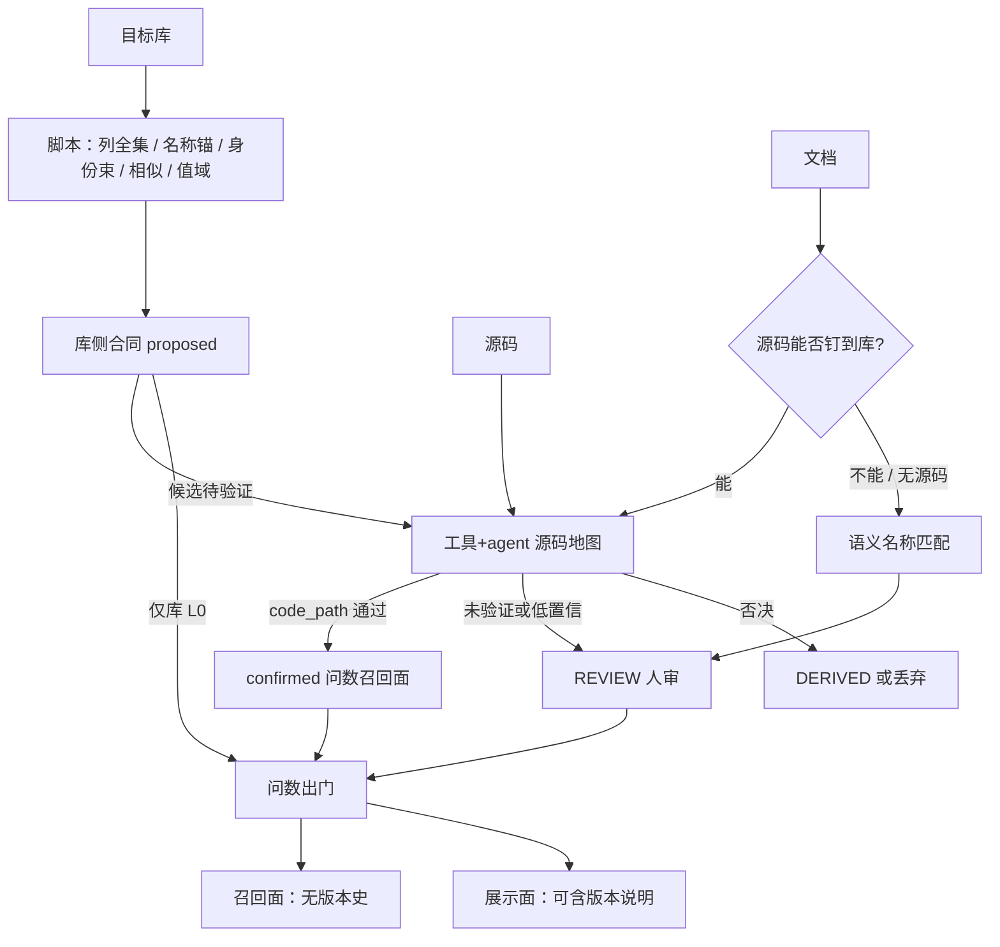

# Wiki 知识提取规范指南 v1

> **已废止（2026-09-15）。** 权威迁至 [`docs/wiki/extract.md`](../wiki/extract.md)。CLI 细节若下文仍可用，以代码为准、以新文档为契约。本文仅作历史。

> 日期：2026-09-10 · 架构修订：2026-09-15 · 原状态：问数 Wiki 提取操作权威（已由 `docs/wiki/` 取代）  
> 读者：执行提取的 agent / 工程师。格式语法不在本文展开，见契约；召回与产品化不在本文操作面。

本文把已落地的提取管线收成一份可执行 runbook。**架构与对象以 §3 为准**；命令与 HOW 见 §4 起。阶段名与代码一致；文档与代码冲突以本文「权威裁决表」为准。

---

## 0. 本文地位、读者、不做什么

**本文 = 问数 Wiki 提取的唯一操作权威。** 写页面、跑脚本、过门禁、独立重提，只认本文 + 其交叉引用。

| 交叉引用 | 管什么 | 与本文关系 |
|---|---|---|
| [`docs/wiki页面契约-spec-v0.md`](../wiki页面契约-spec-v0.md) + [`contract.py`](../../backend/apps/knowledge/wiki/contract.py) | ground 语法、frontmatter、lint 全码表 | **格式权威**；本文只列提取需要的子集 |
| [`问数知识链路契约.md`](./问数知识链路契约.md) | 提取→召回→投影→门禁 hop；P6a/P6b；切流门槛 | **运行时/编译面**；与本文冲突时运行时以链路契约为准，写页仍以本文 §3 / §11.4 为准 |
| [`wiki知识体系统一方案-v3.md`](./wiki知识体系统一方案-v3.md) | 产品/运行时、双轴状态、P1–P11 | **不**另写提取步骤 |
| [`wiki知识体系统一方案-v2.md`](./wiki知识体系统一方案-v3.md) §2.0 | E0–E3 / Step A–F 设计语义 | 提取面设计来源；**架构与执行序以本文 §3 为准** |
| [`wiki源码摄取适配器-v1.md`](./wiki源码摄取适配器-v1.md) | 确定性打底 + 两步 ingest 思想 | 细节以 `ingest.py` 为准 |
| [`wiki召回接口-v1.md`](./wiki召回接口-v1.md) | 运行时召回 | **本文不覆盖召回操作** |
| [`.cursor/skills/knowledge-extraction/`](../../.cursor/skills/knowledge-extraction/) | 扫描器脚本 + 读码硬约束 | wiki **不跑** `knowledge-package submit`；HOW 已转写进 §7.4 / §12 / §13 |
| 实现 | `pipeline.py` / `ingest.py` / `baseline.py` / `filters.py` / `field_roles.py` / `scripts/wiki_admin.py` / `scripts/wiki_enrich.py` | **操作真值**，高于过时方案叙述 |

**读者**：跑提取的人（含 AI agent）。假设已能在 `backend/` 用 venv 调 Python。

**本文不做什么**：

- 不定义召回算法、embedding、datasource 绑定（见召回接口 / `corpus_store.py`）
- 不把 KnowledgePackageV2 当 wiki 产物（`knowledge-package.py scan/decompose/submit` 是旧 unit 旁路）
- 不设计产品化 worker / `wiki_*` 受管表（v3 阶段二）
- 不把好答案回填当本轮必做（已知债，见 §17）

**旧文档降级**：

| 文档 | 地位 |
|---|---|
| `wiki页面契约-v1.md` | superseded（权威 = spec-v0） |
| `wiki知识体系完整方案-v1.md` / `wiki知识体系总体方案.md` | 失败模式 F1–F7 仍对照；阶段表以本文 + v3 为准 |
| `docs/业务系统知识库提取与构建指南-v1.md` 及 v1.4 增补 | 历史经验；与本文冲突则废弃 |
| skill `SKILL.md` 11 步 | **unit 包路径**；wiki 只复用其脚本与读码约束 |

---

## 1. 权威裁决表 + 按知识问题分源 + 证据 kind

### 1.1 文档 vs 代码冲突（必须当场记住）

| 冲突 | 裁决 |
|---|---|
| v2 §2.0 把 Step A 写在 B/C 之前；`pipeline.plan` 实际读取 `callgraph.yaml` | **执行序 ≠ 字母序**。先 B+C+E3（+ field-roles + 三方对账），再 baseline+enrich，再 A，再 D1/D2/E/F。字母名保留以对接代码注释 |
| v2 Step D 上下文含「既有 wiki」；`assemble_context` 只有四块 | **独立重提禁止读旧问数 wiki**。block⑤ 未实现，升格为硬禁令 |
| 技能 11 步 vs wiki 页面树 | wiki 主路径不跑 `knowledge-package submit` |
| 契约 11 种目录 vs 现语料 | **出门按档位**：L0 = table 列全集 + 名称锚 + 注释/profile 枚举候选；L1 另加 scenario / concept / process / caliber / rule。metric / pattern 有证据才建；query / source 默认不做 |
| 「库 > 代码 > 文档」vs 「代码是术语桥」 | **按知识问题分源**（下表），不是单一总分 |

### 1.2 按知识问题分源

| 知识问题 | 唯一权威 | 参照 | 冲突处理 |
|---|---|---|---|
| 表/字段是否存在、类型、可空、索引 | **E2 DB catalog** | Entity `@TableName` / `@TableField` | 不一致 → `FIELD_NOT_IN_DB` / 三方对账 `db_only`/`code_only`，以 DB 为准建页 |
| 实测值域 / TopK / 行数 | **E2 profile/sample** | 代码常量 | DB 有、代码无 → `ENUM_VALUE_NOT_IN_DB` 或 `db-enum-reconcile` REVIEW |
| 枚举 dictKey → 业务 label、状态名 | **E3 源码枚举/常量 + Javadoc/行内注释** | 需求用词 | **禁止 LLM 脑补 label** |
| Join / 写值 / 状态机 From→To | **Service/Mapper 实际读写 + 注释** | 需求流程 | 无 `code_path` 不得落 ground |
| 用户说法、同义/易混边界 | **需求用词 + 代码注释/API 文案** | — | 物理锚必须来自代码赋值/`.eq()` |
| 版本意图（「本期不处理」） | **需求文档** | — | 只进散文 `## 版本演进`；代码已实现则以代码落锚 |
| 怎么切单元 | **E1 调用图** | E0 路由文档 | E1 不做语义裁决 |

权威序压缩版：**E2 > E3（含注释）> E0.5 > E0**；E1 只管切分。

### 1.3 证据 kind（写入 `sources` / ground `evidence`）

| kind | 含义 | 例 |
|---|---|---|
| `database_profile` / `db_dist` | 库字段实际值/分布 | `cust_build_type` 98.8% `AGW_BUILD` |
| `database_schema` | DDL / catalog 列 | `db:db-catalog.yaml` |
| `code_path` | 读写证据 `文件:行号` | `CustCompanyInfoApplication.java:88` |
| `code_enum` | 枚举/常量类 + 注释 | `CustBuildTypeConstant.PC_BUILD` |
| `document_claim` / `reqdoc:<slug>` | 需求主张（最弱） | 未回证不得进 ground |
| `enrich:wiki-admin` | 程序 enrich 盖章 | 关系节/scope/行数 |

休眠表只允许 `database_schema`；出现 `code_path` 则与「休眠」矛盾，须重判。

---

## 2. 目录与文件清单

中间产物 **不进召回**。运行时只认 `wiki-pages/`（或独立重提的 `wiki-pages-v2/`）。

```
docs/wiki-knowledge/<system>/          # 例：pplatform
├── db/                                # E2
│   ├── db-catalog.yaml
│   ├── db-profile.yaml
│   └── db-sample.yaml
├── substrate/                         # E1 + E3（独立重提用 substrate-v2/）
│   ├── callgraph.yaml
│   ├── extract-catalog.yaml
│   ├── extract-enums.yaml
│   ├── extract-relationships.yaml
│   ├── field-roles.yaml
│   └── tmp/
│       ├── page-plan.yaml             # Step A 产物
│       ├── code-ignore.yaml           # 源码过滤（人固化）
│       ├── reqdoc-filter.yaml         # E0.5 白名单（人固化）
│       ├── table-reconcile.yaml       # 表级三方对账
│       ├── db-enum-reconcile.yaml     # 枚举值 db vs 代码
│       └── enum-unbound.yaml          # baseline 未绑字段的枚举
├── req-index/                         # E0.5 中间层（docx→md）；或指向 Test-wiki
└── wiki-pages/                        # 最终语料（独立重提：wiki-pages-v2/）
    ├── _index.md                      # 程序生成，勿手改
    ├── tables/ enums/ concepts/ processes/ calibers/ rules/
    └── .runs/<topic>/                 # _review_*.yaml _reconcile_*.yaml _done
# 预览组织语料（未切运行时）：wiki-pages-v3/ ；纪律见 §11.4
```

过滤清单与对账 YAML 是**一等产物**，不是可选附录。Step A 只给 `ignore_suggestions`，人工写入 `tmp/` 后全管线共用 [`filters.py`](../../backend/apps/knowledge/wiki/filters.py)。

---

## 3. 提取架构流程链路（锁定）

> 2026-09-15 起本节是提取规范的**架构真值**（同日修订：四档输入、两套中间 wiki、有机印证、低置信人审）。字母名（A–F）对接现有 `pipeline.py` / `ingest.py`，是 **L1 全量档** 的实现细节，不是唯一档位。命令与切片预算仍见 §4–§7；页类型 HOW 见 §11。后续改 HOW 不得推翻本节对象、档位与印证规则。

### 3.1 一句话

**库是唯一必选输入。** 三者有则 **有机印证**，不是三条互不相干的管道：库给出存在与候选，源码是业务的唯一落地实践、也是产品用词钉到库的桥梁，文档只提供用户怎么叫。低置信或未经代码验证的绑定 **必须进人工审核**，不得标 confirmed、不得当规划器硬约束。

对话沉淀、以及库/源码/文档变更，走增量流程，不挤进首次全量编译。消费者是 SQL 规划器。问答时不重读仓库，不把 catalog 当运行时 schema。

### 3.2 三套页面（禁止混库）

| 套 | 给谁看 | 进问数召回？ | 典型内容 |
|---|---|---|---|
| **库侧合同** | 规划器（L0 即可发布）+ 后续编译 | 是（表/枚举/名称锚） | 列全集、注释 label 候选、profile 值域、**身份束 / 同名 / 相似 / 值域重合** 的 proposed 关系、名称锚列 |
| **源码地图** | agent / 人读代码 | **否** | 调用、写值、共写组、枚举赋值、注释、入口→表、场景证据 |
| **问数出门** | 规划器 | **仅召回面** | scenario / 认证 JOIN / process / concept / caliber / rule；给人看的版本史不进向量 |

旧名「底稿 YAML」仍可作工具落盘，架构真值是上面三套页面。

仍禁止混名：topic = 有源码时的提取批次，不是 runtime scenario。

### 3.3 四档输入 + 两条钉锚路径

对话沉淀是所有档位上的增量，不占第五种输入。

| 档位 | 输入 | 产品用词怎么钉到库 | 编不出 |
|---|---|---|---|
| **L0 仅库** | 目标库 | 无产品文档；只有列名/注释 | 认证 JOIN、生命周期、代码 label、场景窗 |
| **L0+文档** | 库 + 文档 | **只能**靠语义名称 / 语义分析对齐列与注释 | 无代码桥梁；**默认低置信，进 REVIEW** |
| **L1 库+源码** | 库 + 仓库 | 源码注释/API/写值即产品用词现场 | 文档侧用户叫法可能不全 |
| **L1 全量** | 库 + 源码 + 文档 | **优先源码桥梁**；源码没有的文档主张 **回退语义名称匹配，默认低置信 → REVIEW** | — |

库连不上则编译失败。无源码跳过源码地图。无文档跳过叠加。

**置信与人审（硬规则）：**

- 源码 `code_path` 回证的 JOIN / 锚 / 口径 / 状态机 → 可标 confirmed（仍经 lint）。
- 仅库信号（同名 / 相似 / 身份束 / 值域重合）或仅文档语义匹配（含全量档里源码覆盖不到的文档主张）→ **proposed + 必须 REVIEW**，不得当 EQUI_JOIN、不得当唯一物理锚进规划硬路径。
- 有源码时：库侧候选 **必须用代码逻辑验证**（JOIN / `.eq()` / 共写）。验证通过 → confirmed；验证失败 → 标 DERIVED/否决；**没有代码验证** → 保持 proposed 并 **强制人审**。
- 语义匹配或规则打分低于出门阈值（实现可调，契约只要求「低置信不得静默转正」）→ 同一 REVIEW 队列。

### 3.4 有机印证（三者不是管道拼接）

```
        文档用词 / 口径名称
                 │
        ┌────────┴────────┐
        ▼                 ▼
   源码能钉到库         源码没有
   （桥梁，可 confirmed） 回退语义匹配 → REVIEW
                 │
        给人看的版本史 → 页内「展示」区，禁止进向量
源码实践 ←──────印证──────→ 库存在 / 分布 / 身份束候选
  读写 JOIN、共写组、窗字段、     catalog、topk、注释、
  枚举 label、生命周期、注释       xxx_id/name/code 束
                 │                         │
                 └────────印证─────────────┘
                              │
                    冲突或低置信 → REVIEW
                    一致且有 code_path → 问数召回面
```

代码是业务场景的 **唯一落地实践**。库证明存在与分布。文档证明用户怎么叫：**能经源码钉库的走桥；源码没有的允许语义回退，但默认低置信人审。** 无源码档整路都是语义匹配 + REVIEW。

### 3.4.1 页内召回面 / 展示面（严格分块）

同一 wiki 页必须能机器区分 **向量化（召回）** 与 **非向量化（仅展示）**。切块、词法、embedding **只消费召回面**；页面渲染仍可展示全文。

| 标记 | 效果 |
|---|---|
| 默认正文、`ground:` 块 | 召回面（向量化） |
| 标题为 `展示` / `版本演进` / `版本说明` / `给人看` / `本期说明` / `排期`，或其子标题 | 该节整段非向量化 |
| 标题含 `不召回` | 同上 |
| 围栏 ` ```wiki:display `（或 `display` / `wiki:norecall`） | 该围栏非向量化 |
| 页头 `recall: false` | 整页不进问数召回（源码地图默认如此） |

`ground:` 合同块禁止放进展示区。版本史、本期不处理、排期只进展示区。

### 3.4.2 未确认主张留在同一知识面

不要为争议另开一套 wiki，也不要把整页打回 `draft`。页是知识面；未确认是页上的主张。

| 做法 | 对规划器 |
|---|---|
| 整页 `draft` / 另开 REVIEW 影子页 | 连已确认的字段/取值也丢了 |
| 争议塞进 `## 展示` | 规划器看不见冲突，会静默选边 |
| 争议从 values 删掉只留「看起来真」的一侧 | 静默覆盖，违反权威序 |
| **主张 `confidence: disputed` 留在召回面，标争议 + `sides`** | 依赖该取值则澄清；其余 confirmed 值仍可硬用 |

REVIEW 队列只存 `(page_key, claim_path)`。人审改主张，不换页身份。`proposed` 可召回但不得当硬 JOIN / 唯一锚。`rejected` 才离开召回面。

字段取值争议的典型写法：同一 enum 页里 confirmed 值与 disputed 值共存；disputed 条目列出代码 / DB / 文档各方，禁止只写一个 label。

### 3.4.3 全量 wiki vs 数据源勾选（运行时透镜）

提取产出的是 **库全量** 知识面。问数数据源勾选其中几张表、若干字段，是 **请求时掩膜**，不是二次编译。

- 取消勾选表（DB 表仍在）或取消勾选字段：下一问立刻生效；再勾选立刻恢复。不改 `wiki_page`，不跑 ingest。
- 掩膜作用点：召回命中过滤 → 图扩展子图 → `project_schema` 列集 → plan_gate（SQL 不得引用未勾选表/列）。
- 跨表口径 / 场景窗：裁剪未勾选端，不要因为窗里有一张未勾选表就把整页扔掉（剩余勾选锚仍可用）；若口径的 `field_targets` 全部落在未勾选列上，该口径本轮不可执行。
- 用户问到未勾选对象：澄清「当前数据源未选择」，**不是** `SCHEMA_PAGE_MISSING`，**禁止** catalog 直渲。
- 勾选了但 wiki 缺表页：才是 P6b。
- 未确认主张与未勾选是两轴：争议字段若已被取消勾选，本轮不必澄清。

列权限是勾选之后的访问门禁，不代替 `checked`。

### 3.5 主流程（同一条脊，印证是环不是后缀）

```
① 库侧合同（必选，脚本）
   catalog / profile / 注释词典 / 名称锚
   关联候选加宽：同名、列名相似、值域重合、
   身份束（A.id|name|code ↔ B.xxx_id|xxx_name|xxx_code）
   → 全部 proposed；身份束里默认只有 id/code 可当键，name 倾向拷贝
   → 仅库档：这些候选全部进 REVIEW 后才可升格；否则保持 proposed 出门

② 源码地图（有仓库；工具 + agent）——业务实践层
   调用切片、枚举/常量/注释、setter/mapper、
   同表共写组（签约金额↔签约时间）、跨表共写束（写 fk 同时写 name）
   → 不进问数召回
   → 用代码验证 ① 的库侧候选：通过=confirmed，否决=DERIVED/丢弃，未验=REVIEW
   → 按 topic 加深问数 wiki：scenario 窗、EQUI_JOIN、process、代码 label、术语边界

③ 文档叠加（有文档；必须已有 ①）
   全量档：优先经源码桥梁落到 表.字段（可进召回面）
           源码覆盖不到的文档主张 → 语义名称匹配，默认 REVIEW
   库+文档档：整路语义匹配，默认 REVIEW
   版本史 / 本期不处理 / 排期 → 页内展示区（§3.4.1），不进向量
   无锚新词 → REVIEW，禁止进向量

④ 出门
   lint；低置信/无代码验证的关系与术语不得标 confirmed
   L0 不要求 scenario；L1 按 §3.7
```

名称锚：wiki 只声明列；实例值进 `value_index`。现有 A–F 对应 ② 的 L1 实现（计划在库侧合同之后）。独立重提禁止把旧问数 wiki 当生成上下文。



### 3.6 角色

| 谁 | 只许做什么 | 禁止 |
|---|---|---|
| **脚本 / 工具** | 存在性、profile、身份束/相似/值域候选、调用切片、共写组、lint | 把候选写成认证 JOIN；把低置信标 confirmed |
| **Agent** | 维护源码地图；用代码印证库候选与文档用词 | 整仓自由翻；源码地图进问数召回 |
| **人闸** | **所有低置信 / 无代码验证项**；档位、双入口、切流 | 手改 published 当补丁；跳过 REVIEW 静默转正 |

### 3.7 出门物（按档位）

**所有档位：** `table` 列全集；名称锚；身份束写在表页关系区（状态=proposed|confirmed|review）。休眠表仍留列全集。

**L1 另必建：** `enum`（代码 label）、`scenario`、`concept`（含易混 boundary）、lifecycle `process`、可执行 `caliber`/`rule`、共写组约束。`metric`/`pattern` 有证据才建。

召回面不含版本史。L0 不强制 scenario。

### 3.8 本链路明确不做

- 无代码验证的库关联直接 EQUI_JOIN；文档语义匹配直接当物理锚
- 低置信静默转正；跳过 REVIEW
- 版本史 / 本期不处理 进向量库
- 把争议主张塞进展示区，或把整页打回 draft 来「躲开」一个取值争议
- 勾选变更时重写 wiki / 另编译一份「绑定子集语料」
- 身份束里用 `xxx_name` 当 JOIN 键（无代码证明）
- `knowledge-package submit`；查询时翻源码；catalog 运行时补列；实例值写成 wiki 页；一值一口径；假状态机

### 3.9 增量（主流程之外）

- 对话澄清 / 成功 SQL → REVIEW → `concept`/`pattern`
- 库 / 源码 / 文档变更 → 按档位重跑 ①②③，印证环重算，禁止手改 published

### 3.10 后续完善顺序

1. **已锁**：对象、档位、印证环、两条钉锚路径、低置信人审、召回/展示分面、主张级置信、DS 勾选掩膜（运行时，不改提取出门物）
2. 库侧身份束 / 相似 / 值域 候选格式与置信
3. 源码验证器（JOIN、共写组、注释）与 REVIEW 队列（指针到 claim_path）
4. 文档语义匹配（无源码档）与 disputed chunk 标记
5. 运行时：wiki 召回接 `checked` 掩膜；L1 穿透 HOW；lint 出门码表

---

## 4. 底稿阶段（B / C / E3 + field-roles + 三方对账）

### 4.1 输入

| 输入 | 说明 |
|---|---|
| Java 仓库 | Spring + MyBatis-Plus；分析只读文本，**禁止执行** mvn/gradle/npm |
| DB | 默认识别目标仓 Spring profile（pplatform：`application-qa2-local.properties`）；连不上则显式降级 |
| `repository_revision` | `git -C <repo> rev-parse HEAD`，写入底稿或提取日志 |

### 4.2 命令（在仓库根，使用 `backend/venv`）

```bash
REPO=/path/to/java-repo
SUB=docs/wiki-knowledge/<system>/substrate   # 独立重提改 substrate-v2
DB=docs/wiki-knowledge/<system>/db
PY=backend/venv/bin/python
SK=.cursor/skills/knowledge-extraction/scripts

# B — E1
$PY $SK/extract-callgraph.py "$REPO" -o $SUB/callgraph.yaml

# C — E2（连不上 DB：不要静默；本步失败则后续以 E3 建页并在页上标缺 db）
$PY $SK/extract-dbcatalog.py \
  --db-profile "$REPO/lowcode-pplatform-application/src/main/resources/application-qa2-local.properties" \
  --database lowcode_pplatform \
  --out-dir "$DB"

# E3
$PY $SK/extract-catalog.py "$REPO" -o $SUB/extract-catalog.yaml
$PY $SK/extract-enums.py "$REPO" -o $SUB/extract-enums.yaml
$PY $SK/extract-relationships.py "$REPO" -o $SUB/extract-relationships.yaml
$PY -m apps.knowledge.wiki.field_roles --repo "$REPO" --out $SUB/field-roles.yaml
```

`extract-catalog.py` 使用 `@TableName` + `@ApiModelProperty`（及 `@TableField` 覆盖列名）。  
`extract-enums.py` 扫 `*Enum` 的 `NAME("dictKey","显示名")`，以及 **interface / `*Constant` / `*Constants` / `constant(s)/` 包** 中的字符串（或 int）常量；label 取前置 Javadoc/`//`，无注释仍提取并标 `unlabeled`。setter 绑定认 `Enum|Constant|Constants`。**这份 YAML 只是基线**：写值点、字面量、`.name()` vs `getDictKey`、未使用常量都可以推翻它——LLM 必须 `enum_audit`。

### 4.3 产出文件

见 §2。底稿带 `generated_at` / 源 rev 的，重跑可覆盖；**不要**把 substrate 拷进 `wiki-pages/`。

### 4.4 三方对账（出门必做）

无独立 CLI 时用确定性比对生成 `substrate/tmp/table-reconcile.yaml`：

- `db_only`：在 `db-catalog` 不在代码 catalog（动态表名/他服务建表）→ Step D 确认
- `code_only`：代码有 DO、库无表 → 死代码/未部署，**不建 table 页**（`pipeline._load_db_tables`：库不存在即不建页）
- `dormant_confirmed`：callgraph `dormant_candidates` ∩（库有或库无）

`db-enum-reconcile.yaml`：profile TopK 值 ∉ 代码枚举 dictKey → `mismatches[]`（table/field/value）。ingest 会把该主题表的 mismatch 注入 D 上下文。

### 4.5 注释进入 E3（硬规则）

| 来源 | 用途 |
|---|---|
| `@ApiModelProperty` | 字段业务名 → table 页 `desc`、concept 别名候选 |
| 枚举第二个参数 / 常量字段 Javadoc/`//` | **enum label 的首选来源**（含 interface 常量）；无注释则标 unlabeled，**不许编中文**。写值点旁若有中文注释，可作**该列** `labels` 覆盖，不得回填成枚举页假 displayName |
| 方法/类 Javadoc、行内 `//` | 业务别名、易混说明 → `term_bridges.aliases` / `boundary`；**物理锚仍来自赋值与 `.eq()`** |

机械提取（`extract-*.yaml`）是底稿不是真值：实现若与声明不一致（死常量、字面量直写、`.name()` 而非 `getDictKey`、DTO 拷贝冒充 JOIN），以写值点 + DB TopK 为准，`enum_audit` / `relation_audit` 记录推翻。禁止用需求文档发明 label。

### 4.6 出门检查

- [ ] `callgraph.yaml` 有 `entry_points` 与 `per_entry`
- [ ] `db-catalog.yaml` 顶层 `database` 有值；或已记录 `DB_UNAVAILABLE`
- [ ] 三份 extract + `field-roles.yaml` 存在
- [ ] `table-reconcile.yaml` / `db-enum-reconcile.yaml` 已写
- [ ] HEAD 已钉死
- [ ] `ENUM_UNBOUND` 待 baseline 后记账

---

## 5. 基线页 + enrich 不变量

### 5.1 baseline

```bash
cd backend
venv/bin/python -m apps.knowledge.wiki.baseline \
  --substrate ../docs/wiki-knowledge/<system>/substrate \
  --db-dir ../docs/wiki-knowledge/<system>/db \
  --out ../docs/wiki-knowledge/<system>/wiki-pages
```

只生成 **tables + enums** 存在性真值页。slug = 物理表名 / dictKey。无代码 label 时 enum 页可以只有 values——**不许 LLM 补 label**。未绑定字段的枚举写入 `substrate/tmp/enum-unbound.yaml`。

休眠表：表页可存在，`inactive: true`；`fields` 仍为列全集（与 db-catalog 对齐）。规划器默认不把 inactive 表纳入工作集。

### 5.2 enrich（baseline 后必跑）

```bash
backend/venv/bin/python scripts/wiki_admin.py enrich \
  --pages ../docs/wiki-knowledge/<system>/wiki-pages
```

确定性注入：`## 关联表`、断链补链、`scope.databases` 归一、行数、重建 `_index.md`。  
**不变量**：任何一次 `baseline` 整页重写都会抹掉关联节 → **必须再 enrich**。

`--force` 重建已有关联节；`--dry-run` 只列将改写的页。

### 5.3 出门检查

- [ ] 每个 db 表有对应 `tables/<name>.md`（`code_only` 除外）
- [ ] enum 页 slug = dictKey；label 可追溯到代码
- [ ] 表页含 enrich 的 `## 关联表`（有关系底稿时）
- [ ] `_index.md` 为程序生成

---

## 6. Step A 提取计划

### 6.1 命令

```bash
cd backend
venv/bin/python -m apps.knowledge.wiki.pipeline plan \
  --repo /path/to/java-repo \
  --substrate ../docs/wiki-knowledge/<system>/substrate \
  --db-dir ../docs/wiki-knowledge/<system>/db
```

一次 LLM：读 E0（见 §19）+ 入口/表反向索引。缺口 **重问一次**；仍缺则 `SystemExit`，人工补 `tmp/page-plan.yaml`。

### 6.2 JSON 契约（提示词真值）

```json
{
  "plan_units": [
    {
      "topic": "企业建档",
      "entries": ["CustCompanyInfoController", "OperCustFacade"],
      "tables": ["cust_company_info"],
      "duty": "一句话职责",
      "doc_refs": ["business/客户管理平台业务规则文档.md"]
    }
  ],
  "excluded_entries": [{"class": "ApiMockController", "reason": "Mock 无业务语义"}],
  "exclude_globs": ["*/dto/*"],
  "reqdoc_include": ["concepts/**"],
  "system_summary": "≤300字"
}
```

规则：入口覆盖率 100%（∈ `entries` 或 `excluded_entries`）；类名/表名只能来自输入；topic 用业务术语；休眠表可标 `(dormant)`。

`validate_plan` 缺口键：`missing_entries` / `unknown_entries` / `missing_tables` / `unknown_tables`。

写出：`substrate/tmp/page-plan.yaml`（含 `ignore_suggestions`）。

### 6.3 人闸（强制）

1. 抽检：每个高问数 topic 是否同时包含 **写入口（Controller/Application）与读入口（Provider/Facade/@DubboService）**。只写不读 = 域失败，改 plan 后重跑 A 或手改 YAML。
2. 把 `ignore_suggestions.exclude_globs` 合并进 `tmp/code-ignore.yaml`。
3. 把 `reqdoc_include` 合并进 `tmp/reqdoc-filter.yaml`（`include_only` 白名单）。
4. Mock/生成代码进 `excluded_entries`，不要塞进穿透。

### 6.4 出门检查

- [ ] `validate_plan` 空缺口或已人工闭环
- [ ] 双入口已写入相关 topic
- [ ] 两份 filter YAML 已固化（不是只存在于 plan 的 suggestions）

---

## 7. Step D 穿透

```bash
cd backend
venv/bin/python -m apps.knowledge.wiki.pipeline run \
  --repo /path/to/java-repo \
  --substrate ../docs/wiki-knowledge/<system>/substrate \
  --db-dir ../docs/wiki-knowledge/<system>/db \
  --out ../docs/wiki-knowledge/<system>/wiki-pages \
  --reqdoc-root ../docs/wiki-knowledge/<system>/req-index \
  [--only 企业建档,企业认证审核]
```

`--only` 逗号分隔 topic，**强制重跑**（忽略 `_done`）。无 `--only` 时跳过已有 `_done` 的单元。topic 名若含 `/`，`.runs` 目录写成 `-`。D2 若解析不到 `---FILE---` 会重试一次，并把分析/生成原文写入 `.runs/<topic>/_analysis.yaml`、`_generation.md`。

### 7.1 四块上下文与预算

`assemble_context` 实际组装（**无旧 wiki 块**）：

| 块 | 来源 | 预算 |
|---|---|---|
| ① `[系统文档]` | E0：`doc_refs` 全文节选，缺则路由索引 | `_E0_BUDGET` = 8000 字符 |
| ② `[需求文档]` | `ReqdocFilter` 后词法命中，最多 6 页 | `_REQDOC_BUDGET` = 6000 |
| ③ `[代码]` | 入口 `per_entry` **ring≤2** 结构性类型整文件 | `_TOKEN_BUDGET` = 400_000 字符 |
| ④ `[DB 实测]`+`[代码]底稿` | catalog/profile 切片 + 枚举 + db-enum mismatch | 见 `ingest._block_substrate` |

代码链优先级（同 ring 内）：Application → Controller → ServiceImpl → Service → Manager → DomainService → Dao → Mapper → DO。超长文件按方法体花括号切片。`CodeIgnore.should_scan` 为 false 的路径跳过。

**禁止**把旧 `wiki-pages/` 放进上下文或 `--out` 指向旧树做「就地生成」（独立重提见 §14）。

docx **不得**作为 `reqdoc_root`。先抽成 md 树（§19），再传入。

### 7.2 D1 分析 JSON

系统提示词要求输出（不要 Markdown 围栏）：

```json
{
  "field_semantics": [{"table","field","meaning","evidence":"db|code"}],
  "state_machines": [{"name","field",
     "states":[{"value","label","source":"code_enum|db_dist"}],
     "transitions":[{"from","event","to","evidence":"code_path:文件:行"}]}],
  "calibers": [{"name","predicate":"表.字段 = '值'","scope","evidence"}],
  "term_bridges": [{"term","aliases":[],"maps_to","also_confused_with":[],
     "adjudication":"boundary|synonym","boundary"}],
  "rules": [{"name","content","impact","field_targets":[],"evidence"}],
  "reqdoc_claims": [{"claim","code_status":"confirmed|refuted|uncovered",
     "code_evidence":"文件:行","action":"anchor|prose_only|review"}]
}
```

铁律：

1. 值/字段/表名字面只来自 `[DB][代码]`；需求不能发明结构。
2. 需求主张三通道：代码证实 → `anchor`（双源 evidence）；有出入 → `prose_only`（以代码落块，差异写散文）；无覆盖 → `review`（不落 ground）。
3. 状态值优先 db 分布；代码枚举缺失时 `source: db_dist`。
4. 状态机 transition 必须有真实代码位置。

### 7.3 D2 FILE / REVIEW 协议

每个页面：

```
---FILE: concepts/认证状态.md ---
---
type: concept
title: ...
page_key: ...
domain: ...
status: draft
...
---
正文
```ground:<kind>
...
```
---END FILE---
```

路径首段 ∈ `{tables,enums,concepts,processes,calibers,rules,metrics,patterns,scenarios}`，且 = `type`。

REVIEW：

```
---REVIEW: missing-page | 标题---
描述
---END REVIEW---
```

类型：`contradiction | duplicate | missing-page | stale | confirm | suggestion`。

规则摘要：每页每种 ground 至多一个；concept **不写** `ground:concept`（锚点只在 frontmatter）；禁止发明锚点值。

### 7.4 Agent 读码规程（wiki 化，不跳去 skill）

**双入口**：同一业务主题必须沿 **管理端写入口** 与 **业务端读入口** 各穿一遍并交叉核对。只穿写入会导致漏掉消费端触发的保存/版本/幂等（历史：漏读 Application 首版 → 丢失版本号递增）。plan 的 `entries` 必须覆盖两条链。

**三类代码事实**（关系提取）：

1. 读流转：上一张表查询结果作为下一张表条件。
2. 写流转：先父后子，`child.setParentId(parent.getId())`。
3. 跨方法参数传播：形参来自上层，正则抓 `setXxx(a.getYyy())` 会漏。

**写值点清单**（穿透时逐点记录，再推导，不要事后重读猜）：

`字段 + 值类型（常量/枚举/参数传播）+ 条件（无条件/分支）+ 所属流程`

先剔除噪声：`deleted` / `version` / 审计字段的固定写值。然后分类：

| 形态 | 落页 |
|---|---|
| 固定写值（无条件+常量） | 状态机初始 / rule 默认值 |
| 条件写值（分支写不同枚举） | `rules` |
| 状态递进（同字段多流程不同枚举） | `process` transitions |
| 分阶段写入（同表不同字段集合） | 多 process 的读写效果 + 互链 |

**关系硬约束（wiki）**：

- 关系默认 `proposed`，禁止因「代码里写了」标 confirmed。
- `ref_*` 必须有读/写/join；全仓零引用则剔除。目标字段经 `.eq()`/JOIN 确证是 `code` 还是 `id`。
- 租户隔离字段不是关联；同名字段拷贝不是关联；反规范化标 `derived_from`，不标直连。
- n:n / 共享键 → 表页关联说明为 SHARED_KEY，不得教规划器直接 JOIN 彼此。
- enrich 目前把关系写成散文 `## 关联表`，**不**生成 `ground:relation`（已知债 §17）。语义页可用 wikilink 指向表页。

**注释**：类/方法/字段注释中的业务说法进 `aliases` 与散文；label 仍只许枚举/常量注释。

**域失败条件**：只穿一条入口；concept 无锚；枚举 label 脑补；口径无 `code_path`；近似语义三信号未裁决。

---

## 8. Step E 对账码表与丢块/拒写

`reconcile_page` 对 ground vs E2∪E3，并校验 `code_path` 文件存在、行号范围内。

| code | 范围 | 上层动作 |
|---|---|---|
| `PAGE_CONTRACT_FAILED` | 整页 | **拒写** |
| `TABLE_NOT_IN_DB` | 块 `anchor` | **丢该 ground 块**，散文保留 |
| `FIELD_NOT_IN_DB` | 块 | 丢块 |
| `FIELD_MALFORMED` | 块 | 丢块 |
| `ENUM_VALUE_NOT_IN_DB` | 块 | 丢块 |
| `EVIDENCE_FILE_MISSING` | 块 | 丢块 |
| `EVIDENCE_LINE_OUT_OF_RANGE` | 块 | 丢块 |

全部 findings 写入 `.runs/<topic>/_reconcile_<hash>.yaml`。

`DUPLICATE_GROUND_BLOCK`：保留首个同 kind+键，删后续。

---

## 9. Step F 写入、合并、`_index`、`.runs`

1. `_normalize_page`：若 LLM 误写 `ground:concept`，把 `maps_to` / `field_targets` / `adjudication` / `also_confused_with` 提升到 frontmatter。
2. 同 `page_key` 已有基线 table 页 → `merge_same_key_page`：**不得整页覆盖**。`fields` 以基线全量为底，语义只补空 `desc`；散文取语义页；合并后 `status: draft`。
3. 写入 `--out/<FILE 路径>`。
4. REVIEW 块 → `.runs/<topic>/_review_*.yaml`。
5. 单元成功后写 `_done`。
6. 全部单元结束后 `rebuild_index`。

断点续跑依赖 `_done`。要重跑某 topic：`--only` 或删该目录 `_done`。

---

## 10. 门禁：lint / reviews / adjudicate / publish / verify

```bash
PAGES=../docs/wiki-knowledge/<system>/wiki-pages
PY=backend/venv/bin/python

$PY scripts/wiki_admin.py lint --pages $PAGES
$PY scripts/wiki_admin.py reviews --pages $PAGES
$PY scripts/wiki_admin.py adjudicate --id <slug> --action skip|create-page --pages $PAGES
$PY scripts/wiki_admin.py publish --page tables/cust_company_info.md --pages $PAGES
$PY scripts/wiki_admin.py verify --pages $PAGES
```

**lint 硬错误**（`wiki_admin._ERROR_CODES`，publish 阻断）：

`GROUND_PARSE_FAILED` `DUPLICATE_GROUND_BLOCK` `CONCEPT_UNANCHORED` `REF_TARGET_MISSING` `ENUM_GENERIC_COLUMN`  
+ §8 全部 reconcile 码。

**软/咨询**（不进硬错误集，仍应治理）：`BROKEN_LINK` `NO_OUTLINKS` `TERM_UNADJUDICATED` `SEMANTIC_PAGE_UNLINKED_TABLE` `TABLE_PAGE_NO_RELATIONS` 及 catalog 门控的 `TYPE_FAMILY_MISMATCH` 等。

**人闸**：每个 topic 抽检 `_review` / `_reconcile`；`adjudicate` 的 `create-page` 只标记意图，**不会自动写新页**（需按 REVIEW 手写或重跑 D）。`skip` 归档为 `_done_*`。

**publish**：当前实现只 lint **单页**，不是引用闭包全检（§17）。独立重提默认识别为 draft 语料，**不要**对 v2 树批量 publish 到生产，除非对比报告已裁决切流。

**verify**：关系列是否在 catalog、行数、scope 形态。

**覆盖验收**（无 `coverage.yaml` 子命令）：

```
COVERAGE_GAP ≡ db 活跃表 − tables/ 页
```

外加：callgraph 可达但无语义页的主题；`CONCEPT_UNANCHORED`；enum 有业务值无 concept 术语桥。技术/日志表可排除（对账 `hint` + 无问数场景），**有入口的活跃表不得当 excluded 掩盖缺口**。

---

## 11. 页类型提取细则

### 11.1 问数最小完备集（每主题应力争）

| type | 来源 | 必填锚点 | 出门 | 坏样本 |
|---|---|---|---|---|
| `table` | baseline(E2∪E3) + enrich | `ground:table` 物理名、fields 来自 catalog | slug=表名 | 幻觉表；用语义 id 当表名 |
| `enum` | baseline(E3+profile) | `ground:enum` dictKey；label 来自代码注释 | slug=dictKey | LLM 猜「平台录入」；一页塞多 dictKey |
| `concept` | D1 `term_bridges` | frontmatter `maps_to` 或 `field_targets`；`adjudication` | 无 ground 块 | 无锚；多页同 title 不互链 |
| `process` | 写值点串成的状态机 | `ground:process` states + transitions 带 `code_path` | 与 enum 值一致 | 用 `create_time` 冒充业务状态 |
| `caliber` | 命名的、会反复被问的集合 | `ground:caliber` predicate=`表.字段…`；`code_path` | 近义口径互链边界 | 一枚举值一页（`bg_color='G'`）；无 field 的「有效」空话 |
| `rule` | 锁/幂等/默认值/条件写值 | `ground:rule` + `field_targets` | 可执行 | 无字段的治理口号 |
| `scenario` | D1 问数入口闭包（≠ page-plan topic） | `ground:scenario` hub + window + shared；与表字段 `scenes:` 镜像 | 每活跃问数入口一页 | 用 Java 包名当场景；把 topic 直接当 scenario |

### 11.2 可选（有证据才建，禁止空壳）

| type | 何时建 |
|---|---|
| `metric` | 有 COUNT/SUM/AVG + grain 证据 |
| `pattern` | 有可复现成功 SQL（回填或 mapper 范例） |

`query` / `source`：本规范默认不做。

### 11.3 一物理实体一页

一表一页、一 dictKey 一页。其余页只引用物理键 `表.字段` / `表.字段=值`。跨目录允许同 slug（`concepts/pay_status` vs `enums/pay_status`），wikilink 歧义须写 `[[enums/pay_status]]`。

### 11.4 问数语料纪律（v3，后续生成必须遵循）

问数 Wiki 是给规划器的**离线查询契约**（说法 → 物理键、字典值+label、可执行口径、合法 JOIN、默认过滤），不是代码域说明书，也不是提取 runbook。`page-plan.yaml` 的 topic 只是提取批次，**不是**运行时场景对象。

写 `wiki-pages-v3/`（及以后按此组织的语料）时：

**A. 场景是投影窗，不是切表**

- 场景 = 主档（hub）+ 本窗字段 + 从属/共享角色。同一张表可属于多个场景（如 `cust_company_info` 在建档是主档，在收费/认证/变更里只是身份或状态源）。
- **表页 = 该表列全集**（与 db-catalog 列对齐）。`extract-catalog` / `db-catalog` / `field-roles.yaml` 只是生成期基线，**不是运行时语料**。规划器只读 wiki；禁止「字段不在表页就回退 catalog」。
- **场景窗 = 代码证实的用法划分**，不是删列借口。窗口必须能对上 mapper/service 的读写（过滤、排序、展示、JOIN 键）；表页用字段级 `scenes:` 与场景 `window:` 互为镜像。未划入任何窗的列仍留在表页，标为未分窗，等代码证据再划，不得从 wiki 删除。
- **场景窗要能被召回裁剪。** 表页 `## 场景字段划分` 按场景写成 `###` 小节（完整列名，禁止 `…`），向量化按标题路径嵌入，命中某一窗会把该表页召回。规划器加载 schema 时：无 `scenes`/`group` 的表（v1）整表入 prompt；有场景标注的表只加载 `group=always` ∪ 本轮召回的 `scenarios/<slug>` 窗口 ∪ 口径/证据列 ∪ 问题点名列 ∪ JOIN 端点。没有命中任何场景页时，不要把 100+ 列整表塞进 prompt。`ground:scenario` 的 `window` 是证据源，运行时不得回退 catalog。
- **字典列必须能被 SQL 使用。** 注释里已写出取值（`1,主数据` / `0记录数据` / `Y 已生成`）或代码常量有 displayName 的列，表字段要写 `dict` + `labels`，窄值域再写 `topk`（来自 db-profile，不编造）。label 仍只跟代码走：列注释与常量冲突时以常量 Javadoc/displayName 为准，并在枚举页写清差异。禁止只抄 `desc` 却不建字典。
- **场景无关必留列**（列存在则表页必有，引用该表的场景窗默认带上）：`id`、`enable`、`create_time`、`update_time`（以及同族 `create_by` / `create_user` / `update_by` / `update_user`）。`code` 有则作为业务键必留。租户列（`db_tenant_code` 等）留在表页，但**不作 JOIN 端点**。
- 不要按代码包名切「客户管理/租户」当问数场景。问数默认 FROM 主档。共享表不要在本窗展开不属于本场景的状态机。

**B. 类型边界 = 编译规则**

| 类型 | 必须落到 | 不建页 |
|---|---|---|
| concept | 唯一 `maps_to` / `field_targets` = `表.字段` | 无落点；两页争同一锚却不声明 synonym/boundary |
| caliber | 可执行 `predicate` | 单个枚举值除非它是**被反复询问的命名集合** |
| rule | `field_targets` + 条件/后果 | 无字段的治理口号 |
| process | 钉**同一列**；transition 有 `code_path` | 分类字典上的假 From→To |
| enum | 代码枚举/常量全量值 | 把 Constants 垃圾值混进共享开关字典 |

**C. 只有生命周期列强制状态机**

- 生命周期：值会沿 From→To 被代码改写（缴费状态、建档状态、上送状态、变更审核状态）。枚举页链到 process，process 钉同一列。
- 分类字典（角色、订单类型、认证方式、开关）只列值+label，**不写 process**。这条是生成约定，**不要写进 wiki 正文**。
- 同一套字典绑多列时：列各有自己的 process（`CheckStatus` 既在 `cust_company_info.check_status` 又在 `cust_change_record.status`）。
- Y/N 一般是分类开关；若该列可复位且有迁移动作（如 `renew_remind_sent`），单独 process，label 用**该列注释**，不要改共享 `enable` 字典。

**D. label 只跟代码走**

- 来源优先级：`displayName` / 枚举第二参数 > 常量 Javadoc/`//` > `@ApiModelProperty` 里「值 中文」。
- 没有中文定义：**不编**。枚举值可以只有 key。列上的 `labels=` 覆盖只来自该列注释（「Y 已生成 / N 未生成」），不得当成整个 `enable` 字典的释义。
- 两份同名枚举 displayName 不一致：写清采用哪一份（表所属模块优先），不要折中成第三种说法。

**E. 代码枚举、写入路径、库分布分开写**

- 枚举有、从未 `setXxx`、库分布 0 → 声明未落地，不是「废弃」也不是「不进本机」。
- 库有、代码枚举无 → 记下条数与无写入路径；禁止当正式过滤值。同名跨字典（订单列出现企业 `UNPAID`）必须点破。
- 脏值（`returnCust-2024-…`、`PAIDING`）进 enum 的 `note`，不编 label。

**F. 关系**

- 等值 JOIN（`EQUI_JOIN`）才教规划器去 JOIN。
- 同名拷贝 / 滚动快照（`company_name`、`service_end` 企业←订单）标 `DERIVED` 或散文说明，**不当 JOIN 键**。
- 租户/审计字段不作关系端点（契约硬规则）。

**G. 正文只写问数事实**

禁止出现生成侧黑话：「不要给本页写 process」「没有 From→To」「本预览不另开页」「不脑补中文」「v2 丢掉」。边界写成「A 列答 X，B 列答 Y，混用后果」。

**H. 切流**

- 未确认前 **不要**改 `KNOWLEDGE_WIKI_PAGES_DIRS`。v1=`wiki-pages/`、v2=`wiki-pages-v2/` 冻结；v3 预览自洽。

实证对照：`pay_status`（企业 PAID/UNPAID）≠ `order_status`（订单 PENDING/PAID/CLOSED；EXPIRED 枚举未写入）；`cust_status` label 用 `CustStatusEnum` 的「新增/生效/注销」，不用「未生效/已生效」。

---

## 12. 术语桥专项（同义 / 近义 / 易混 / 多页争锚）

D1 字段：`term_bridges[{term, aliases, maps_to, also_confused_with, adjudication, boundary}]`。

**检测是结构触发的，不靠扫词**，三信号必查：

1. 同表 ≥2 个字典字段，取值/显示名语义空间重叠（认证方式 vs 录入方式都像在回答「企业怎么进来的」）。
2. `extract-enums.yaml` 的 `ambiguous_fields`（一字段绑多枚举类）与 `convention_mismatch`。
3. 同域跨表近似编码/状态字段（`auth-status` vs `auth-state`；`cust_status` vs `cust_build_status` vs `check_status`）。

每个命中必须裁决为二者之一：

| adjudication | 含义 | 写法 |
|---|---|---|
| `boundary` | 不同问题 | `also_confused_with` + `boundary` 写清各自答什么、混用后果；两边互链 |
| `synonym` | 同一语义或冗余粒度 | `maps_to` 指向权威物理键；别名进 `aliases`；禁止第二页再争同一锚而不声明同义 |

**物理锚**只许 `表.字段` 或 `表.字段=值`，证据来自代码读写，不是需求字面。  
需求有、代码无落库 → `reqdoc_claims.action=review` 或散文「未落地」。  
代码有、需求无显式命名 → 仍建 concept，散文注明「需求未显式命名」。

**禁止**：无互链的重复 `title`（如四个「企业角色」各 maps_to 不同字段却都叫企业角色且不声明边界）。应拆成带边界的多页，或一页 synonym + 分字段说明。

实证疫苗：`cust_build_type`：`PC_BUILD` = 客户录入，`AGW_BUILD` = 平台录入（源码常量注释）。用户说「平台录入」不得映射到 PC_BUILD。

---

## 13. 质量门槛 + 失败模式 F1–F7

机械 lint 全绿 ≠ 语义到位。每个活跃表相关的语义页应同时满足：

1. 字段/枚举 payload 真实（catalog / enums.yaml / 注释），无退化（description 抄回字段名、全 varchar、有枚举不填）。
2. 至少 1 条 `code_path`（非仅 `database_schema`），状态机/口径尤其如此。
3. 非 `count` + `enable=Y` 模板。
4. 写值语义已按 §7.4 分类落位。
5. 近似语义三信号已按 §12 裁决，业务别名已进 concept。
6. concept 有锚；口径/规则有 field 指向。

| # | 问数失败 | 对应页 | 提取源 | 验收 |
|---|---|---|---|---|
| F1 | 枚举值↔说法鸿沟 | enum + concept | 代码注释 + 术语桥 | label 可回证；`maps_to` 对得上 catalog |
| F2 | 状态谓词错误 | process | 写值点 | 谓词字段 ∈ 状态字段，不是时间列顶替 |
| F3 | 口径静默选边 | caliber | WHERE + 边界 | 近义口径有 boundary 互链 |
| F4 | JOIN 猜测 | table 关联节 | relationships + enrich | 端点在 catalog；租户字段不当 JOIN |
| F5 | SQL 范式 | pattern（可选） | 成功 SQL | 本轮可不建；有则与 caliber 自洽 |
| F6 | 表/字段不可见 | table | catalog | `COVERAGE_GAP`=0（活跃表） |
| F7 | 选错主表 | concept/scenario + 表页 | 入口职责 | topic.duty 与主表一致 |

---

## 14. 三条操作面

### 14.1 独立重提（本战役默认）

目标：从权威源生成**另一棵**语料树，生成期零读旧 wiki。

```
docs/wiki-knowledge/pplatform/
  wiki-pages/          # 旧版冻结，只读对比
  wiki-pages-v2/       # 新树
  substrate-v2/
  req-index/
```

- `--substrate` / `--out` 全部指向 v2。
- `--reqdoc-root` 指向 `req-index` 或 Test-wiki 的 `wiki/`，**不要**指向旧问数 `wiki-pages`。
- 工作集禁止打开旧页面正文 / 旧 `.runs` 裁决当生成输入。
- 跑完全部 D–F 与 lint 后，才允许打开旧树做 §14.1 对比（见战役交付 `wiki-v2-vs-v1-comparison.md`）。
- **不要**把运行时 `KNOWLEDGE_WIKI_PAGES_DIRS` 切到 v2，直到对比报告经人确认。

### 14.2 增量（`update.py`）

```bash
backend/venv/bin/python -m apps.knowledge.wiki.update \
  --repo ... --substrate ... [--reqdoc-root ...] [--dry-run]
```

产出变更报告（代码指纹 / 需求新页 / db 指纹）。**不会自动** `pipeline run`。按报告 `--only` 重跑单元。入口清单相对 plan 有新增类 → 必须重新 `plan`，不能只重跑旧 topic（增量盲区）。

### 14.3 日常发布

对**已确认**的语料树：`lint` 硬错误清零 → 抽检 reviews → `publish` 单页 draft→published。召回默认只消费 published（运行时另有 draft 临时开关时以代码为准）。

---

## 15. CLI 速查（含 v2 隔离）

以下均在仓库根；`<SYS>=pplatform`，独立重提把 `substrate`/`wiki-pages` 换成 `*-v2`。

```bash
REPO=/Users/fanjunwei/IdeaProjects/pplatform-web
ROOT=docs/wiki-knowledge/pplatform
SUB=$ROOT/substrate-v2
DB=$ROOT/db
OUT=$ROOT/wiki-pages-v2
REQ=$ROOT/req-index
PY=backend/venv/bin/python
SK=.cursor/skills/knowledge-extraction/scripts

$PY $SK/extract-callgraph.py "$REPO" -o $SUB/callgraph.yaml
$PY $SK/extract-dbcatalog.py --db-profile "$REPO/lowcode-pplatform-application/src/main/resources/application-qa2-local.properties" --out-dir "$DB"
$PY $SK/extract-catalog.py "$REPO" -o $SUB/extract-catalog.yaml
$PY $SK/extract-enums.py "$REPO" -o $SUB/extract-enums.yaml
$PY $SK/extract-relationships.py "$REPO" -o $SUB/extract-relationships.yaml
cd backend && $PY -m apps.knowledge.wiki.field_roles --repo "$REPO" --out ../$SUB/field-roles.yaml

cd backend && $PY -m apps.knowledge.wiki.baseline --substrate ../$SUB --db-dir ../$DB --out ../$OUT
cd .. && $PY scripts/wiki_admin.py enrich --pages $OUT --substrate $SUB --db-dir $DB --force

cd backend && $PY -m apps.knowledge.wiki.pipeline plan --repo "$REPO" --substrate ../$SUB --db-dir ../$DB
cd backend && $PY -m apps.knowledge.wiki.pipeline run --repo "$REPO" --substrate ../$SUB --db-dir ../$DB --out ../$OUT --reqdoc-root ../$REQ
# LLM 跑完后：盖章 page_key、回填表基线；枚举页与 LLM 合并（基线键保全，不整页覆盖）
cd backend && $PY -m apps.knowledge.wiki.pipeline repair --out ../$OUT --substrate ../$SUB --db-dir ../$DB
cd .. && $PY scripts/wiki_admin.py enrich --pages $OUT --substrate $SUB --db-dir $DB --force

$PY scripts/wiki_admin.py lint --pages $OUT
$PY scripts/wiki_admin.py reviews --pages $OUT
$PY scripts/wiki_admin.py verify --pages $OUT
$PY -m apps.knowledge.wiki.update --repo "$REPO" --substrate ../$SUB --dry-run
```

`pipeline` 子命令：`plan` / `run` / `repair`。`update` 在 `wiki.update`。`extract-enums` 会写 `java_name`/`stored_as`（`.name()` vs `getDictKey`），并收录 interface/`*Constants`；`extract-relationships` 会写同名拷贝 `SHARED_KEY`。二者都只是基线，LLM `enum_audit`/`relation_audit` 可推翻。`pipeline run` 对已有枚举页做 `merge_enum_page`（键保全 + note/stored_as）。

---

## 16. 阶段检查表

复制到工作笔记打勾。

**底稿**

- [ ] HEAD 已记录
- [ ] E1/E2/E3/field-roles 文件齐全
- [ ] E2 失败已显式记录（非静默）
- [ ] table-reconcile / db-enum-reconcile 已写
- [ ] 过滤 YAML 初值存在

**基线**

- [ ] baseline 已跑
- [ ] enrich 已跑（rebuild 后再次）
- [ ] `enum-unbound.yaml` 已阅

**计划**

- [ ] plan 无 validate 缺口或已手补
- [ ] 双入口已覆盖高问数域
- [ ] filter 已从 suggestions 固化

**穿透（每 topic）**

- [ ] 写+读都穿了
- [ ] 写值点已分类
- [ ] 术语三信号已裁决
- [ ] `_done` 存在；reconcile/review 已抽检

**门禁**

- [ ] lint 硬错误 = 0 或已挂账
- [ ] COVERAGE_GAP（活跃表）已知
- [ ] 独立重提：对比报告已出，**未**自动切流

---

## 17. 已知实现债与本轮不做

| 债 | 现实 | 本轮 |
|---|---|---|
| ingest 块⑤ 既有 wiki | 未组装 | 独立重提当硬禁令，不修代码 |
| `pipeline update` 子命令 | 只有 `wiki.update` 报告 | 不自动重跑 |
| baseline `ground:relation` | 无；enrich 散文关联节 | 不改 baseline |
| publish 引用闭包 | 只 lint 单页 | 独立重提不批量 publish |
| spec-v0 §6 部分码 | `RELATION_*` `PATTERN_*` `ORPHAN_PAGE` `STALE_VS_CATALOG` `COVERAGE_GAP` 未进 `lint_page` | 覆盖用手算 §10 |
| 回填面 | 未落地 | 不做 |
| `knowledge-package` | 旁路 | 不跑 submit |
| E0 路径写死 pplatform | `lowcode-pplatform-common/.dev-standards/knowledge` | 缺则 A 认知退化，须在附录标明 |

---

## 18. 禁止项

- 用旧问数 wiki 正文/旧 reconcile 裁决当生成输入（独立重提）
- 把 docx 直接传给 `--reqdoc-root`
- 文档或模型发明表/字段/枚举值
- 脑补 enum label（尤其 `PC_BUILD`/`AGW_BUILD`）；无 displayName/注释仍编中文
- 把提取契约写进 wiki 正文（「不要写 process」「本预览…」）
- 分类字典上编 From→To；一枚举值一页当口径
- 用代码架构域名冒充问数场景；把共享表在每个场景里当主档
- 未确认对比报告就把运行时语料根切到 v2 / v3
- 静默覆盖冲突（必须 REVIEW 或对比报告）
- 整页覆盖 baseline 表字段全集
- 复制 `count` + `enable=Y` 模板当语义页
- 多页争同一 `maps_to` 却不互链、不声明 synonym/boundary
- 只穿透写入口
- 执行目标仓库构建工具
- 口令写入底稿或提交 git

---

## 19. 附录：pplatform 路径

| 项 | 路径 / 值 |
|---|---|
| 源码 | `/Users/fanjunwei/IdeaProjects/pplatform-web` |
| 钉 rev | 开提时 `git -C ... rev-parse HEAD`（历史底稿曾钉 `ee434954e`） |
| E0 | `{repo}/lowcode-pplatform-common/.dev-standards/knowledge/`（`service-routing-index.md` + `business/` `codemap/` `service/`） |
| 缺 E0 | Step A 几乎无系统认知，plan 质量下降，须人工加大抽检 |
| 需求原件 | `/Users/fanjunwei/Desktop/需求文档`（V1.0–V1.35 docx + 专题 xlsx） |
| E0.5 接入 | **原件 → `docs/wiki-knowledge/pplatform/req-index/` md**（或已有 Test-wiki 的 `wiki/` 目录）。ingest 只扫 `*.md` |
| 需求默认优先切片 | V1.30–V1.35 + `非供应商角色建档梳理.xlsx` + `非自主认证建档&变更.docx` + `产融平台数据迁移涉及的改造需求V1.2.docx` + SSO 设计；更早版本按域检索补洞 |
| Test-wiki（若可用） | 历史设计路径 `/Users/fanjunwei/workspace/Test-wiki`；`reqdoc-filter.yaml` 按相对 `wiki/` 的 glob |
| DB profile | `{repo}/lowcode-pplatform-application/src/main/resources/application-qa2-local.properties` |
| 物理库名 | `lowcode_pplatform`（`scope.databases`） |
| 独立重提目录 | `substrate-v2/` `wiki-pages-v2/` `req-index/` |
| 旧语料 | `docs/wiki-knowledge/pplatform/wiki-pages/`（冻结） |
| 预览语料 | `docs/wiki-knowledge/pplatform/wiki-pages-v3/`（未切运行时；组织纪律 §11.4） |
| 项目内文档 | `{repo}/docs/`、`AGENTS.md`、相关 `.cursor/skills` → 可摘入 `req-index/project-docs/` |

**E0.5 原件抽取最低要求**：每份 docx 变成 `req-index/concepts/<slug>.md` 或 `req-index/entities/` 下带少量 frontmatter 的 md，正文含版本号与业务规则原句。`reqdoc-filter.yaml` 的 `include_only` 必须覆盖这些相对路径（独立索引可用 `concepts/**` + `entities/**`）。xlsx 抽成表格 md（角色清单、状态对照）。

**对比报告条目格式**（独立重提收尾）：

```yaml
id: CMP-ENT-ROLE-01
severity: P0|P1|P2
kind: CONFLICT|V1_ONLY|V2_ONLY|SYN_IMPROVED|OMISSION_V2
v1_pages: []
v2_pages: []
evidence: {db, code_comment, req}
verdict_proposal: prefer_v2|prefer_v1|merge|needs_human
```

切流 / 合并旧独有真值：**人确认后**才做，不在提取 runbook 自动步骤内。
