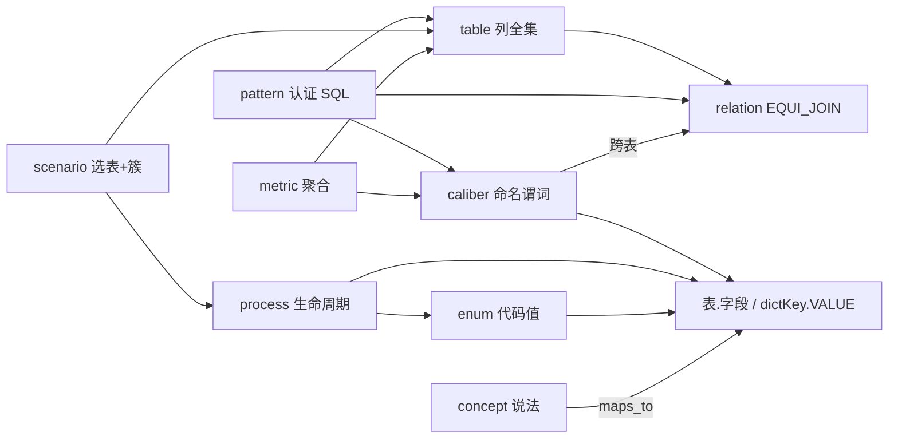

# 问数 Wiki 架构

> 权威：[README.md](README.md) · 语法 [pages.md](pages.md) · 编译 [extract.md](extract.md) · 消费 [runtime.md](runtime.md)
>
> SCHEMA：对象怎么组合、谁说了算、怎么发布、规划器怎么用。字段名以 [pages.md](pages.md) 为准。不绑定某一版代码。

## 0. 是什么

问数 Wiki 是给 **SQL 规划器 + 确定性门禁** 的编译产物。散文给人审，**ground 给规划器验**。问答不重推源码。

骨架取 Karpathy：**Raw 不可变 → Wiki 持续合成 → 操作受 schema 约束**。合金是 ChatBI，不是笔记本：物理身份仍是 **库表.字段**（要执行 SQL），语义层只补叫法、JOIN、口径、粒度。不另造逻辑表 id。

未绑定数据源没有 wiki，走物理目录，直到第一次编译。这是产品状态，不是失败降级。

## 1. 一张对象图（先组合，再谈字段）

规划器不消费「一袋页面类型」，消费的是下面这张图。页只是图里节点的载体。



| 层 | 对象 | 一句话 | 不承担 |
|---|---|---|---|
| **结构** | `table` | 一表一页：列全集、PK、grain、名称锚、**字段簇**、关系、默认过滤、共写 | 不写实例名；不按问法切列 |
| | `enum` | 一 dictKey 一页：代码值 + 代码 label | 不当公司名词典 |
| **语义** | `concept` | 用户说法 → 唯一物理锚 | 无锚术语 |
| | `caliber` | 可执行命名谓词 | 一枚举值一页 |
| | `metric` | caliber + 聚合；粒度继承自表 | 第二套 predicate；自由散文 grain |
| | `process` | **同一列**上的 From→To | 分类字典假流转 |
| | `scenario` | 问法：选哪些表、每张表带哪些**簇** | Java 包；提取 topic；字段上倒挂 `scenes` |
| | `rule` | 写约束 / 非默认查询约束 | 默认过滤（在表上）；共写（在字段上） |
| **复利** | `pattern` | 认证 Q→SQL；draft 即候选，published 才 few-shot | 未过 JOIN 图的 SQL |
| **簿记** | `_index` `_log` `source` | 给人 / lint / 出处 | 规划硬路径 |

`query` **不是**一类页。候选 SQL 就是 `pattern` + `status: draft`。

关系、默认过滤、共写 **不是**一类页：写在表页上，和列全集同一生命周期。

## 2. 一次提问怎么用这张图

不是九个独立功能，是同一条链：

```
说法 ──concept/aliases──► 物理键
值   ──enum 或 value_index──► 谓词常量 / 实例名
窗   ──scenario 选簇──► 本轮列集
谓词 ──caliber + table.default_filter──► WHERE
连接 ──table 上 confirmed EQUI_JOIN 图──► FROM/JOIN（不得出图）
粒度 ──table.grain + metric.aggregation──► SELECT（禁止隐式 fan-out）
共写 ──field.written_with──► 投影同伴列
争议 ──confidence=disputed──► 澄清卡（同一 ClarificationCard）
好答案 ──draft pattern──► REVIEW → promote
```

业内对照只为说明「为什么是这些对象」，不是第二套设计：

| 取 | 落到上图 | 明确不取 |
|---|---|---|
| Karpathy ingest/lint/query、raw 不可变、回流 | 四操作；`_index`/`_log` | 查询塞全书；LLM 当 JOIN 真值 |
| Cortex 关系图、verified query、synonym | JOIN 图；`pattern`；`aliases` | 逻辑表/列改写物理身份；运行时猜多路径 |
| MetricFlow / LookML / Cube：PK、explore、set/folder、always_filter、agg | `primary_key`/`grain`；scenario 选簇；table.clusters；`default_filter`；`aggregation` | 再编译一份隐藏列模型；explore 里点列名当字段分组 |
| CHESS/BIRD：错表不可恢复、值要在上下文 | 列在页上、窗裁进 prompt；值在 enum/`value_index` | 问数时扫 catalog 补列 |
| Vanna certified SQL | `pattern` 同一 lint | 未过门禁的 few-shot |

## 3. 原则（按层，不必当 15 条清单记）

**解析与身份**

- P1 零信任解析：语法失败丢块 + 警告。
- P4 一物理实体一页；其余只引 `表.字段` / `dictKey.VALUE`。
- P5 程序盖章身份；页 `status` 只经 promote。

**分源与编译**

- P2 确定性打底，LLM 只做语义跃迁。
- P3 按知识问题分源，冲突进 REVIEW。
- P7 编译一次，问答不从 raw 重推。
- P8 / P15 好答案走同一管道；**promote 是唯一发布写手**。

**运行绑定**

- P6a 业务召回可降级（少一段散文 ≠ 乱 JOIN）。
- P6b 绑定后缺表页不规划该表，禁止 catalog 直渲。
- P9 三轴：页 status ≠ 主张 confidence ≠ 请求时勾选/权限。
- P10 召回与图扩展只在勾选 ∩ 权限内。
- P11 绑定后 wiki 是唯一运行时 schema；场景选簇是投影不是删列。

**规划器法律**

- P12 JOIN 图即法律：只走 confirmed EQUI_JOIN。
- P13 粒度在表上声明一次，度量/场景继承；禁止隐式 fan-out。
- P14 值与页分离：wiki 不写实例名。

## 4. 两层真相

| 层 | 权威 | 禁止 |
|---|---|---|
| 编译期 | catalog = 存在/类型/可空/PK；代码 = label、JOIN、生命周期、共写、**字段簇**；profile = 实例值/`value_index` | LLM 编列、label、From→To、聚合；按问法给字段打 `scenes` |
| 运行期已绑定 | published wiki ∩ 勾选 ∩ 权限 + `value_index` | 缺列回退 catalog；SQL 出 JOIN 图 |
| 运行期未绑定 | 物理目录，直到第一次编译 | 长期混跑 |

压缩：**库赢存在与实测；代码赢含义与流转；文档赢叫法与时间线。** 分源表见 [extract.md](extract.md)（编译时用），不在此重复。

同一棵页树、三种角色（禁止混成三套库）：

| 角色 | 谁读 | 召回 |
|---|---|---|
| 结构合同 | 规划器 | 是（table/enum；L0 即可 promote） |
| 源码地图 | agent / 人 | **否**（`recall: false`） |
| 语义出门 | 规划器 | 仅召回面 |

topic = 提取批次，不是 scenario。`_index`/`_log` 不是页。

## 5. 一个状态机（三轴 + 四操作）

整页草稿、字段取值争议、数据源取消勾选是三件事，套在同一生命周期上：

```
ingest → draft 页 + REVIEW（指向 claim_path）
lint   → 只写 REVIEW / stale；不改主张正文
promote → published | retired     ← 唯一改页 status 的手
query  → 只读 published ∩ 勾选    ← 好答案回到 ingest，不写 published
```

| 轴 | 取值 | 规划器 |
|---|---|---|
| 页 `status` | `draft` \| `published` \| `retired` | 只消费 published。没有 `review`/`stale` 这种页 status |
| 主张 `confidence` | `confirmed` \| `proposed` \| `disputed` \| `rejected` | 硬路径 / 软候选 / 澄清 / 当不存在 |
| 请求可见性 | 勾选 ∩ 权限 ∩ ¬disabled | `available` / `selection_excluded` / `permission_denied` |

- REVIEW 是队列，不是页 status。stale 是指纹漂移，页仍 published。
- `inactive` 是表的业务休眠（结构仍在），不是未勾选，也不是 retired。
- 允许 published 页内含 proposed/disputed。
- 勾选变更不重写页、不重编译。

**lint 两层：** 结构 error 阻断 promote；语义问题进 REVIEW，不自动改 published。码表见 [pages.md](pages.md)。

## 6. 规划器法律（结构页上的图，不是旁路对象）

**JOIN。** 节点 = 表。边 = 表页上 `type: EQUI_JOIN` 且 `confidence: confirmed` 的 `(left, right)`。边写在 **FK 所在表** 页（`right` 或 `left` 落在本表的那一端）；对端表不必重复，lint 按无向图收边。SQL 等值 JOIN ⊆ 勾选掩膜后的图。`SHARED_KEY` / `DERIVED` 不是边。n:n 必须落到**中间表的两条 EQUI_JOIN**，禁止把共享键当 JOIN。多路径：caliber/metric 用 `using_relations` 钉死，否则澄清。LLM 不准裁决能不能 JOIN。

L0 只有 proposed 关系时：图在运行时为空，只允许单表 SQL。

**粒度。** 只在 **表** 上写 `primary_key` + `grain`（一行代表什么）。scenario 主档、metric 的计数对象 **继承** 该表，不另写一套。many 端 COUNT 一 端实体必须 `count_distinct` 一 端 PK。

**默认过滤。** 表的 `default_filter`：该表进入 FROM 时默认 AND 上谓词（软删/有效）。用户明确要求推翻则计划里记录。行权限在 AccessScope，不写 wiki。

**共写。** 字段的 `written_with`：同一次写入的同伴列。问到其中一列且语义是这笔写入 → 投影同伴或澄清。不是 JOIN。

**值。** 代码值在 enum；哪一列存名称在 `name_anchors`；实例名在 `value_index`（profile/字典编译，随勾选过滤）。

**字段簇 ≠ 场景。** 表内分块是结构事实：按字段关联性 / 代码模块（同一 VO、同一 form、同一前缀、同一写入组）把列**分区**。例如账户信息 = 账号 + 户名 + 开户行，应在同一簇，不能因为「建档问法没用到开户行」就拆进未分窗。场景是问法：选哪些表、每张表带上哪些簇。字段不倒挂 `scenes` 列表。簇不是 Java 包名，也不是提取 topic。

- 每列恰好一个 `cluster`（分区，不是标签云）。
- 表上声明簇：`common`（或等价）`include: always` —— 表进入 FROM 默认带上（id / enable / 时间戳 / 有则 code）。
- 其余簇按模块：`account`、`bank`、`build`、`cert`… 名称是领域块，证据来自代码。
- 未归簇的列仍留表页，只在点名 / 口径 / JOIN 端点时展开（lint warning）。
- `written_with` 仍是写入同伴；多数落在同一簇，跨簇时投影仍并入同伴。

**投影代数（唯一公式）。** 表页永远是列全集。**prompt 是提示，不是存在性法律。** 三层列集不得收成一个开关：

| 层 | 集合 | 用途 |
|---|---|---|
| 存在 | wiki `fields` | 列是否存在；SQL 不得引用页上没有的列（P6b） |
| 许可 | 勾选 ∩ 权限 | SQL 不得引用未勾选/无权列 |
| 提示 | 下面公式 | 塞进 prompt 的列；模型仍可使用「存在∩许可」中未提示的列，不得幻觉 wiki 没有的列 |

prompt 列 =

```
(include:always 的簇
 ∪ 命中 scenario 所选簇
 ∪ 命中 concept/caliber/metric/process 锚点所在簇    ← 不要只投锚列、把同簇拆开
 ∪ 点名列所在簇
 ∪ JOIN 端点 ∪ written_with(已选列))
∩ 勾选字段
```

无场景命中：不靠「只留 always」撑完整问数。有锚点命中则并入其簇；仍无锚、无点名 → always 簇，禁止默默塞整表。L0 无 confirmed JOIN 时产品预期是**单表问数**（出图的边为空，不得猜 JOIN）。WHERE 另加 `default_filter`（可推翻）。场景页只写 `clusters:`。

口径/概念命中若只投 `field_targets` 那一列，会把账户簇重新拆开，等于退回旧「场景窗点列」。

**共用列。** 一列只进一个簇。建档和认证都用的列，抽成更小的独立簇，场景多选；不要一列打两个 cluster，也不要因此把两簇合成一个大杂烩。

## 7. 争议只有一条路

编译期未决 = REVIEW（`claim_path`）。查询期依赖未决 = 澄清。二者指向同一主张，投影到规划器已有的 **唯一** `ClarificationCard`，不另造卡片。

| `reason` | 何时 |
|---|---|
| `disputed_claim` | 依赖 `disputed` |
| `ambiguous_concept` | 多 concept 争同一说法且无 synonym |
| `selection_excluded` | 只落在未勾选表/字段 |
| `multiple_join_paths` | 多路径且未钉 `using_relations` |
| `missing_grain` | 聚合但表无 grain |
| `unanchored_term` | 说法无物理锚 |
| `schema_page_missing` | 已勾选无表页（P6b） |

`disputed` / 多路径禁止静默默认。`schema_page_missing` 可以没有两个物理锚选项（走补页/换范围）。用户选择 → ingest → REVIEW → promote。

## 8. 字段词典（防撞名，不是第二份语法）

语法与必填见 [pages.md](pages.md)。这里只写「容易当成两件事的一件事」：

| 名字 | 家 | 不是 |
|---|---|---|
| 页 `status` | frontmatter | REVIEW；stale；`verification` |
| `confidence` | 主张（含 relation、pattern） | 页 status。relation 旧字段 `status` 是别名 |
| `recall` | 页 | 展示区标题 |
| `inactive` | 表 | 未勾选；retired |
| 勾选 / `page_disabled` | 请求 / 运行库 | 不写进 markdown |
| `maps_to` | concept 的唯一权威锚 | `field_targets` 的同义词（后者是闭包） |
| `primary_key` / `grain` | **仅 table** | scenario/metric 上再写一套 |
| `clusters` / `cluster` | **仅 table**（分区） | 场景；Java 包；字段上的 `scenes` 列表 |
| `name_anchors` | table | 实例值 |
| `default_filter` | table | 行权限；rule 页上的第二份谓词 |
| `written_with` | table.fields | `ground:cowrite` 独立块；JOIN；字段簇本身 |
| `using_relations` | **仅** 跨表 caliber/metric | pattern（SQL 即边）；逻辑关系名 |
| `aggregation` | metric | 散文「统计一下」 |
| `claim_path` | REVIEW / 澄清 | page_key 本身 |
| `value_index` | 运行时索引 | 不是 wiki 页 |
| prompt 列 | 投影公式 | 不是 SQL 可用列的白名单 |

## 9. 明确不做

- 无代码验证的库关联当 EQUI_JOIN；文档语义匹配当唯一物理锚
- ingest 写 published；低置信静默转正
- 为争议整页 draft，或把争议塞进展示区
- 勾选变更时重写 wiki / 另编译子集
- `xxx_name` 当 JOIN 键；查询翻源码或全书；catalog 运行时补列
- 实例值写成 wiki；一值一口径；假状态机；生成黑话进正文
- 按问法给字段打 `scenes` / 用列清单当「场景窗」；把账户相关列拆进未分窗
- unit/semantic 双轨；独立 `query` 页类型；独立 `cowrite` 页/块
- 用 LLM 裁决 JOIN；Obsidian 运行时依赖

## 10. 成功标准

1. 同一问题第二次规划不再翻 raw
2. 枚举 label 零脑补；冲突 100% 进 REVIEW
3. SQL 的 JOIN ⊆ 掩膜后 confirmed 图；聚合 grain 能指回一张表
4. 无权 / 未勾选不能经召回或 wikilink 漏出
5. P6a 业务段缺失主链路仍可跑；P6b 缺表页不得 catalog 顶上
6. 勾选可逆；争议能澄清；认证 SQL 能 promote 成 published pattern
