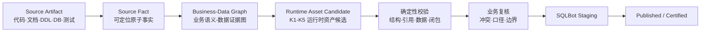
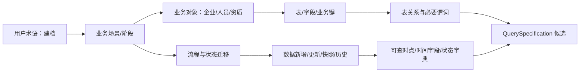
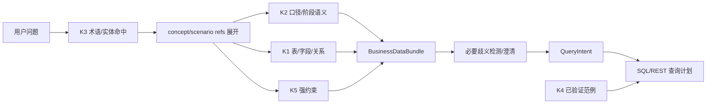
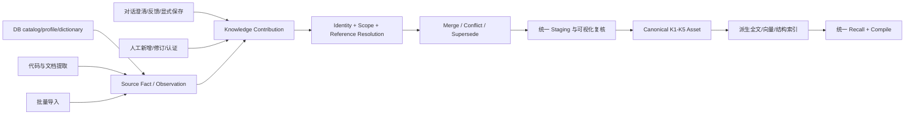
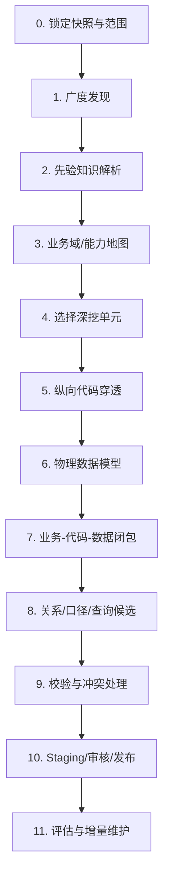
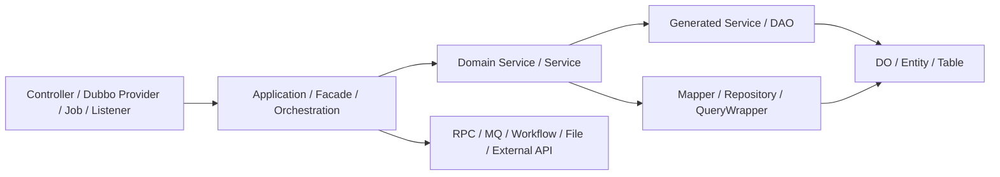
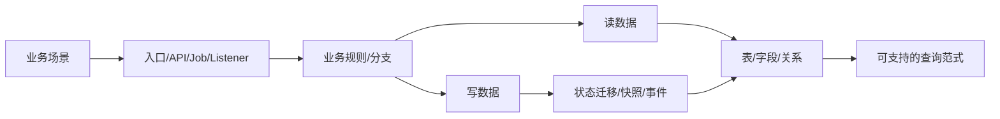

# 业务数据知识提取与 SQLBot 资产构建指南 v1.2

> 日期：2026-08-12  
> 定位：面向 SQLBot 运行时的业务↔数据知识提取、校验、导入与维护指南  
> 首个分析样本：`/Users/fanjunwei/IdeaProjects/pplatform-web`  
> 配套架构：[`docs/知识存储与召回体系-目标架构-v1.md`](./知识存储与召回体系-目标架构-v1.md)

---

## 0. 结论先行

本工作的唯一业务目标是**提升 SQLBot 对用户自然语言和底层数据的对齐、规划与查询能力**。业务系统知识库不应等于“把代码和文档切片后全部向量化”，也不是另外编写一套业务百科。可持续、可复用的构建路径应为：



核心策略是“现有知识优先、代码与数据闭环、按事实类型判定权威来源”：

1. 先利用项目中已整理的 skills、业务规则、代码地图、需求与设计文档，建立业务域和候选索引。
2. 再从 Controller / Provider 向 Application / Domain / Service / Mapper / DB 纵向穿透，完成业务与数据的证据闭环。
3. 文档不自动等于现状，代码不自动等于业务真理，数据库不自动等于正确口径。
4. 抽取结果先进入 staging；只有结构真实、语义闭合、边界明确、溯源完整的内容才能发布。
5. 系统认知不是平级目标，只是生产 SQLBot 运行时资产的证据和中间索引。
6. **无法连到数据对象、表、字段、状态值、关系、读写动作或可执行查询的业务描述，不算完成知识提取。**

### 0.1 运行时应该得到什么

用户说“建档”时，知识召回不应只返回“建档是客户准入流程”，而应返回一个可编译的业务数据上下文：



因此，一条业务术语的完成标准不是“有中文解释”，而是能够帮助 Planner：

- 选择正确业务对象和数据粒度；
- 召回涉及的表、字段、枚举和关系；
- 识别过程词中可能含有的多个业务阶段；
- 将用户的“完成、失败、待审核、本月新增”转换为真实字段和谓词；
- 选择恰当的事件时间，而不默认使用 `create_time`；
- 涉及多个可能口径时，生成面向业务的澄清问题；
- 将已确认语义直接填入 QuerySpecification，再生成物理查询。

---

## 1. 目标、使用者与非目标

### 1.1 建设目标

对任意一个业务系统，稳定构建一张“业务语义↔数据语义↔查询语义”图，并生成以下 SQLBot 可消费产物：

- 业务术语↔场景↔业务对象↔表字段的语义映射；
- 业务场景↔数据读模型↔数据写模型的可执行映射；
- 业务流程↔数据新增/更新/删除/快照↔状态迁移的时序映射；
- 业务专业术语、同义词、枚举和状态对应的数据形态；
- 功能模块↔主表/关系表/历史表/快照表，以及每张表在流程中的职责；
- 业务规则↔字段谓词、去重粒度、事件时间和 join 边界；
- 可支持的常用查询范式和已验证的问题→查询范例；
- 冲突、空白、风险、时效性和需要人工确认的问题清单。

系统边界、模块地图和代码调用链仍然需要提取，但它们只是建立上述映射的导航和溯源，不是最终成果。

### 1.2 主要使用者

| 使用者 | 使用产物 |
|---|---|
| SQLBot NLQ | 结构关系、口径、术语、范例、规则 |
| 配置助手 | 系统地图、数据地图、候选关系、证据与冲突 |
| 业务专家 | 术语、口径、流程和冲突待办 |
| 开发/数据开发 | 模块、调用链、表影响、状态迁移和查询模板 |
| 运营与治理人员 | 溯源、证据、认证、漂移和重新审查 |

### 1.3 明确非目标

- 不把全部源代码和文档作为长文本直接注入 NLQ prompt。
- 不仅凭同名字段、`xxx_id` 或 LLM 猜测自动认证关系。
- 不将一个方法的局部过滤条件自动提升为全局业务规则。
- 不把开发规范、运维配置、安全密钥和业务查询知识混在同一召回通道。
- 不因为缺少少量文档就阻塞全部提取；缺口应被显式标注，而不是被自动补齐。
- 不在本指南中新建一套与 SQLBot 并行的知识运行时。
- 不以“已整理多少个模块/流程/文档”作为完成标准；必须证明它们如何帮助 SQLBot 理解和查询数据。

---

## 2. 一个目标、两种形态：SQLBot 运行时资产与其证据包

### 2.1 业务数据证据包

业务数据证据包是一次提取任务的可读、可审计中间产物，专门为生成和维护 SQLBot 运行时资产服务，它不是第二个线上知识库。建议目录：

```text
business-data-evidence-package/
├── manifest.yaml                 # 仓库、分支、commit、数据源、提取器版本
├── source-catalog.jsonl          # 源材料清单和指纹
├── domains/                      # 业务域/能力到主数据对象的索引
├── glossary/                     # 术语↔场景↔表字段/枚举值
├── rules/                        # 业务口径↔谓词/聚合/时间/粒度
├── processes/                    # 流程↔读写集/状态机/数据变化
├── data-model/                   # 表、字段、分类、画像
├── relations/                    # 关系候选与验证记录
├── query-patterns/               # 查询范式与已验证范例
├── evidence/                     # 可定位的证据包
├── conflicts/                    # 冲突、空白、待确认项
├── import/                       # 面向 SQLBot staging 的候选清单
└── report.md                     # 覆盖度、风险、验证和验收结果
```

它可作为一次任务的文件形式中间产物，不要为此新增一组线上业务表。

### 2.2 SQLBot 运行时知识资产

| 提取产物 | SQLBot 归属 | 进入运行时的条件 |
|---|---|---|
| 表、字段、类型、主键、统计画像 | K1 Structural | DB 同步/探测验证 |
| join 关系及其必要谓词 | K1 Structural / `field_relation` | 字段真实、类型兼容、关系可执行、基数和边界明确 |
| 指标、维度、统计主体、人群口径 | K2 Semantic caliber | 语义闭包、`schema_refs` 完整、来源可追溯 |
| 业务名、同义词、枚举值和字典值 | K3 Entity | 发布受控，不跨数据源泄漏 |
| 已验证的问题→查询 | K4 Exemplar | 在目标数据源安全执行且与口径一致 |
| 强约束、安全与合规规则 | K5 Rule | 人工确认；能由代码强制的不仅靠 prompt |
| 提取过程、冲突和处理轨迹 | K6 Episodic | 只用于审计、评估和后续挖掘 |
| 系统架构、代码规范、调试方法 | 业务数据证据包的导航/溯源 | 默认不进入 NLQ prompt，可供配置助手/维护者使用 |

这个分界避免了一个常见错误：“知识越多，问数越准”。运行时需要的是高密度、强边界、可执行的知识，而不是项目所有信息。

### 2.3 与 SQLBot 现有管道的对接边界

- K1 表/字段/关系候选进入现有 datasource / relation 治理链路，不复制为第二份 `knowledge_asset`。
- K3 术语和字典进入 terminology / dictionary 现有发布链路，不由通用文档向量代替。
- K2/K4/K5 候选通过 Knowledge Gateway 统一准入入口提交，不由提取器直接写资产表。
- 外部提取任务的执行、验证和复核作为 provenance/evidence 记录，不伪造对话反馈或 apply outcome。
- NLQ 消费继续通过统一 knowledge compile 门面，不为“代码提取知识”增加一条专用 prompt 注入路径。
- 业务数据证据包可由配置助手或审核台按需读取，但不默认加入问数上下文。

### 2.4 运行时资产不是孤立条目，而是可展开的业务数据图

知识资产之间需使用稳定 ID 和引用连成图，而不是把“建档”、“建档流程”、`cust_company_info` 和 `cust_build_status` 存成彼此无关的四段文本。

这里的“图”是指 SQLBot 现有 K1–K5 资产之间的逻辑引用图，不要因此引入新图数据库或第二套资产模型。

```text
BusinessConcept
├── term/entity refs
├── scenario refs
├── process/stage refs
├── data object refs
├── table/field/relation refs
├── rule/caliber refs
├── query pattern refs
└── provenance/evidence refs
```

对 SQLBot 的编译结果可表示为一个 `BusinessDataBundle`：

```text
BusinessDataBundle
├── matched_concepts[]       # 命中的业务词与上下文
├── scenarios[]              # 相关场景和边界
├── process_stages[]          # 可能的流程阶段
├── tables[] / fields[]       # 数据落点
├── relations[]               # 已发布关系与必要谓词
├── read_models[]             # 可查对象与粒度
├── mutations[]                # 流程中的新增/更新/历史变化
├── state_dictionaries[]       # 状态字段、值和语义
├── caliber_fragments[]        # 可填充查询规格的口径
├── exemplars[]                # 已验证查询
├── ambiguities[]              # 需澄清的业务差异
└── assumptions/risks[]        # 低影响未确定性
```

`BusinessDataBundle` 是现有 knowledge compile 的逻辑视图，不要为它再建一套并行存储。它由 K1–K5 已发布资产按语义引用在召回后编译得到。

### 2.5 业务信息向 K1–K5 的唯一投影方式

| 业务信息 | 运行时投影 | 不应做的事 |
|---|---|---|
| “建档”、“企业准入”等用户语言 | K3 术语/同义词，携带 concept/scenario/data refs | 只保存一段中文解释 |
| “建档中/成功/失败”等阶段 | K3 状态语义 + K2 谓词/时间口径 + K1 字段引用 | 把整个流程图当成一条 prompt 卡片 |
| 业务对象和数据粒度 | K1 表/字段结构 + K2 subject/grain 口径 | 默认把一行当成一个业务对象 |
| 业务流程的读写、状态迁移 | 作为 K2/K3/K5 的 provenance/evidence，并产生阶段口径 | 再建一套不受 compile 治理的“流程 prompt 库” |
| 业务字典、状态和角色值 | K3 entity/dictionary，引用对应字段和上下文 | 将同一 code 的所有含义无上下文合并 |
| 表间实际关系和必要谓词 | K1 `field_relation` / structural hints | 把 Mapper 中所有 WHERE 都当成关系键 |
| 指标、人群、时间和聚合口径 | K2 caliber / IntentDefault fragment | 只存 SQL 或只存口头描述 |
| 已验证的常用查询 | K4 exemplar，引用 K1/K2/K3 | 把 LLM 未执行的 SQL 标记为已验证 |
| 强制数据安全/口径限制 | K5 rule，能由程序执行的继续以程序为准 | 仅靠自然语言 prompt 保障安全 |

不将“业务流程”单独设计为第七类运行时资产。流程的价值在于解释业务词如何对应数据变化，它应被编译到现有 K1–K5 及其 provenance，避免多套存储、多套召回和多套应用标准。

### 2.6 运行时召回和编译链



召回不是因为命中“建档”就把整个建档流程和全部表注入 prompt。Compile 应依问题中的主体、状态、时间、维度和指标选取相关切片，然后按预算去重、排序和编译。

### 2.7 多渠道知识必须汇入同一资产生命周期

DB 探测、代码/文档提取、对话沉淀、人工维护和批量导入是**知识生产渠道**，不是五套知识库。它们产生的内容必须经过同一身份解析、冲突处理、准入、版本、索引和运行时编译标准：



四层职责必须严格区分：

| 层 | 内容 | 是否可变 | 运行时是否直接消费 |
|---|---|---|---|
| Source Fact / Observation | DB 快照、代码位置、文档摘录、对话原文、人工说明 | 追加保存，不覆盖历史 | 否 |
| Knowledge Contribution | 某个渠道基于事实提出的术语、关系、口径、范例或规则贡献 | 可被新贡献纠正，历史保留 | 否 |
| Canonical Asset | 归并、校验、定界和发布后的 K1-K5 资产版本 | 通过 supersede 演进 | 是 |
| Derived Index | rank text、embedding、tsvector、字典快照等检索投影 | 可重建 | 只用于找资产，不是事实源 |

该分层解决两个相反问题：既不把每个渠道的数据原样混入运行时，也不因“统一”而丢失每条结论来自哪里、为什么可信。

#### 2.7.1 各渠道只贡献其擅长证明的内容

| 渠道 | 主要贡献 | 不能自行决定 |
|---|---|---|
| DB catalog / profile | 表字段真实性、类型、分布、字典值、关系统计 | 业务名称、指标口径和流程含义 |
| 代码 / Mapper / Enum | 当前读写行为、谓词、状态值、事务和关系候选 | 业务目标是否仍然正确、局部条件是否为全局规则 |
| 需求 / 设计 / skills | 业务语言、场景、目标流程和深挖导航 | 未验证功能是否已经上线 |
| 对话澄清 | 用户在特定问题和 scope 下确认的业务语义 | 一次选择是否可直接成为全局 Certified 规则 |
| 对话执行与反馈 | 口径被成功应用、SQL 结果和用户反馈的证据 | 没有归因时为某个资产自动升格 |
| 人工维护 | 补充解释、处理冲突、修订 scope、认证强资产 | 修改或删除原始证据历史 |
| 批量导入 | 高效提交已结构化的事实、贡献和证据 | 绕过引用解析、准入门禁和人工认证 |

“人工优先”也不能被实现为任意覆盖 DB 结构。例如人工可以把某字段解释为“建档完成时间”，但如果字段不存在或类型不兼容，该贡献仍不能发布。反过来，DB 中存在 `create_time` 也不能自动证明它是建档完成时间。

#### 2.7.2 同一知识如何归并

每条贡献都必须携带：

```text
contribution_id
candidate_kind
semantic_natural_key
scope
payload
schema_refs[]
source_fact_refs[]
source_channel
confidence_dimensions
observed_at
effective_time
contributor
```

统一归并规则：

1. **同 natural key、语义等价**：不创建重复资产，只累积新的 evidence/provenance。
2. **同 natural key、信息互补**：形成同一 staging 聚合视图，例如 DB 补字段真实性、代码补状态谓词、文档补业务名称。
3. **同 natural key、结论冲突**：不执行最后写入覆盖；按 scope/版本拆分，或进入冲突队列等待复核。
4. **用户/人工明确纠正**：新增 contribution，并产生新的资产 version；旧资产 `valid_to` 结束并由新版本 supersede。
5. **schema 漂移**：使引用失效的资产立即禁用或回到复核，不删除其业务证据。
6. **只有描述相似、业务身份不同**：保持两个 natural key，例如“企业创建时间”和“企业建档成功时间”不能因都含“企业时间”而合并。

`semantic_natural_key` 必须由规范化的业务身份和 scope 生成，而不是对整段描述做哈希。例如 K2 可由“数据源 + 统计主体 + 指标/阶段 + 人群口径 + 粒度”构成，K3 可由“数据源 + 业务概念 + 上下文 + 目标字段”构成。

#### 2.7.3 可视化维护的是规范资产，不是向量内容

统一知识工作台应以业务概念或场景为入口，组合展示：

- 业务名称、同义词、适用场景和 scope；
- 数据对象、表、字段、关系和状态字典；
- 流程阶段及其读写变化、事件时间；
- 由该概念关联的口径、规则和验证查询；
- 来自 DB、代码、文档、对话和人工的证据；
- 当前冲突、缺口、schema 漂移和索引状态；
- 将要用于 RANK 和 PROMPT 的确定性渲染预览。

页面保存的是结构化资产或 contribution。发布后由确定性投影函数生成索引文本和指纹，再异步更新向量/全文索引。禁止让运营人员直接编辑 embedding，也禁止维护一份与结构化资产脱节的“向量文案”。

#### 2.7.4 运行时只认统一发布视图

Recall 不应分别询问“DB 知识库”“对话知识库”和“人工知识库”。它只按 scope、kind、trust、有效期和问题相关性检索 Canonical Asset；来源渠道仅参与可信度、解释和审计。

例如“建档成功”最终可能由以下贡献共同组成：

```text
文档贡献：业务阶段名称为“建档成功”
Enum 贡献：BUILD_SUCCESS 是候选状态值
代码贡献：某动作同时更新 cust_build_status 与 cust_status
DB 贡献：字段存在、类型和实际值分布成立
对话贡献：当前统计要求按认证成功而非创建记录
人工贡献：确认适用系统、时间字段和排除范围
                         ↓
统一资产：阶段语义 + 状态谓词 + 事件时间 + 数据对象 + scope
                         ↓
派生 K3 命中、K2 caliber、K1 refs 和澄清差异
```

运行时看到的是这份归并后的有效资产及其引用，不是六段互相竞争的 prompt 文本。

#### 2.7.5 “统一”不等于所有知识塞进一张表

统一的是下面五件事：

1. 一个 contribution 信封和来源标准；
2. 一套 scope、身份、版本和冲突规则；
3. 一个 staging/复核工作台；
4. 一套发布、失效、索引和 lineage 生命周期；
5. 一个运行时 Compile 门面。

各资产仍由类型适配器投影到最合适的现有事实源：

```text
KnowledgeContribution
        ↓ kind adapter
        ├── structural       → core_table/core_field/field_relation 治理
        ├── entity/term      → terminology
        ├── dictionary       → dictionary config/value generation
        ├── caliber          → knowledge_asset(kind=caliber)
        ├── exemplar         → data_training / verified exemplar
        └── rule             → knowledge_asset(kind=rule)
```

不要建立一个可以接受任意 `kind + payload`、却对所有类型都使用 Caliber natural key 和校验器的“万能 Gateway”。统一入口内部必须按 `candidate_kind` 路由到明确的 parser、identity builder、validator、merger 和 publisher；未知 kind 直接拒绝。

建议保持一个外部写契约：

```text
submit_contribution(envelope)
  → parse_by_kind
  → resolve_refs
  → build_semantic_identity
  → validate_by_kind
  → merge_or_conflict
  → stage
```

发布则使用一个编排入口和分类型 projector：

```text
publish_staging(staging_id)
  → project_by_kind
  → update lineage/dependencies
  → mark derived indexes stale
  → enqueue reindex
```

这样既保留现有术语、字典、结构关系和查询示例的成熟存储，又保证所有渠道采用同一治理标准。

---

## 3. 基本原则

### 3.1 不建立单一的“来源优先级”

不同事实的权威来源不同：

| 事实类型 | 首要证据 | 次要证据 | 处理要求 |
|---|---|---|---|
| 当前物理表/字段/类型 | 实际 DB catalog | 当前 DDL、ORM/DO | 冲突时以数据源实际结构为准 |
| 当前 SQL 查询逻辑 | Mapper SQL、QueryWrapper、Repository | Service 参数和测试 | 动态分支必须分开提取 |
| 当前写入/状态转换 | 应用服务、回调、事务代码 | 测试、日志、流程文档 | 记录前置条件、副作用和补偿 |
| 业务名称/意图 | 已审核业务文档 | API 文案、方法名、页面文案 | 代码名仅能作为候选解释 |
| 目标态需求 | 已批准的最新需求/设计 | 任务拆分 | 明确标记 `target`，不当作 `as_is` |
| 当前业务口径 | 业务规则 + 可执行代码 | 历史需求、测试 | 口径、范围和应用场景都一致才能发布 |
| 枚举值及含义 | Enum/Constant + 分支行为 | 字典 DML、文档 | 同一值在不同流程中可有不同业务解释 |
| 表关系 | 实际 FK/稳定 join + 数据验证 | ORM、Mapper、设计文档 | 必须区分关系键和必要过滤条件 |
| 安全/租户/数据权限 | 实际拦截器和鉴权代码 | 安全设计文档 | 不能因 NLQ 知识缺失而绕过 |
| 开发规范 | AGENTS/强制标准 | skill、代码惯例 | 只用于理解代码，不写成业务口径 |

### 3.2 事实、解释、候选和认证必须分层

- **Source Fact**：可直接定位和重放的原子事实，例如“Mapper 在某分支中过滤 `status='EFFECT'`”。
- **Interpretation**：对事实的业务解释，例如“该接口只查有效角色”。
- **Candidate**：可能进入 SQLBot 的结构化知识，但尚未通过完整验证。
- **Published/Certified Asset**：通过准入或人工认证，可在明确 scope 内生效的资产。

LLM 可以生成 Interpretation 和 Candidate，但不能伪造 Source Fact，也不能自行将候选提升为 Certified。

### 3.3 作用域比文本相似度更重要

每条知识都要明确：

- 工作区、数据源和系统；
- 业务域和能力；
- 调用场景/API/报表；
- 角色、租户、项目、产品等业务边界；
- 生效版本或时间范围；
- 是局部口径还是全局规则。

没有 scope 的精确 SQL 片段比一条模糊描述更危险。

### 3.4 不可变溯源，可修订结论

- 源文档版本、commit、文件、行号、摘录和数据快照不覆盖。
- 新证据使旧结论失效时，产生新 version，旧结论保留供审计。
- 相同 natural key 的知识以 supersede 演进，不通过原地改写历史证据来“保持一致”。

### 3.5 数据可达性是知识完成的硬条件

核心业务术语、场景、规则和流程均必须具有 `data_refs`：

```text
data_refs
├── object_refs[]             # 企业、项目、建档申请等对象
├── table_refs[]              # 主表、关系表、历史表、快照表
├── field_refs[]              # 主体键、状态、类型、时间、金额等
├── relation_refs[]           # 已发布 join 路径
├── state_value_refs[]        # 数据值及业务含义
├── mutation_refs[]           # insert/update/delete/snapshot/event
├── event_time_refs[]         # 发起/提交/审核/完成时间
└── query_pattern_refs[]       # 可用查询模式
```

准入规则：

- 核心业务术语没有任何 `data_refs`：只保留为导航线索，不视为完成产物。
- 流程只有文字步骤、没有读写集和状态变化：保持 `incomplete_data_mapping`。
- 业务规则只有中文描述、没有字段谓词：可作澄清线索，不得作为 Certified Bind。
- 外部系统流程的本库数据落点不明：标记为跨系统证据缺口，不猜测本库表。
- 有数据落点但缺少用户语言映射：只是 K1 结构事实，尚不是完整业务数据知识。

---

## 4. 来源发现与分类

### 4.1 通用来源分类

| 来源 | 常见内容 | 适合提取 | 主要风险 |
|---|---|---|---|
| 项目 skills / agent 指南 | 系统能力、调用方式、开发约束 | 能力索引、术语候选、调用入口 | 摘要过期、工程知识与业务口径混合 |
| 项目知识库/代码地图 | 模块、服务、规则和链路 | 广度索引、深挖路由 | 自我宣称已验证不等于当前 commit 真实 |
| 需求、设计、任务拆分 | 目标行为、场景、业务语言 | 意图、术语、流程候选 | 未落地、部分落地、方案已变更 |
| 发布 DDL/DML/配置/任务 | 版本数据变化 | schema 演进、字典、任务和配置 | 多环境差异、历史重复 |
| Controller / Provider / API | 用户和外部系统入口 | 场景、入参、返回、权限入口 | 只看入口无法确定数据口径 |
| Application / Domain / Service | 编排、规则、事务、调用 | 业务流程、前置条件、写入行为 | 跨服务副作用容易遗漏 |
| Mapper / Repository / QueryWrapper | 真实 SQL 和动态谓词 | 关系、过滤、粒度、排序 | 局部查询不代表全局口径 |
| DO/Entity/ORM | 表字段映射 | 结构候选、字段语义线索 | 生成代码和实际 DB 可漂移 |
| Enum/Constant/Dictionary | 状态、类型、标识 | 枚举、状态迁移候选 | 死值、别名、相同编码不同上下文 |
| Test/Fixture | 预期行为与边界 | 例子、反例、事务顺序 | 覆盖不全、样例值泄漏 |
| 实际 DB catalog/profile | 当前结构、数量和分布 | 结构证实、基数、关系证据 | 敏感值、环境非生产、样本偏差 |
| 日志/调用链/监控 | 真实运行路径 | 分支覆盖、时序、异步事件 | 不完整、敏感信息、时效性 |

### 4.2 `pplatform-web` 的优先入口

该项目已经具备较好的先验知识，应优先用于导航：

1. `.cursor/skills/*/{SKILL.md,reference.md,examples.md,collaboration.md}`：能力、外部系统、调用约束。
2. `lowcode-pplatform-common/.dev-standards/knowledge/`：
   - `service-routing-index.md`：服务路由；
   - `business/`：业务规则；
   - `codemap/`：模块与代码地图；
   - `service/`：服务级说明；
   - `api-jar/`：外部能力与契约。
3. `lowcode-pplatform-common/.dev-standards/requirement/` 和 `design/`：版本化需求、设计和任务。
4. `lowcode-pplatform-common/.dev-standards/standards/`：代码规范与模块边界。
5. `docs/<version>/` 及 `docs/已发布/`：真实发布过的 DDL、DML、job、配置和设计。
6. Java / XML / YAML / SQL / Test 源码：完成证据闭环。

这些文档应被当作“索引和候选生成器”，而不是批量直接发布的资产源。

### 4.3 源材料清单字段

```text
source_id
repository
commit
branch
path
artifact_kind
version_label
validity: as_is | target | historical | unknown
scope_hint
content_fingerprint
parser_version
discovered_at
```

`validity` 必填。没有它，目标设计很容易被误当为已上线能力。

---

## 5. 提取总流程

### 5.1 两遍提取模型



**第一遍：广度建图**

- 目标是知道“用户会如何表述这个系统、这些表述可能落到哪些主数据对象、主表和读写链路”。
- 不在此阶段产生全局强口径或认证 join。
- 结果是业务术语→数据落点的粗粒度路由、待深挖单元以及证据空白。

**第二遍：纵向闭环**

- 以一个可命名的业务能力或查询场景为单位。
- 从业务语言穿透到可执行查询和实际数据。
- 同时提取该语义对应的数据读模型和数据写/状态模型。
- 只有能在召回后展开为 `BusinessDataBundle` 的闭环产物，才有资格进入运行时知识候选。

### 5.2 步骤 0：锁定快照和边界

每次提取先记录：

- 仓库 URL/本地路径、commit、branch、dirty 状态；
- 项目版本和目标环境；
- 目标数据源、schema 与租户范围；
- 允许读取的文档/代码/数据范围；
- 敏感信息脱敏要求；
- 本次是全量基线还是增量更新。

仓库在提取中发生变化时，不应将两个 commit 的证据混为一个版本。

### 5.3 步骤 1–3：广度发现与能力地图

1. 读取项目指南、skills、知识库 README 和路由索引。
2. 盘点模块、启动项、API/RPC、定时任务、消息监听器和数据访问模块。
3. 将文档中的业务功能合并为稳定的业务域和能力，不以 Java 包名作为业务域名。
4. 建立“业务术语/场景 → 业务对象 → 代码入口 → 读写服务 → 主表/状态字段”索引。
5. 给每个能力标记优先级：查询价值、业务重要度、证据完整度、变更频率。

业务域条目至少包含：

```text
domain_id
business_name
description
actors
capabilities[]
business_terms[]
data_objects[]
code_modules[]
entrypoints[]
primary_entities[]
primary_tables[]
state_fields[]
read_paths[]
write_paths[]
external_systems[]
source_refs[]
confidence
```

### 5.4 步骤 4：选择可闭环的深挖单元

一个深挖单元应是：

- 一个业务能力，例如“企业建档”；
- 一个业务流程，例如“项目上线审批”；
- 一组密切相关的查询，例如“某租户某角色的有效企业”。

不宜以“整个客户中心”或“某个 Mapper 文件”作为单个闭环单元：前者过大，后者没有业务边界。

### 5.5 步骤 5：纵向代码穿透

对 Java / MyBatis 项目，默认追踪路径：



对每条路径提取：

- **入口**：业务名、调用者、参数、权限、租户上下文；
- **编排**：方法顺序、事务边界、前置校验、降级与补偿；
- **读操作**：读取表、join、过滤、去重、排序、分页；
- **写操作**：写入表、字段变化、状态迁移、历史表、幂等键；
- **外部副作用**：RPC、MQ、工作流、文件、短信、邮件、配置；
- **返回语义**：数据粒度、空值含义、枚举翻译、隐藏的二次组装；
- **异常路径**：业务异常、部分成功、重试和回滚。

生成代码模块可用于识别 DO/Service/Mapper 的结构映射，但其中的通用 CRUD 不自动等于可用业务场景。

### 5.6 步骤 6：物理数据模型

对每张在范围内的表，建立：

```text
table
├── business_name / description
├── ownership: domain / module / datasource
├── grain: 一行代表什么
├── primary_key / business_keys
├── tenant_keys / permission_keys
├── lifecycle_fields
├── soft_delete / effective flags
├── time_fields
├── measures / dimensions
├── status/type fields and enums
├── sensitive_fields
└── profile: rows / null_rate / distinct_rate / samples_digest
```

字段要标注角色，不只保留数据类型：

- 主键、业务唯一键、外部系统键；
- 租户键、项目键、产品键、用户归属键；
- 状态、类型、是否标记、软删除；
- 事件时间、业务期间、创建/更新时间；
- 金额、数量、比例、排序号；
- 名称、类别、地区、组织等维度；
- JSON/数组/密文/脱敏字段；
- 快照、当前态、历史态、预变更态。

### 5.7 步骤 7：构建业务-代码-数据闭包

每个深挖单元都应产生一个 Evidence Pack：

```text
EvidencePack
├── business_claim          # 要证明的业务结论
├── scope                   # 适用场景和版本
├── business_phrases[]      # 用户可能使用的自然语言
├── document_evidence[]     # 需求/规则/设计定位
├── code_evidence[]         # 类/方法/文件/行号/分支
├── schema_evidence[]       # 表/字段/类型/指纹
├── data_evidence[]         # 数量/匹配率/唯一性/空值率
├── test_evidence[]         # 用例或执行验证
├── contradictions[]        # 矛盾与未解问题
├── data_refs               # 对象/表/字段/关系/状态/读写/时间
├── runtime_candidates[]     # 计划生成的 K1-K5 资产
└── conclusion              # 范围、置信度、状态和未完成项
```

关键关系：



如果某个业务规则无法连到具体字段或可执行谓词，它可以留在业务数据证据包中作为待完成线索，但不应生成强 K2 口径。

### 5.8 步骤 8：生成知识候选

从 Evidence Pack 中生成：

- 术语和枚举候选；
- 字段语义和表粒度候选；
- 关系候选；
- 口径与强规则候选；
- 流程与状态机候选；
- 查询范式和范例候选。

候选必须保留业务引用与数据引用两端。例如术语“建档成功”不仅生成 K3 同义词，还要引用对应 K2 谓词片段、K1 状态字段和相关表。否则召回层只知道“这个词是什么”，仍不知道“数据在哪里、如何查”。

候选生成后必须从原文章节脱离，转换为可验证的结构化对象，不以一大段“系统如何工作”的摘要替代。

外部提取、DB 探测、对话沉淀、人工编辑和批量文件均提交同一 `KnowledgeContributionEnvelope`：

```yaml
schema_version: knowledge-contribution/v1
contribution_id: <producer-generated-idempotency-key>
candidate_kind: caliber
operation: upsert              # upsert | supersede | disable-proposal
scope:
  oid: 1
  datasource_ref: <stable-datasource-ref>
semantic_identity:
  natural_key_hint: null       # 服务端重算，不能由客户端强制指定
payload: {}
schema_refs: []
source_fact_refs: []
provenance:
  source_channel: code_analysis
  producer: pplatform-extractor@1
  extraction_run_id: <run-id>
  observed_at: <timestamp>
confidence: {}
```

要求：

- `contribution_id` 只保证一次渠道提交幂等，不等同于资产 natural key；
- `semantic_identity` 由服务端分类型解析器重新计算，导入文件不能直接控制资产身份；
- `datasource_ref/table_ref/field_ref` 先解析为当前 SQLBot ID，无法解析的贡献进入待映射，不静默丢弃；
- `operation=disable-proposal` 只是失效建议，只有 schema 确认删除等确定性事件才可自动禁用；
- 批量导入先产生 dry-run：新增、补证据、互补合并、冲突、无效引用、可能 supersede 的数量与明细；
- 页面人工编辑也调用同一接口，只是 provenance 为 `manual`，不能绕过分类型校验；
- 对话沉淀沿用同一 contribution 标准，额外引用 run/record/evidence，不直接写 Certified；
- DB 探测的物理事实可以直接更新 K1/字典快照，但由它推导的业务语义仍进入 staging。

推荐的批量交付结构：

```text
knowledge-delivery-package/
├── manifest.yaml                 # schema 版本、系统、commit、提取器、目标 scope
├── facts.jsonl                   # 不可变来源事实/观测
├── contributions.jsonl           # 渠道无关的知识贡献
├── dependencies.jsonl            # 源文件、符号、schema 和贡献依赖
├── evaluations.jsonl             # 基准问题与预期语义/结果特征
└── attachments/                  # 经脱敏的必要证据摘录
```

业务场景、过程阶段和 DataImpact 可以保留在 facts/contributions 中供页面组合展示，但真正发布时必须被确定性投影为 K1–K5 及其稳定引用，不另建运行时旁路。

### 5.9 步骤 9–11：验证、发布与维护

1. 通过确定性验证和业务复核后，通过知识统一准入口写入 staging。
2. 不允许提取器直接写 Published/Certified 资产表。
3. 发布后运行一组固定评估问题，对比无知识/有知识的召回和 SQL 结果。
4. 通过文件指纹、schema 指纹和代码符号依赖图发现漂移。
5. 依赖变更的资产先失效或回到待复核，不让旧知识静默生效。

---

## 6. 详细提取口径

### 6.1 业务场景和功能模块

功能模块不应只是 Maven module 或菜单的复制。建议三层：

```text
业务域 Domain
└── 业务能力 Capability
    └── 场景/Use Case
```

场景至少包含：

```text
scenario_id
business_name
actors
trigger
preconditions
happy_path
alternative_paths
outputs
exceptions
permissions
tenant_scope
entrypoints
read_models
write_models
state_fields
event_time_fields
data_relations
external_effects
source_refs
```

一个 Controller 可服务多个场景，一个场景也可跨多个 module，两者不能强制一对一。

每个场景必须额外产生一个数据影响摘要：

```text
DataImpact
├── primary_object / grain
├── created_records[]
├── updated_records[]
├── deleted_or_disabled_records[]
├── snapshots_or_history[]
├── relation_changes[]
├── state_transitions[]
├── event_times[]
├── readable_after_stage[]
└── queryable_dimensions_measures[]
```

没有 `DataImpact` 的场景条目不进入业务数据资产发布队列。

### 6.2 术语、同义词和枚举

术语条目包含：

```text
canonical_name
aliases[]
definition
domain
context
examples[]
scenario_refs[]
process_stage_refs[]
data_object_refs[]
field_refs[]
enum_values[]
query_semantics[]
exclusions[]
source_refs[]
confidence
```

规则：

- 业务名称和字段名建议展示为“供应商层级(`apply_level`)”，既便于业务理解又便于追溯。
- 同一词在不同业务域中不合并，例如“有效”必须携带对象和场景。
- 过程词必须识别可查的阶段语义：“建档企业”可能指已发起、审批中或建档成功；不能仅映射到一个流程名。
- 每个可查阶段需对应主体粒度、状态字段/值、时间字段和默认纳入条件。
- 枚举需同时保留 code、label、作用字段和引用分支。
- 字典中已废弃值不删除证据，但要标记有效期和默认是否召回。

常用业务字典不应只保存 `code -> label`，应保存：

```text
BusinessDictionary
├── dictionary_id / business_name
├── target_field_refs[]       # 作用的表字段
├── context                  # 对象/流程/来源系统
├── values[]
│   ├── code / label / aliases
│   ├── business_meaning
│   ├── stage_refs[]
│   ├── inclusion_predicates[]
│   ├── valid_from / valid_to
│   └── deprecated
├── source_refs[]
└── scope
```

这样召回“建档失败”时，系统拿到的不只是 `BUILD_FAIL`，还包含该值作用的字段、所属流程阶段、可用谓词与不同上下文中的排除项。

### 6.3 业务规则和口径

一条可执行口径必须回答：

1. 统计/查询对象是什么？
2. 一行代表什么？
3. 纳入和排除条件是什么？
4. 是否去重，按什么去重？
5. 时间字段、时间范围和时区是什么？
6. 金额/数量用哪个字段，单位和空值政策是什么？
7. 分组、排序和缺失维度是否补齐？
8. 需要哪些 join，这些 join 是否会放大事实行？
9. 租户、项目、权限和软删除如何处理？
10. 口径是全局、报表级、API 级还是某个流程专用？

缺失其中关键项时，口径保留为候选，不 Bind。

### 6.4 业务流程和状态流转

流程不只是 Mermaid 图，必须对应数据变化：

```text
Process
├── trigger / actor
├── preconditions
├── steps[]
│   ├── entrypoint / method
│   ├── reads[]
│   ├── writes[]
│   ├── transition: before -> after
│   ├── emitted_events[]
│   ├── external_calls[]
│   └── transaction / idempotency / compensation
├── terminal_states[]
└── failure_paths[]
```

区分：

- 当前态表、历史表、快照表、预变更表；
- 业务状态、审批状态、同步状态、任务状态；
- 同步调用成功、异步受理成功和最终业务成功。

只有存在代码分支或数据变化证据的 transition 才进入已验证状态机。

运行时不应只召回整个流程文本，而应召回与问题相关的流程切片：

```text
ProcessDataSlice
├── process_id / stage_id
├── business_phrases[]        # 提交建档、建档中、建档成功、建档失败
├── actor / trigger
├── subject_grain
├── reads[] / writes[]
├── before_predicates[]
├── mutations[]
├── after_predicates[]
├── event_time_ref
├── related_tables[] / fields[]
├── relation_refs[]
└── evidence_refs[]
```

`ProcessDataSlice` 是 K2/K3/K5 和 K1 引用的组合视图，它允许“建档成功企业”直接展开成数据主体、状态谓词和相关表，不必让 Planner 重新从长文本中理解全部流程。

### 6.5 表和字段关系

关系类型建议统一分为：

| 关系类型 | 含义 | 默认信任 |
|---|---|---|
| `physical_fk` | DB 声明外键 | 高，仍需考虑软删除/租户 |
| `executable_join` | 稳定 Mapper/Repository 中的真实 join | 中高，需验证边界和基数 |
| `bridge_path` | 通过中间表连接 | 中，需确认粒度放大 |
| `service_lookup` | 代码先查键再查另一表 | 中，不一定可直接 SQL join |
| `business_key` | 按业务编号/外部 ID 对应 | 中低，必须验证唯一性 |
| `snapshot_origin` | 快照/变更记录指向原记录 | 中，需时态语义 |
| `workflow_correlation` | 业务单与流程实例通过业务号关联 | 中，可跨库/跨系统 |
| `event_correlation` | 通过消息 key/request id 关联 | 低，主要用于流程审计 |
| `name_similarity` | 仅同名或命名推测 | 极低，不能发布 |

关系对象至少包含：

```text
left_table.field
right_table.field
relation_kind
operator
direction
cardinality
required_predicates[]
scope
null_policy
temporal_policy
join_safety: safe | may_multiply | unsafe | unknown
evidence_refs[]
profile_evidence
status: discovered | validated | confirmed | rejected | stale
```

**join 键与谓词不能混淆**：

```sql
a.project_id = p.id              -- 关系键
AND a.tenant_code = p.tenant_code -- 可能是复合关系的一部分
AND a.deleted = 0                 -- 读取谓词，通常不是关系键
```

必须为关系验证：类型兼容、非空率、值覆盖率、左/右唯一性、基数、孤儿率、join 前后行数放大倍数。

### 6.6 查询范式

常用查询范式应从已闭环业务场景中派生，不是随机生成 SQL。建议优先覆盖：

- 主体明细/列表；
- 符合口径的主体数量、去重数量；
- 状态/类型分布；
- 日/周/月/季/年趋势；
- 按组织、租户、项目、产品、角色的分组统计；
- Top N 和排名；
- 流程漏斗、状态转化和处理时长；
- 逾期、异常、缺失、待处理和空结果检查；
- 关联覆盖率、孤儿记录和数据质量诊断。

查询范式使用与 QueryIntent 一致的业务结构；物理字段、关系和权限映射单独归入 Grounding 与 Plan：

```text
QueryPattern
├── business_question_template
├── business_purpose
├── grain
├── outputs[]
├── predicates[]
├── group_by[]
├── time_windows[]
├── order_by[] / limit
├── relations[]
├── parameters[]
├── assumptions[]
├── safety_scope
├── evidence_refs[]
└── verification
```

只有在目标数据源上安全执行并校验业务结果的 QueryPattern 才可升为 K4 Exemplar。未执行的 SQL 骨架只是候选，不标注为“已验证查询”。

### 6.7 安全、权限和租户信息

- 租户键、数据权限键和隔离规则必须被识别。
- 可由 SQLBot 数据源权限层强制的，不仅作为 K5 prompt 规则。
- 密码、token、证件号、手机、邮箱、账号等不存入证据摘录和向量文本。
- 代码中的测试样例、日志和 fixture 也按真实敏感数据处理。
- 外部系统的对象 ID 只能在跨库查询能力和作用域都明确时生成可执行关系。

---

## 7. 验证、冲突和置信度

### 7.1 验证门禁

| Gate | 检查 | 失败结果 |
|---|---|---|
| G0 溯源 | repo/commit/path/locator 和摘录完整 | 拒绝进入 staging |
| G1 结构 | 表字段真实、类型可用 | 标记 invalid/stale |
| G2 引用闭包 | 口径中的字段、operand、order、关系都有定义 | 保留候选，不 Bind |
| G3 数据 | 关系覆盖、唯一性、基数、枚举分布可接受 | 降低信心或拒绝关系 |
| G4 可执行 | 查询安全执行，无未知标识符 | 不能升为 Exemplar |
| G5 语义 | 业务名、口径、范围、时态一致 | 进入冲突/人工复核 |
| G6 安全 | 不泄漏秘密/个人信息，scope 可控 | 拒绝发布 |
| G7 运行评估 | 知识召回和应用对基准问题有正向效果 | 回退、降权或继续 staging |

### 7.2 置信度是分项证据，不是一键发布分

建议保留以下分项：

- `physical_confidence`：结构和字段真实性；
- `semantic_confidence`：业务语义证据；
- `relation_confidence`：join 和基数证据；
- `version_confidence`：当前版本确定性；
- `scope_confidence`：应用边界是否精确；
- `execution_confidence`：可执行性与结果验证；
- `cross_source_consistency`：多源一致性。

综合分可用于排序和分诊，不可代替 G0–G6 硬门禁或人工认证。

### 7.3 冲突类型

- `as_is_vs_target`：当前代码与目标设计不同；
- `document_vs_code`：业务文档与执行代码不同；
- `code_vs_database`：ORM/DDL 与实际 DB 不同；
- `same_term_multiple_meanings`：同一术语在不同场景含义不同；
- `same_relation_multiple_predicates`：同一表关系在不同查询中需要不同谓词；
- `current_vs_history`：当前态和历史/快照口径混淆；
- `environment_drift`：开发、测试、生产环境不一致。

冲突未解决时，保留多个有作用域的候选，不强行合并为一条“通用规则”。

---

## 8. 自动化与 LLM 的责任边界

### 8.1 确定性提取器负责

- 仓库和文件清单、commit 和指纹；
- Java 符号、注解、包/模块、方法调用图；
- Controller/Provider/Job/Listener 入口；
- ORM/DO 到表字段的静态映射；
- Mapper XML、注解 SQL 和能解析的 QueryWrapper 条件；
- DDL/DML、Enum/Constant、字典值；
- 事务注解、事件发布、RPC/MQ/工作流调用；
- DB catalog、profile 和关系统计；
- 引用闭包、字段存在性、SQL 安全与可执行性验证。

### 8.2 LLM 负责

- 业务场景、能力和代码符号候选对齐；
- 术语和同义词候选；
- 从多条原子事实归纳口径、流程和冲突；
- 产生结构化 Knowledge Candidate；
- 发现证据缺口并生成待人工回答的业务问题；
- 为已闭环场景提出查询范式候选。

### 8.3 LLM 不得负责

- 自行声明某张表、字段或关系存在；
- 将未实现的需求当作当前事实；
- 根据名称相似度认证 join；
- 把调试数据、密钥或完整生产值存入向量资产；
- 绕过 staging 和人工认证生成强 Bind/Reuse 资产。

---

## 9. 通用数据结构

### 9.1 SourceFact

```yaml
fact_id: fact_mapper_001
fact_kind: query_predicate
statement: "listEffectCompanyByCustType requires cust_role_info.enable = 'Y'"
scope:
  system: pplatform
  capability: list_effective_company_by_role
locator:
  repository: pplatform-web
  commit: <commit>
  path: lowcode-pplatform-customer-management/src/main/resources/mappers/CustCompanyQueryMapper.xml
  symbol: listEffectCompanyByCustType
  lines: "77-..."
excerpt_digest: <sha256>
validity: as_is
extractor: mybatis-analyzer@1
```

### 9.2 BusinessRuleCandidate

```yaml
candidate_id: caliber_effective_company_finance
business_name: "按角色查询有效企业"
scope:
  capability: list_effective_company_by_role
  role_parameter: custType
population:
  - role.enable = Y
  - company.data_type = 1
  - company.enable = Y
  - (company.build_status = BUILD_SUCCESS and company.status = EFFECT)
  - or (company.build_status = CUST_CHANGE and company.status = CHANGE)
inputs:
  - tenantCode
  - custType
field_refs: []
evidence_refs: []
confidence: {}
status: discovered
```

注意：上述结论的 scope 是“该能力”，不能仅因为方法名包含“有效企业”就发布为全局“有效企业”定义。

### 9.3 RelationCandidate

```yaml
left: cust_role_info.ref_cust_company_info
right: cust_company_info.code
kind: executable_join
cardinality: many_to_one
required_predicates:
  - cust_role_info.role_type = :custType
  - cust_role_info.enable = Y
  - cust_company_info.db_tenant_code = :tenantCode when tenantCode is provided
scope:
  capability: <capability-id>
evidence_refs:
  - <mapper join locator>
profile:
  coverage_rate: null
  orphan_rate: null
  multiplication_factor: null
status: discovered
```

### 9.4 ProcessTransition

```yaml
process_id: <process-id>
from_state:
  field: <table.before_status_field>
  value: <before-status>
event: <business-event>
to_state:
  field: <table.after_status_field>
  value: <after-status>
preconditions: []
writes: []
external_effects: []
transaction_boundary: null
idempotency_key: null
evidence_refs: []
status: discovered
```

示例中的空数组和 `null` 必须通过实际代码填充；模型不得为了格式完整而猜测。

---

## 10. `pplatform-web` 业务数据落地示例

### 10.0 主示例：将“建档”编译为业务数据图

“建档”是典型的过程型业务术语。它不能只被存成一条定义，需要被拆成可召回的业务数据资产组。

#### A. 术语和澄清语义

```text
canonical term: 企业建档
aliases: 客户建档、企业准入、客户准入、认证建档
subject: 企业
process stages:
  - 初始化/未建档
  - 提交认证/待客户确认
  - 待审核/审批中
  - 建档成功
  - 建档失败/退回
```

用户问“本月建档企业数”并不必然完整。SQLBot 应使用资产中的阶段差异识别：

- 按创建企业记录统计；
- 按首次提交认证统计；
- 按进入审批统计；
- 按认证成功统计。

这些口径可能对应不同状态、不同事件时间和不同数据来源，因此需要业务澄清，不能默认把 `cust_company_info.create_time` 当作建档完成时间。

#### B. 主数据对象和表职责

根据当前项目先验文档、DO 映射和代码线索，可建立以下候选，再通过 Mapper/DB 完成校验：

| 数据对象 | 物理表 | 数据职责 | 核心字段/线索 |
|---|---|---|---|
| 企业当前主数据 | `cust_company_info` | 企业主体、当前建档/业务/审批状态 | `id`, `code`, `cust_build_status`, `cust_status`, `check_status`, `act_procinst_*`, `cust_first_submit_auth`, `create_time` |
| 企业资质 | `cust_certification_info` | 企业认证与资质证据 | 企业关联键、资质类型/状态，待 Mapper/DB 校验 |
| 企业人员 | `cust_person_info` | 管理员/经办人及人员建档状态 | `cust_company_id`, `user_type`, `status`, `cust_build_status` 等，待校验 |
| 企业角色 | `cust_role_info` | 企业的核心/供应商/资金方等角色 | `ref_cust_company_info`, `role_type`, `enable` |
| 项目关系 | `cust_project_rel` | 建档成功后的企业项目归属和业务角色 | `project_id`, `ref_cust_project_rel_cust_company_info`, `company_type`, `enable` |
| 企业变更记录 | `cust_change_record` | 建档后企业信息变更过程，不应与初次建档静默合并 | 原企业关联键、变更状态/时间，待校验 |

表格中“待校验”的字段不得直接进入 Certified 资产。该表的作用是说明最终要构建哪些数据引用，不是用文档替代 DB 验证。

#### C. 状态数据形态

`CustBuildStatusEnum` 显示“建档”不是单一布尔值，当前代码包含：

| 业务表述 | 代码 | 默认语义 |
|---|---|---|
| 初始化 | `INIT` | 建档流程尚未正式开始 |
| 未建档 | `TO_BE_BUILD` | 等待建档 |
| 建档中 | `BUILDING` | 建档处理中 |
| 认证成功 | `BUILD_SUCCESS` | 企业建档/认证成功 |
| 认证失败 | `BUILD_FAIL` | 建档/认证失败 |
| 退回 | `BUILD_BACK` | 被退回，可能等待修改 |
| 待客户认证 | `CUST_CONFIRM_AWAIT` | 等待客户确认/认证 |
| 待审核 | `CUST_AUDIT_AWAIT` | 等待审核 |
| 审批中 | `CUST_BUILDING` | 审批流程进行中 |
| 审核通过 | `CUST_BUILD_SUCCESS` | 审核已通过，是否等价于最终认证成功需按场景验证 |
| 审核拒绝 | `CUST_BUILD_FAIL` | 审核拒绝 |
| 变更 | `CUST_CHANGE` | 建档后变更，不是初次建档阶段 |

状态资产还必须引用作用字段 `cust_company_info.cust_build_status`。“建档成功”在部分查询中还与 `cust_status='EFFECT'`、`data_type='1'`、`enable='Y'` 组合出现；这些组合必须按场景保存，不伪造为唯一全局规则。

#### D. 数据流转资产应如何表达

对每个已验证步骤，不只存“上传资质”或“审核通过”，而存：

```yaml
stage: <已验证的建档阶段>
business_phrases: []
subject_grain: company
reads: []
creates: []
updates:
  - table: cust_company_info
    fields: []
    before_predicates: []
    after_values: []
relation_changes: []
event_time:
  field: null
  semantics: null
external_effects: []
evidence_refs: []
status: discovered
```

例如当代码明确出现 `updateStatus(custId, BUILD_SUCCESS, EFFECT)` 时，可以生成“同一动作更新 `cust_build_status` 和 `cust_status`”的 Source Fact；但在未确定触发场景、前置状态和事务边界前，不能生成完整 Certified transition。

#### E. 对 SQLBot 问数的直接价值

| 用户问题 | 需召回的业务数据资产 | 可能需澄清 |
|---|---|---|
| “本月建档了多少家企业？” | 企业主体粒度、建档阶段、状态字典、事件时间、去重键 | “建档”指创建记录、提交认证还是认证成功？ |
| “查询建档中的核心企业” | 企业角色关系、建档中状态集、主数据与有效标记 | `BUILDING` 还是包含待认证/待审核/审批中？ |
| “各项目建档成功的供应商数” | 企业主表、角色/项目关系、成功状态口径、去重粒度 | 按企业去重还是按项目-企业关系计数？ |
| “建档退回后多久重新提交？” | 退回/重提状态事件及时间差、历史/流程记录 | 当前主表是否保留历史时间；如否，需选哪个历史表？ |

此时“建档”知识的价值不是让 LLM 更了解一段业务故事，而是使它可以直接生成或澄清 QueryIntent 中的 subject、filters、time、groupings 和 outputs；物理 relations 由 GroundingRule 与 Schema 元数据负责。

### 10.1 补充示例：按角色查询有效企业

#### 10.1.1 先验导航

先从以下材料了解企业、租户、项目和角色的业务概念：

- `lowcode-pplatform-common/.dev-standards/knowledge/business/客户管理平台业务规则文档.md`；
- `lowcode-pplatform-common/.dev-standards/knowledge/codemap/客户管理平台代码地图.md`；
- `lowcode-pplatform-common/.dev-standards/knowledge/service/lowcode-pplatform-customer-management.md`；
- 相关 `lls-*` skills。

这一步只生成术语、主对象和入口候选。

#### 10.1.2 代码闭环

实际调用链包含：

```text
CustCompanyInfoController
  -> CustCompanyIfoEnchanceService.listEffectCompanyByCustType
  -> CustCompanyQueryMapper.listEffectCompanyByCustType
  -> CustCompanyQueryMapper.xml#listEffectCompanyByCustType
  -> CustCompanyInfoDO(@TableName("cust_company_info"))
```

Mapper 中的条件还要连接到：

- 企业角色/类型关系表；
- 项目/租户关联；
- `CustBuildStatusEnum`、`CustStatusEnum` 等枚举；
- 实际 DB 中的字段、值分布与索引。

#### 10.1.3 可提取与不可直接提升的内容

**可生成候选：**

- K3：企业角色、建档状态和有效状态的业务名与编码；
- K1：Mapper 中出现且通过 DB 验证的关系键；
- K2：“该接口语境下的有效企业”的完整口径；
- QueryPattern：按租户和角色查询有效企业列表/数量。

**不可直接提升：**

- 不可把该 Mapper 的过滤条件定义为所有场景的“有效企业”；
- 不可把 `cust_status`、`cust_build_status`、角色 `status` 合并成一个没有对象的“状态”术语；
- 不可忽略 tenant 条件对查询范围的影响；
- 不可未验证关系基数就将列表 SQL 改为聚合 SQL。

这个例子说明：项目现有知识能显著加快导航，但“口径的完整语义”仍来自多层代码、表结构和数据证据的组合。

---

## 11. 增量更新和失效联动

### 11.1 依赖图

每条候选和资产保存可机器处理的依赖：

```text
asset/candidate
├── source_artifact_ids[]
├── code_symbol_refs[]
├── schema_refs[]
├── enum_refs[]
├── relation_refs[]
└── query_verification_refs[]
```

变更处理：

| 变更 | 处理 |
|---|---|
| 文档摘录指纹变化 | 关联解释回到待检查 |
| 方法删除/签名变化 | 依赖该符号的业务链路重跑 |
| Mapper SQL 变化 | 关系、谓词、查询范式重新验证 |
| Enum/Constant 变化 | 术语、状态机和口径重新检查 |
| 表/字段删除或改型 | SQLBot 依 `schema_refs` 立即失效关联资产 |
| profile 显著漂移 | 关系和粒度回到待复核 |
| 新需求仅有文档 | 创建 target 候选，不覆盖 as-is |

### 11.2 不重跑全仓库

增量任务根据 git diff、文件指纹、schema diff 和依赖图确定受影响的业务域，只重跑相关闭环单元。

---

## 12. 任务分段与交付准则

### 12.1 基线阶段

1. 仓库与来源材料清单；
2. 业务术语/场景/数据对象/代码模块的粗粒度路由；
3. 每个核心业务域的主表、主字段、主枚举、主读写路径和主关系候选；
4. 深挖优先级和证据空白。

### 12.2 业务域深挖阶段

每个业务域独立交付：

- 能力和场景清单；
- 术语↔场景↔数据对象↔表字段映射；
- 规则↔谓词/聚合/粒度/时间映射；
- 流程↔读写集/状态迁移/数据时序映射；
- 代码路径与上述数据映射的溯源；
- 表字段、关系与画像验证；
- 查询范式和评估问题；
- 冲突和人工确认清单；
- SQLBot staging 导入候选。

### 12.3 单个业务域完成定义

- 主要业务术语均可召回至少一个场景、数据对象和数据引用；
- 主要场景均有业务入口、代码定位和 `DataImpact`；
- 主要业务对象都有表粒度和主键/业务键；
- 主要流程的关键阶段均有主体粒度、读写集、状态转换和事件时间；
- 已发布关系均有可执行证据和基数验证；
- 已发布口径均有完整 scope 和 `schema_refs`；
- 已发布范例均通过安全执行和业务结果检查；
- 所有未解冲突均显式记录，没有被静默合并；
- 具有一组可重复运行的基准问题。
- 对核心业务术语执行召回时，能编译出完整 `BusinessDataBundle`，不只返回业务摘要。

---

## 13. 质量指标与验收

### 13.1 覆盖指标

- 可展开为业务对象、表字段和口径的核心业务术语比例；
- 具有 `DataImpact` 的核心业务场景比例；
- 已说明粒度的核心表比例；
- 具有读写集、事件时间和数据变化证据的核心流程阶段比例；
- 有证据闭包的已发布口径和关系比例。

### 13.2 准确性指标

- 关系执行成功率和行放大异常率；
- 口径引用字段真实率；
- 枚举 code/label 一致率；
- 查询范例的规格一致性和结果验证通过率；
- 人工复核中的驳回率与主要驳回原因。

### 13.3 SQLBot 效果指标

- 业务术语→数据对象/表/字段/状态值的编译完整率；
- 过程型术语的阶段和事件时间识别准确率；
- `BusinessDataBundle` 对 QueryIntent 所需业务口径及其 Grounding 字段/关系的覆盖度；
- schema/relation 召回的命中率；
- 必要澄清的遗漏率和无意义澄清率；
- 已认证口径 Bind 后的规格覆盖度；
- 未知表/字段和错误 join 的下降幅度；
- Exemplar Reuse 成功率；
- 有知识与无知识的基准问题质量差异；
- schema 漂移后过期知识的失效时延。

### 13.4 不可接受的验收方式

- 只统计“生成了多少条知识”；
- 只检查 Markdown 是否完整；
- 只验证 SQL 能执行，不检查业务口径；
- 只看向量相似度，不看 scope、证据和资产信任层级。
- 召回“建档”时只展示建档流程文本，却无法确定对应的主表、状态字段、阶段值、事件时间和关系路径。

---

## 14. 建议的首轮落地顺序

### 14.1 `pplatform-web` 基线建图

1. 固定 commit 和项目版本。
2. 导入 `.cursor/skills` 与 `.dev-standards/knowledge` 为“导航索引”，不发布运行时知识。
3. 产生全局业务域、能力、服务、入口和主表地图。
4. 对需求/设计/发布文档标注 `as_is/target/historical`。

### 14.2 选择两个试点业务域

建议选两种不同难度的试点：

1. **语义+流程密集型**：企业建档，重点验证术语、阶段、状态字典、事件时间、读写集和数据变化。
2. **关系+查询密集型**：企业/租户/项目/角色关系，重点验证关系、人群口径、去重粒度和查询范式。

### 14.3 试点后再扩展自动化

试点首先验证：

- 中间结构是否能表达实际复杂口径；
- 关系验证是否能识别行数放大；
- 文档和代码冲突是否能被正确保留；
- SQLBot staging 候选是否具有真实价值；
- 基准问题质量是否改善。

只有当中间契约稳定后，才实现批量 AST/调用图提取器，避免先写一个大量产出无效候选的通用平台。

---

## 15. 执行检查清单

### 提取前

- [ ] 锁定 commit、branch、项目版本和数据源。
- [ ] 读取项目 AGENTS/规范，确认生成模块和不可改区域。
- [ ] 建立源材料清单和 `as_is/target/historical` 标识。
- [ ] 确认敏感数据和脱敏策略。

### 广度建图

- [ ] 业务域名称不等同于代码目录名称。
- [ ] 每个核心业务术语至少有一个候选数据对象/主表落点。
- [ ] 每个核心能力有入口、模块定位和主读写链路。
- [ ] skills/现有知识仅作为导航和候选，未直接认证。
- [ ] 缺少代码、数据或版本证据的能力已标注。

### 纵向闭环

- [ ] 业务场景已连到 Controller/Provider/Job/Listener。
- [ ] 业务分支已连到 Service/Application 和枚举。
- [ ] 读写行为已连到 Mapper/Repository/DO/表字段。
- [ ] 每个核心场景已生成 `DataImpact`。
- [ ] 每个核心流程阶段有主体粒度、读写集、状态变化和事件时间。
- [ ] 动态 SQL 的不同分支未被合并为一条无条件口径。
- [ ] 外部调用、异步回调、事务和补偿已记录。

### 数据与关系

- [ ] 每张主表的行粒度已说明。
- [ ] 关系键与读取谓词已分开。
- [ ] 已验证覆盖率、唯一性、孤儿率和行数放大。
- [ ] 租户/项目/数据权限边界已识别。
- [ ] 当前态、快照、历史态和预变更态已区分。

### 知识候选

- [ ] 术语有对象和上下文，没有无主语的“有效/完成/金额”。
- [ ] 术语可通过稳定引用展开到场景、过程阶段、表字段、枚举值和查询模式。
- [ ] 口径具有粒度、人群、时间、聚合、关系和 scope。
- [ ] 范例已执行，而不只是 LLM 生成。
- [ ] 溯源不包含密钥、完整敏感数据和过长源码。
- [ ] 只通过 SQLBot 统一候选准入口进入 staging。

### 发布后

- [ ] 运行固定基准问题和无知识对照。
- [ ] 用核心业务术语检查召回后的 `BusinessDataBundle` 是否包含必需数据落点。
- [ ] 检查无意义澄清、错误 Bind、错误 join 和过度召回。
- [ ] 保存 apply/outcome 反链和业务复核结论。
- [ ] 配置 schema/code/document 漂移重检规则。

---

## 16. 指导文档本身的版本规则

本指南定义稳定的“取什么、如何验证、何时发布”，不应写入某个项目的大量业务硬编码。

当不同技术栈接入时，增加薄的技术栈附录，例如：

- Java + MyBatis 调用链与 SQL 提取；
- Spring Data JPA 关系与 Specification 提取；
- Go + sqlc/GORM 数据访问提取；
- Python + SQLAlchemy/Django ORM 提取；
- REST/API 数据源的请求契约提取。

附录只负责把某技术栈转换成本指南的统一 SourceFact / EvidencePack / Candidate 结构，不为每种技术栈另建一套知识标准。

---

## 附录 A：Java + MyBatis 提取适配要点

### A.1 Maven 模块与依赖

1. 从根 `pom.xml` 和子模块 `pom.xml` 构建模块依赖图。
2. 识别 API/Client、Application、Provider、Domain、DAO、Generated 等角色，不仅看 artifactId。
3. 对项目规范声明的生成模块只抽取映射，不将通用 CRUD 解释为业务能力。
4. 第三方 jar 中的能力记为 external capability；没有目标数据源映射时不生成 SQL 关系。

### A.2 入口和调用链

识别但不限于：

- Spring MVC `@RequestMapping/@GetMapping/@PostMapping`；
- Dubbo/RPC Provider 实现和 client interface；
- `@Scheduled`、XXL-Job/自研 job handler；
- MQ listener、Spring event listener、workflow callback；
- 启动初始化、补偿任务和人工管理入口。

方法调用图必须标记静态调用、接口派发、反射/配置路由与外部调用。静态无法决定的实现不猜测，通过 Spring bean、配置或运行日志补证。

### A.3 MyBatis XML

不能只保留渲染后的单条 SQL，应保留动态条件树：

```text
MappedStatement
├── id / namespace / result type
├── base tables / aliases
├── joins[]
├── unconditional predicates[]
├── variants[]
│   ├── condition: tenantCode != null
│   └── added predicate: cci.db_tenant_code = :tenantCode
├── choose/when/otherwise branches[]
├── foreach cardinality behavior
├── group/order/page
└── includes[]
```

要求：

- `<if>` 中的谓词不转成无条件全局规则。
- `<choose>` 每个分支分开生成 predicate variant。
- `<foreach>` 识别 IN 语义和空集行为，不记录具体样例值。
- `<include>` 保留引用关系和展开后指纹，避免 SQL fragment 变更无法失效下游知识。
- `resultMap` 只证明输出映射，不自动证明 join 关系。

### A.4 MyBatis-Plus / QueryWrapper

尽可能解析 Lambda 字段引用、`eq/in/like/between/isNull/orderBy/groupBy/select/set`，并记录 Java 控制流条件。

对无法静态解析的 wrapper 传递、自定义 SQL 片段和反射列名：

- 标记 `partially_resolved`；
- 保留调用方法与证据缺口；
- 不生成 Certified 口径或关系；
- 可使用测试或 SQL 日志完成补证。

### A.5 写入和事务

- 从 `insert/update/delete/saveOrUpdate` 提取写入表、字段和条件。
- 记录 `@Transactional` 边界、传播级别与明确的手工事务。
- 外部 RPC/MQ 发送与 DB commit 的顺序作为流程证据，不默认它们原子一致。
- 状态变化必须保留 WHERE 前置状态，否则会把幂等/防覆盖保护遗漏。
- 批量更新、逻辑删除和快照复制分别建模。

### A.6 与数据库校验

静态结果与目标 DB 对齐：

- `@TableName/@TableField` 和实际 catalog；
- Mapper 引用列和实际字段；
- 发布 DDL 与当前 schema；
- 枚举代码与实际值分布；
- 软删除、租户、启停标记的实际空值/分布；
- 关系键的唯一性、覆盖率、孤儿率和行数放大。

当线上 DB 不可用时，可交付静态候选和待验证 SQL，但状态必须保持 `discovered`，不标注为 `confirmed`。
