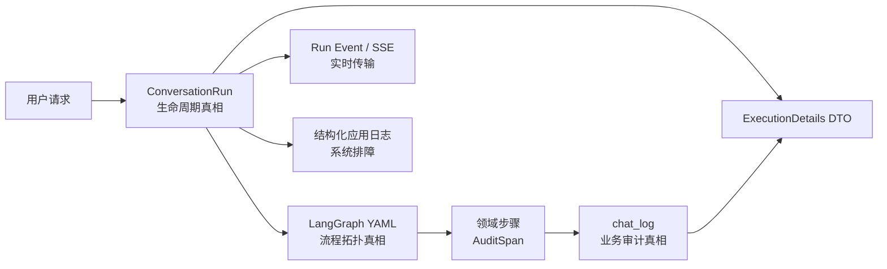
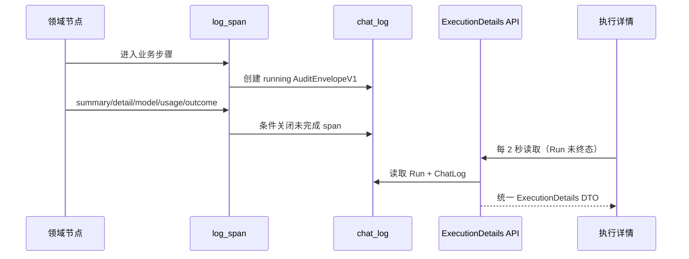

# 对话流程与审计日志架构 v1

## 1. 唯一真相与职责边界



- `ConversationRun` 只保存运行状态、当前节点、中断、调度尝试和终态。
- `backend/graphs/current/*.yaml` 是唯一流程拓扑；节点包装器只更新运行位置并输出应用日志。
- `chat_log` 是用户可见执行详情的唯一审计通道，不从 SSE 或完成节点重建时间线。
- Run Event 只传输开始、澄清、用户可见流式内容和终态。
- 应用日志只记录结构化生命周期字段，不记录完整问题、提示词、SQL 或凭证。
- Debug Bundle 聚合上述数据，不定义新的日志契约。

## 2. AuditEnvelopeV1

所有新业务审计只能通过 `apps.chat.steps.observability.log_span` 写入。`messages`
保存版本化 `AuditEnvelopeV1`：

```json
{
  "sqlbot_span": true,
  "version": 1,
  "phase": "execute",
  "graph_node": "execute_queries",
  "title_key": "chat.log.EXECUTE_QUERY",
  "summary_key": "chat.audit.query_executed",
  "summary_params": {"count": 18},
  "batch_index": 0,
  "attempt_index": 1,
  "unit_index": 0,
  "outcome": "success",
  "detail": {"source": "datasource", "row_count": 18},
  "model_messages": []
}
```

规则：

- `phase` 仅允许 `prepare/understand/plan/execute/review/present/respond`。
- 运行中的初始记录只包含身份和“处理中”摘要，不写 `count=0`、空数组等完成态数据。
- `status`、耗时和 token 使用 `ChatLog` 列，不在 JSON 中重复维护。
- 异常、降级和正常退出由 `AuditSpanHandle` 统一关闭；审计错误不得覆盖业务错误。
- Run 终止或恢复时，未关闭 span 原子标记为 `interrupted`；迟到 Worker 无权覆盖该终态。
- 模型上下文和工具数据写入前统一递归脱敏。
- 未版本化历史日志只走“原始记录”回退，不再维护旧语义解析器。

## 3. 写入与读取路径



后端负责解析 envelope、推导状态和本地化 key；前端只消费 DTO。执行详情打开且 Run
未终止时静默轮询，步骤按 ID 合并并保留展开状态。SSE 和轮询都不会拼装审计记录。

## 4. 业务阶段覆盖

| 阶段 | 业务审计 |
|---|---|
| prepare | 数据源确认、连接、Schema 与访问范围 |
| understand | 术语、知识、示例、实体、澄清规划 |
| plan | 查询计划、Reuse、修复、Agent 决策 |
| execute | 权限应用、SQL/REST、缓存或持久化复用、Tool 调用 |
| review | 结构门禁、候选决策、质量评估 |
| present | 表格、图表及降级展示 |
| respond | 总结、预测、分析与 fallback |

不为只搬运状态的 LangGraph 微节点创建审计；推荐问题等旁路任务也不进入主回答时间线。

## 5. 前端状态语义

- running：加载图标与阶段文案，不渲染空 detail。
- success：默认折叠。
- degraded/failed/interrupted：默认展开并展示原因。
- attempt/batch/unit 使用本地化标签。
- 技术详情、模型上下文与 reasoning 分层折叠。
- 实时、刷新后和历史页面均读取相同的 `ConversationRun + chat_log` 投影。

## 6. 禁止事项

- 禁止领域步骤直接调用底层 `start_log/end_log`。
- 禁止在 Graph 节点包装器、SSE 或 complete 节点伪造业务步骤。
- 禁止前端按 `operate` 猜测多种原始 message 结构。
- 禁止建立第二张审计表或第二条业务时间线。
- 禁止应用日志和 Run Event 保存完整提示词、SQL、连接信息或密钥。
