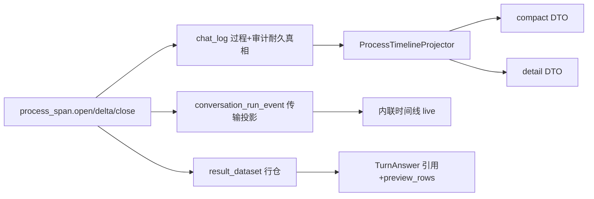

# 对话流程与审计日志架构 v2

v1 规定 `chat_log` 是唯一业务审计通道。v2 在此基础上规定：**内联过程时间线与执行详情必须同源投影**，并明确 Run Event 可携带用户可见产物、本地化边界，以及禁止业务术语硬编码。

## 1. 唯一真相与三层投影

| 层 | 职责 | 禁止 |
| --- | --- | --- |
| `chat_log` | 过程与审计耐久真相（thought / tool / artifact / clarification / answer） | 前端从 SSE 伪造步骤；`answer.agent_stages` 平行时间线 |
| `conversation_run_event` | 传输与断线续传；payload 为 ProcessItem 增量 | 完整 prompt、全量 rows、凭证 |
| `TurnAnswer` | 终态交付：content / assumptions / quality / datasets（引用+预览） | 嵌全量行；再存过程时间线 |
| `result_dataset` | 查询行数据真相 | 只写在 answer JSON |

刷新与历史一律 `GET /chat/record/{id}/timeline?view=compact|detail`。执行详情抽屉是同一时间线的 detail 视图。

## 2. ProcessItemV1

持久化只存 `title_key` / `title_params` / `summary_key` / `summary_params`。API 按请求 locale 解析为 `title` / `summary` 后下发。前端不做工具名映射。

稳定 `id` = `chat_log.id`。`open` 必须先于任何 `delta`。`delta` 只发 run_event，按字符数/秒阈值 flush envelope；`close` 写终稿。

并行 tool_calls：每个 call 一个 tool item，`parent_id` 指向所属 thought，`tool.call_id` 从 open 到 close 强制贯穿。`plan_id` = 该 `call_id`。

取消 / 失败 / 超时：`close_open_audit_spans` 将未关闭 span 标为 `interrupted`。

非 SSE sink（markdown / json / MCP）只写 `chat_log`，不发过程事件。终态文本仍由 finalize 输出。

SSE 事件类型：`process_upsert` | `process_delta` | `clarification` | `finish` | `error` | `run_status`。

## 3. Run Event 可携带的内容（相对 v1 §6 修订）

Run Event **可以**携带用户可见产物：SQL、样例行摘要、`preview_rows`、截断标记。

Run Event **禁止**携带：完整 prompt、模型原文、凭证、连接信息、全量结果行。模型 I/O 与 token 只出现在 timeline `view=detail`，来自 `chat_log`。

对已终态 run 的后续 `append_run_event` 必须记录 `run_event_rejected`，不得静默丢弃。

## 4. 产物与截断

- 执行 `max_rows = limit + 1` 探测；多出即 `truncated=true` 并丢弃探测行。
- 工具层生成 `dataset_id`，写入 `result_dataset`（`plan_id = call_id`），并立刻 close 一个 `kind=artifact` item。
- `finalize_run` 只引用已有 dataset，不再按 SQL 文本去重或重算。
- `TurnAnswer.datasets[]` 带 `dataset_id`、展示元数据、`row_count / truncated / limit / preview_rows`。
- 全量行：`GET /chat/record/{id}/datasets/{dataset_id}/rows`。导出与 `/data` 读行仓。
- 多轮上下文只读 `preview_rows`。
- Unified Agent 路径 `execution_mode=agent`，**不创建** `query_run`。

## 5. 无硬编码

- 用户可见文案：生产代码只出现 i18n key（`chat.timeline.*`、`chat.summary.*`）。
- 业务对象（表、字段、枚举 label、前缀）只能来自数据源 schema、wiki/字典召回或配置（如 `Settings.WIKI_COLUMN_PREFIXES`）。
- 图表推断只基于列值类型（numeric / temporal / categorical），不基于列名关键词。
- Prompt 模板不得内嵌具体业务字段样例；样例由知识注入提供。

## 6. 前端

- 类型镜像：`frontend/src/features/conversation/processTimeline.ts`。
- 单状态机 `Map<id, ProcessItem>`；SSE 只 `upsert / delta`；中途刷新先 GET compact timeline 再从 cursor 订阅。
- `AgentTimelineView` 是唯一过程 UI；`ExecutionDetails` 消费 detail view。
- finish 后用 compact timeline 整表替换。

## 7. 禁止事项（延续并升级 v1）

- 禁止 `answer.agent_stages` 与 BaseAnswer 双思考通道。
- 禁止前端按 `operate` 猜结构或维护 `TOOL_DISPLAY_NAMES`。
- 禁止建立第二张审计表。
- 禁止 Unified Agent 路径写空壳 `query_run`（`planning_status=pending` 且 `execution_status=completed`）。
- 禁止生产代码硬编码业务前缀或用户可见中文字面量。
