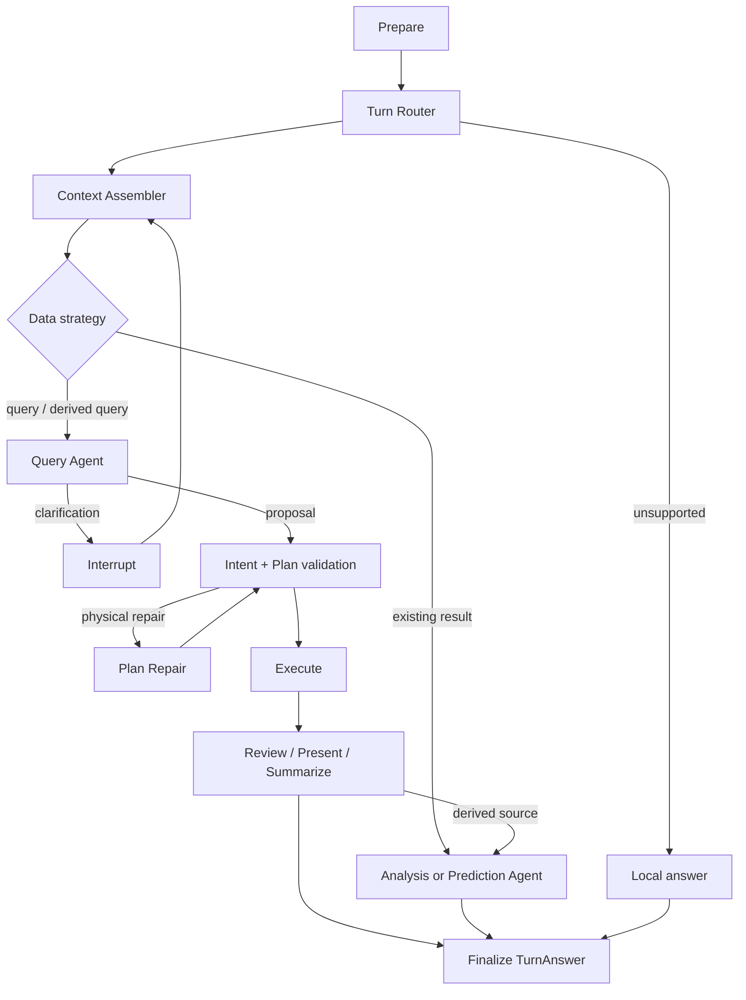

# 对话路由与查询执行统一架构 v6

本文档是普通对话查询、分析、预测的当前实现标准。旧 QuerySpecification、独立 analysis/predict Graph、父子结果记录和旧 Answer 结构均不再是运行标准。

## 唯一真相

| 领域 | 唯一真相 |
|---|---|
| 用户轮次与可见答案 | `ChatRecord.question` + `ChatRecord.answer (TurnAnswerV1)` |
| 一次运行尝试 | `ConversationRun` |
| 用户输入与澄清 | `ConversationEvidence` 追加式账本 |
| 业务查询语义 | accepted `QueryIntent` revision |
| 物理实现 | `PlanCandidate` + plan-scoped Grounding |
| 已执行数据 | `ResultDataset` |
| 业务执行审计 | `chat_log` / AuditSpan |

普通问数不再把 `data/sql/chart/analysis/predict` 作为第二份答案持久化。旧图表读取接口只从 `TurnAnswerV1` 即时投影旧视图；配置 Graph 仍可使用其独立所需字段。

## 生产拓扑

只有 `backend/graphs/current/chat.yaml` 定义普通对话拓扑。Config 使用独立 Tool Graph；Recommend 是非持久化旁路。

## 核心不变量

1. Router 每个 Run 只执行一次，只判断任务类型和历史关系，不解释指标或字段。
2. Resume 复用同一 Run；Regenerate 在同一 Turn 下创建新的串行 Run Attempt。
3. QueryIntent 不包含表、字段、JOIN、权限或系统行数上限，也不能由 PlanFacts 反向生成。
4. Grounding 只属于单个 Plan；物理修复前后 Intent hash 必须一致。
5. Intent 无法结构化但计划安全时可 unverified 执行，最高 59 分，且不进入知识沉淀或自动继承。
6. 每个 dataset 独立执行；失败数据集不发布，required 缺失不得宣称完整成功。
7. 结果回放必须同时匹配 plan、Schema fingerprint 和 AccessPolicy fingerprint。
8. `ResultDataset` 先提交，SSE 后发布；断线、刷新和恢复读取同一持久化状态。
9. 模型不能创建持久化 ID；Plan ID 由物理 payload 确定性生成。
10. Intent 置信度由服务端依据 Evidence 计算，模型自报分值不作为最终值。

## 迁移边界

`090_unified_turn_query_intent.py` 是有意不兼容、不可逆的迁移：清理旧 QuerySpecification 状态、旧普通问数答案投影和旧 caliber 运行资格。升级后应重新认证符合 IntentDefault v1 的知识资产。
