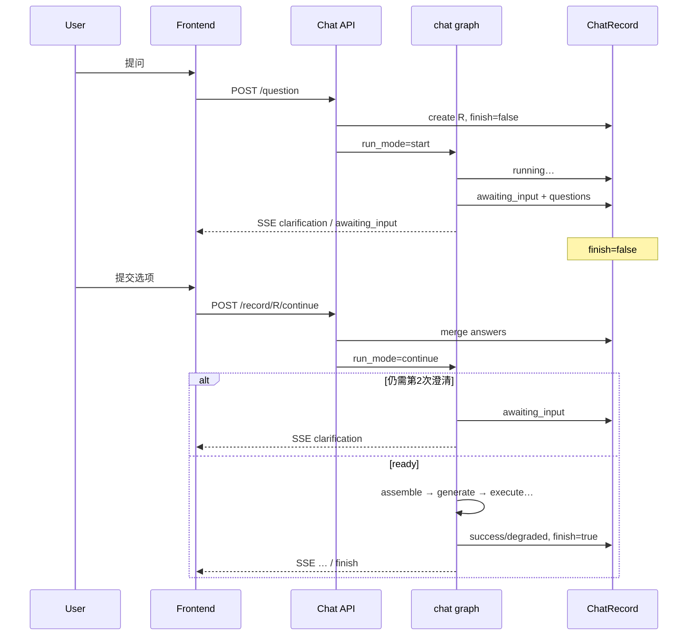

# 澄清交互统一方案：同轮暂停 / 续跑（唯一路径）

> 原则：**一条 record、一种暂停、一个续跑入口、一套状态**。  
> 旧「父 record 结束 + 子 record 重跑」整段删除，不做存量兼容，不留双轨。  
> 本文只固化**交互与生命周期**；契约/SQL/repair 见《查询契约与NLQ整体优化方案》。

---

## 1. 要替换掉的旧模型（删除，不是旁路）

| 删除项 | 原因 |
|---|---|
| `clarification_parent_id` / `clarification_for_record_id` | 用父子 record 伪造多轮 |
| 澄清时 `prepare_question_intent` 的 parent 分支 | 第二入口，与续跑重复 |
| 澄清提交走 `questionApi.add` + 新用户气泡 | 交互语义错误 |
| `complete_intent` 里 `terminal=True` + 业务 `finish` | 把「等待」当成「结束」 |
| 前端「找 child record 判断已答」 | 依赖已删除的父子结构 |
| 「逻辑上同轮、实现上仍建子 record」的过渡态 | 典型双轨补丁 |

**不保留**兼容层、适配器、feature flag 双路径。旧 awaiting 卡直接失效；用户重新提问。

---

## 2. 唯一生命周期（ChatRecord）

一条用户问题 = **一条** `ChatRecord`，从提问到出数（或失败）不换 id。

```text
created → running → awaiting_input ⇄ running → terminal
                         ↑ 最多再进 1 次（第 2 卡）
terminal ∈ { success | degraded | failed }
```

### 状态唯一真相

| 字段 | 含义 |
|---|---|
| `outcome.status` | **流程相位**：`running` / `awaiting_input` / `success` / `degraded` / `failed` |
| `intent_context` | **意图内容**：draft / questions / answers / contract |
| `finish` | **仅 terminal 为 true**；`awaiting_input` 时必须 `finish=false` |

禁止第三套「是否在等澄清」布尔；UI/API/图路由只读 `outcome.status`（或与其同步的投影）。

### SSE 语义（传输结束 ≠ 业务结束）

```text
首问/续跑流结束：
  awaiting_input → event: awaiting_input（可带 intent_context）
                   连接关闭；record 未 finish
  terminal       → event: finish；record.finish=true
```

前端用 `awaiting_input` / `finish` 区分，**禁止**再用「流结束」推断本轮已完成。

---

## 3. 唯一 API 面

### 3.1 首问（已有，净化后）

```http
POST /chat/question
Body: { chat_id, question, ... }   # 无 clarification_* 字段
→ SSE on record R
```

### 3.2 澄清续跑（唯一提交答案入口）

```http
POST /chat/record/{record_id}/continue
Body: { answers: ClarificationAnswer[] }
→ SSE on **同一** record_id
```

职责固定为三步，**只在这一处实现**（curd/service 单函数，API 薄封装）：

1. 校验：`outcome.status == awaiting_input`，且属于当前用户/会话  
2. `merge_clarification_answers` → 更新 `intent_context`  
3. `submit_graph("chat", { record_id, run_mode: "continue" })` 续跑  

禁止：

- continue 里再 `save_question` 新建 record  
- continue 走「假 question + clarification_for」旧协议  
- 前端 continue 时再调 `questionApi.add`

### 3.3 取消等待

```http
POST /chat/record/{record_id}/cancel
→ outcome=failed（用户取消确认），finish=true
```

暂停中用户发**新问题**：先 cancel 旧 record（或拒绝新问直到确认/取消）——只保留一种策略并写死实现。推荐默认：**禁止并行新问，提示先确认或取消**。

---

## 4. 唯一图入口与路由

仍用 **同一个** `graphs/current/chat.yaml` / `submit_graph("chat")`，用 `run_mode` 区分，不新增并行 graph_key。

```text
run_mode = "start" | "continue"
```

### 路由统一

```text
START → prepare_record
prepare_record:
  start    → ensure_datasource → … → assess_clarity
  continue → hydrate_resume → route_after_clarity 等价点
                ├ needs_clarification → pause_intent（再暂停）
                └ ready → assemble_context → generate_queries → …
```

`hydrate_resume` **不是**第二套业务逻辑，只做：

- 从 record 恢复 `intent_context`、datasource、已缓存的 schema/bindings/temporal 等  
- 校验缓存指纹；失效则 **落入已有节点** `retrieve_schema` / `ground_entities`（复用节点，不复制实现）

`assess_clarity` **只有一份**：

- `start`：完整评估  
- `continue`：merge 后若仍需再评估（自定义回答）走同一 `assess_semantic_intent`；结构化选项已 `ready` 则跳过评估  

禁止单独写 `assess_clarity_after_child_record()` 之类副本。

### 暂停节点（替换 complete_intent 的「终结」语义）

将原 `complete_intent` 中「等待澄清」收敛为 **`pause_intent`**：

```text
pause_intent:
  - persist intent_context + outcome=awaiting_input
  - finish=false
  - SSE clarification + awaiting_input
  - END（图结束，record 未业务完成）

真正失败（不懂/系统异常）:
  - fail_node / terminal failed，finish=true
  - 不再与 pause 共用一个「complete_intent 大杂烩」
```

---

## 5. 暂停时持久化（一份 resume 状态）

全部落在 **该 ChatRecord** 上，不另建 clarification 表、不做 parent 指针。

```text
intent_context:  draft / questions / submitted_answers / contract? / status
clarification_round: 1 | 2
resume_cache:
  schema_text / schema_fingerprint
  entity_bindings
  temporal_parse
  access_scope 摘要
  ds_id
```

续跑只读这份状态；**禁止**再去「找上一条 child/parent record 拼上下文」。  
缓存失效：指纹不符 → 走现有 retrieve/ground 节点重填，仍同 record。

---

## 6. 前端唯一交互路径

```text
用户发送问题
  → 一条 user 气泡 + 一条 assistant(record R)
  → SSE(R)：… → clarification → awaiting_input → 流关

用户提交澄清卡
  → POST .../continue（同一 R）
  → 同一 assistant 组件续接 SSE(R)
  → 再卡或 sql/chart → finish
```

删除：`sendMessage(..., clarification)`、`clarification_for_record_id` 传参、用 parent_id 找子记录。  
澄清卡 `answered`：读本 record 的 `submitted_answers` / 非 `awaiting_input`。

---

## 7. 与整体架构的衔接约束

| 约束 | 落点 |
|---|---|
| 强澄清、单卡 ≤4 题、最多 2 卡 | `clarification_round`；第 2 次仅冲突题 |
| 有数后不因契约偏差再澄清 | `decide_next` 禁止再进 `pause_intent` |
| 确认冲突 → repair → 再澄清 | 仅当无可用 SQL 时 `pause_intent`（round=2） |
| 清晰直跑 / 不懂失败 / 异常失败 | `assess_clarity` → assemble / fail，不经 pause |

---

## 8. 端到端时序



---

## 9. 模块职责（一处实现）

| 模块 | 唯一职责 |
|---|---|
| `api/chat.py` | `question` 创建；`continue` 续跑；`cancel` 取消 |
| `curd/chat.py` | `merge` + 加载/保存 resume；删除 parent 分支 |
| `nlq.pause_intent` | 只负责暂停持久化与 SSE |
| `nlq.hydrate_resume` | 只负责灌状态；失效则路由到已有节点 |
| `route_after_clarity` | `ready→assemble` / `needs_clarification→pause` / 失败→`fail` |
| `ClarificationCard` | 只调 continue |
| `MultiStepAnswer` | 只绑定一个 recordId 吃多段 SSE |

---

## 10. 数据模型变更（不兼容）

- 删除：`clarification_parent_id` 及 API/DTO/前端类型。  
- Alembic：drop 即可，不做数据回填。  
- `intent_context` 可升版本：只认新生命周期；旧版不可 continue。  
- 调试包：按单 record 导出，去掉 parent/child 段。

---

## 11. 验收（防双轨）

- 代码检索：`clarification_parent_id` / `clarification_for_record_id` 零引用（除迁移删除）。  
- 一次澄清过程中 DB 只增加 1 条 ChatRecord。  
- continue 与 start 共用同一 `assess`/`assemble`/`generate`，无副本函数。  
- `awaiting_input` 时 `finish is false`；仅 terminal 为 true。  
- 前端无「澄清专用 sendMessage」分支。  

---

## 12. 一句话决议

> **澄清 = 同一 ChatRecord 上的 `awaiting_input` 暂停；答案只通过 `continue` 进入同一 `chat` 图；父子 record 与「新消息回答」路径删除；恢复只 hydrate 一份状态并复用现有节点，不建第二套实现。**
